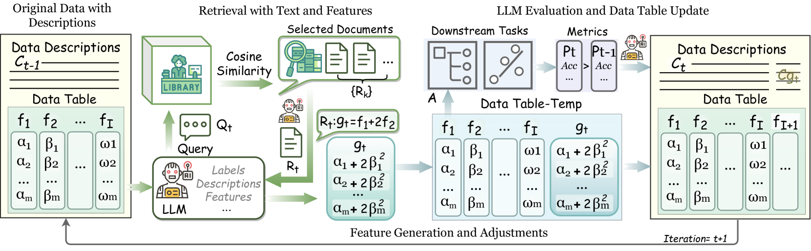

# TIFG：大型语言模型下的文本引导特征生成技术

发布时间：2024年06月16日

`RAG

理由：这篇论文主要介绍了一个基于大型语言模型（LLM）的文本信息特征生成（TIFG）框架，该框架利用检索增强生成（RAG）技术从外部知识库中提取相关特征，生成新的可解释特征。RAG技术是论文的核心，因此将其归类为RAG。虽然论文中提到了LLM的应用，但主要焦点是RAG技术的应用和效果，而不是LLM的理论或Agent相关的研究。` `数据挖掘` `特征工程`

> TIFG: Text-Informed Feature Generation with Large Language Models

# 摘要

> 在数据挖掘和特征工程中，文本信息的重要性不言而喻。然而，现有方法往往只关注数据结构，忽视了伴随数据的文本信息，从而错失了挖掘文本中深层数据关系的良机。本文创新性地提出了文本信息特征生成（TIFG）框架，该框架基于LLM，通过检索增强生成（RAG）技术，利用文本信息从外部知识库中提取相关特征，生成新的可解释特征，丰富特征空间，并深入挖掘特征间的关联。TIFG框架具备自动化特性，能不断优化特征生成流程，适应新数据，提升下游任务性能。实验证明，TIFG在多个下游任务中生成的特征不仅质量高，意义深远，且显著超越了现有技术。

> Textual information of data is of vital importance for data mining and feature engineering. However, existing methods focus on learning the data structures and overlook the textual information along with the data. Consequently, they waste this valuable resource and miss out on the deeper data relationships embedded within the texts. In this paper, we introduce Text-Informed Feature Generation (TIFG), a novel LLM-based text-informed feature generation framework. TIFG utilizes the textual information to generate features by retrieving possible relevant features within external knowledge with Retrieval Augmented Generation (RAG) technology. In this approach, the TIFG can generate new explainable features to enrich the feature space and further mine feature relationships. We design the TIFG to be an automated framework that continuously optimizes the feature generation process, adapts to new data inputs, and improves downstream task performance over iterations. A broad range of experiments in various downstream tasks showcases that our approach can generate high-quality and meaningful features, and is significantly superior to existing methods.

[Arxiv](https://arxiv.org/abs/2406.11177)