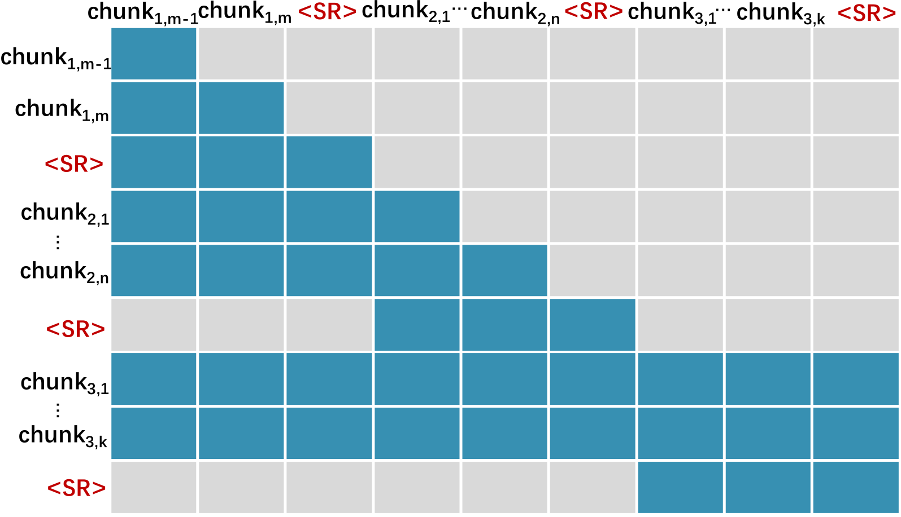
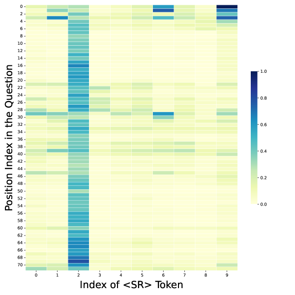

# 深呼吸：利用哨兵令牌提升大型语言模型的语言建模性能

发布时间：2024年06月16日

`LLM应用

这篇论文摘要描述了一种改进大型语言模型（LLMs）处理长篇上下文信息的方法。通过引入特殊标记<SR>和调整注意力掩码，该方法允许LLMs更有效地总结和利用文本块内的信息。这种方法的目的是提高LLMs在处理长文本时的性能，特别是在语言建模和跨领域任务中的应用。因此，这篇论文属于LLM应用分类，因为它专注于改进LLMs的实际应用性能，而不是探讨LLMs的理论基础或Agent的设计与实现。` `文本分析`

> Taking a Deep Breath: Enhancing Language Modeling of Large Language Models with Sentinel Tokens

# 摘要

> 大型语言模型（LLMs）在多任务中表现出色，成为生活中的得力助手。但基于Transformer的LLMs在处理长篇上下文时，因减少计算负担而丢失信息，导致性能受损。为此，我们提出一种简便高效的方法，让LLMs“深呼吸”，总结文本块内的信息。我们先将文本切分为块，并在每块末尾添加特殊标记<SR>，再调整注意力掩码，将块信息融入<SR>。这样，LLMs不仅能解读单个历史标记，还能通过<SR>聚合块的语义信息。实验证明，我们的方法在语言建模和跨领域任务中表现卓越。

> Large language models (LLMs) have shown promising efficacy across various tasks, becoming powerful tools in numerous aspects of human life. However, Transformer-based LLMs suffer a performance degradation when modeling long-term contexts due to they discard some information to reduce computational overhead. In this work, we propose a simple yet effective method to enable LLMs to take a deep breath, encouraging them to summarize information contained within discrete text chunks. Specifically, we segment the text into multiple chunks and insert special token <SR> at the end of each chunk. We then modify the attention mask to integrate the chunk's information into the corresponding <SR> token. This facilitates LLMs to interpret information not only from historical individual tokens but also from the <SR> token, aggregating the chunk's semantic information. Experiments on language modeling and out-of-domain downstream tasks validate the superiority of our approach.

[Arxiv](https://arxiv.org/abs/2406.10985)