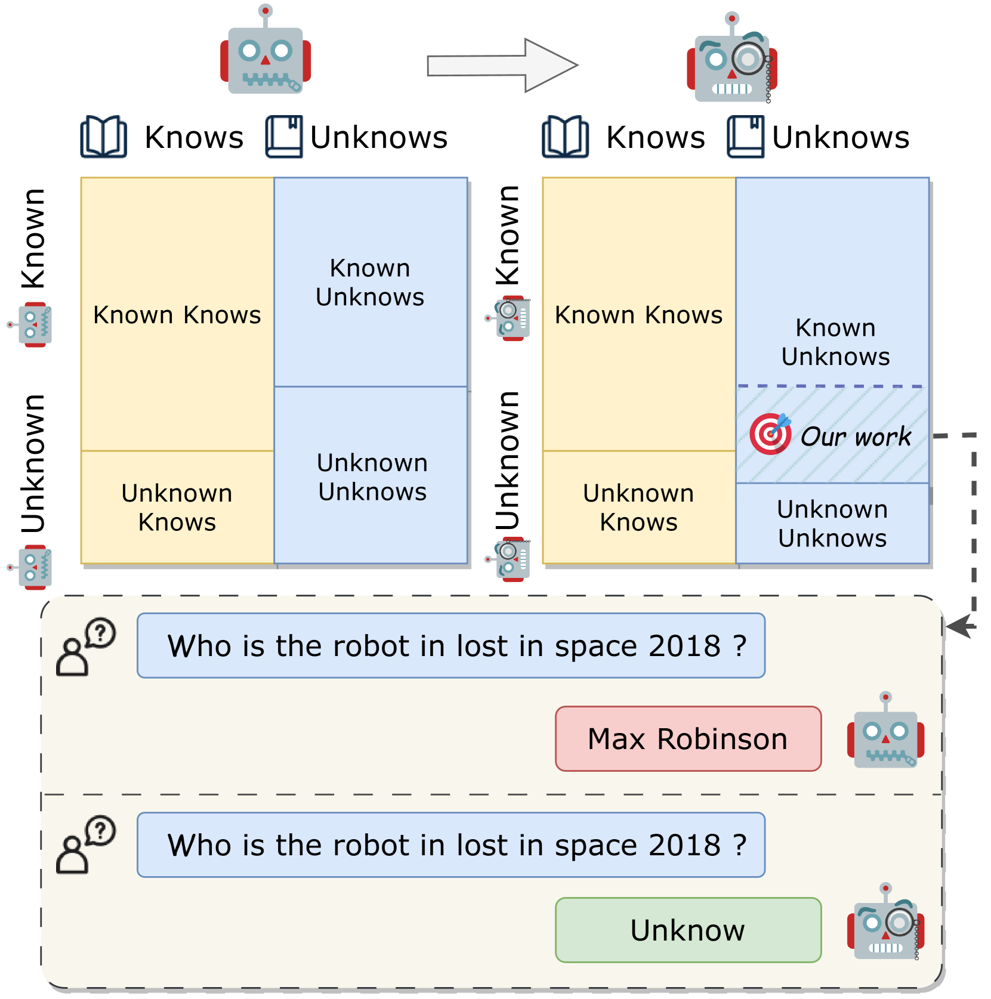
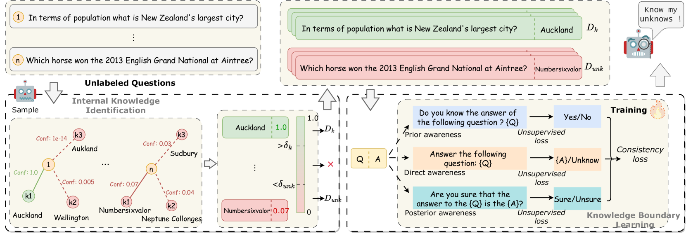
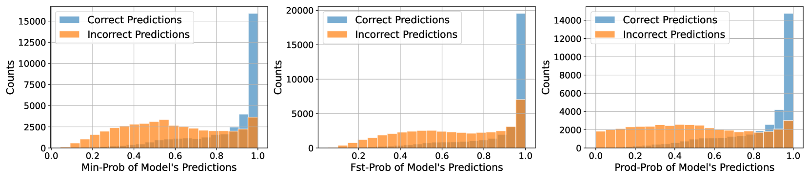
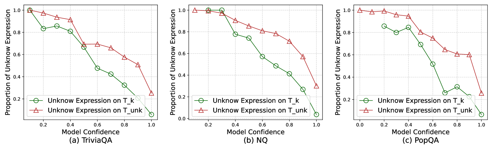

# 引导大型语言模型利用自身信号界定知识边界

发布时间：2024年06月16日

`LLM理论

这篇论文主要探讨了大型语言模型（LLMs）在知识边界上的问题，即“幻觉”现象，并提出了一种名为CoKE的方法来帮助LLMs识别和表达自己的知识边界。这种方法通过测试LLMs的自信度来探知其知识边界，并利用这些信息引导LLMs明确表达其知识界限。因此，这篇论文的研究内容更偏向于LLMs的理论改进和内部机制的优化，而不是具体的应用场景或Agent的设计，也不是关于RAG（Retrieval-Augmented Generation）的研究。因此，将其归类为LLM理论是合适的。` `人工智能`

> Teaching Large Language Models to Express Knowledge Boundary from Their Own Signals

# 摘要

> 大型语言模型（LLMs）虽成就斐然，但其偶尔的内容虚构——我们称之为“幻觉”——却成了应用的绊脚石。这种幻觉源于LLMs在知识边界上的训练不足，导致它们难以坦承无知。本文旨在让LLMs学会识别并表达自己的知识边界，从而减少因无知而虚构的幻觉。我们提出的CoKE方法，首先通过一系列问题测试LLMs的自信度，探知其知识边界，进而利用这些信息引导LLMs明确表达其知识界限。实验证明，CoKE使LLMs能区分已知与未知，有效提升了其在特定领域及跨领域的表现。

> Large language models (LLMs) have achieved great success, but their occasional content fabrication, or hallucination, limits their practical application. Hallucination arises because LLMs struggle to admit ignorance due to inadequate training on knowledge boundaries. We call it a limitation of LLMs that they can not accurately express their knowledge boundary, answering questions they know while admitting ignorance to questions they do not know. In this paper, we aim to teach LLMs to recognize and express their knowledge boundary, so they can reduce hallucinations caused by fabricating when they do not know. We propose CoKE, which first probes LLMs' knowledge boundary via internal confidence given a set of questions, and then leverages the probing results to elicit the expression of the knowledge boundary. Extensive experiments show CoKE helps LLMs express knowledge boundaries, answering known questions while declining unknown ones, significantly improving in-domain and out-of-domain performance.

[Arxiv](https://arxiv.org/abs/2406.10881)