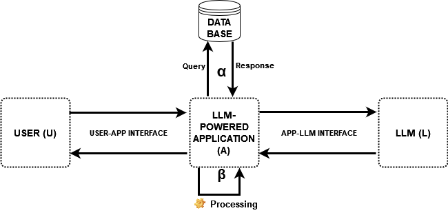
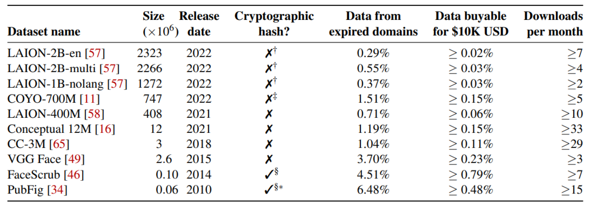
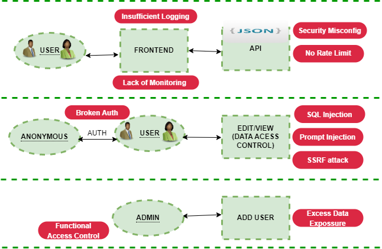

# 大型语言模型应用的威胁建模与风险评估

发布时间：2024年06月16日

`LLM应用

这篇论文主要关注大型语言模型（LLMs）在应用中面临的网络安全问题，包括数据中毒、提示注入、SQL注入、越狱和组合注入等攻击手段，并提出了相应的防御策略。这些内容直接关联到LLM在实际应用中的安全问题，因此属于LLM应用分类。` `网络安全` `人工智能安全`

> Threat Modelling and Risk Analysis for Large Language Model (LLM)-Powered Applications

# 摘要

> 大型语言模型（LLMs）的兴起极大地推动了自然语言处理技术的发展，但同时也带来了新的网络安全问题。本文深入分析了针对LLM应用的威胁模型和风险评估，特别关注了数据中毒、提示注入、SQL注入、越狱和组合注入等攻击手段，并提出了相应的防御策略。我们采用STRIDE和DREAD相结合的方法论，构建了一个主动识别威胁和评估风险的框架。通过一个定制LLM应用的案例研究，我们验证了端到端威胁模型的有效性，并根据LLMs特有的安全挑战调整了Shostack的四问题框架。我们的最终目标是提升这些AI工具的安全防护，确保LLM系统的稳定与安全。

> The advent of Large Language Models (LLMs) has revolutionized various applications by providing advanced natural language processing capabilities. However, this innovation introduces new cybersecurity challenges. This paper explores the threat modeling and risk analysis specifically tailored for LLM-powered applications. Focusing on potential attacks like data poisoning, prompt injection, SQL injection, jailbreaking, and compositional injection, we assess their impact on security and propose mitigation strategies. We introduce a framework combining STRIDE and DREAD methodologies for proactive threat identification and risk assessment. Furthermore, we examine the feasibility of an end-to-end threat model through a case study of a custom-built LLM-powered application. This model follows Shostack's Four Question Framework, adjusted for the unique threats LLMs present. Our goal is to propose measures that enhance the security of these powerful AI tools, thwarting attacks, and ensuring the reliability and integrity of LLM-integrated systems.

[Arxiv](https://arxiv.org/abs/2406.11007)