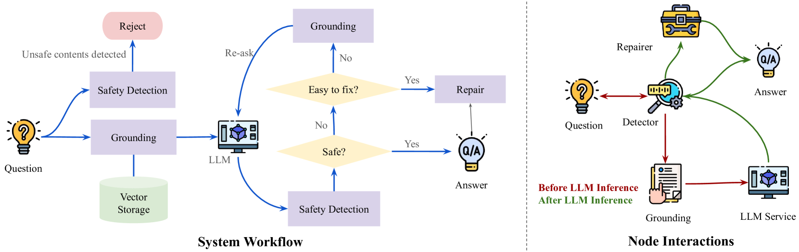
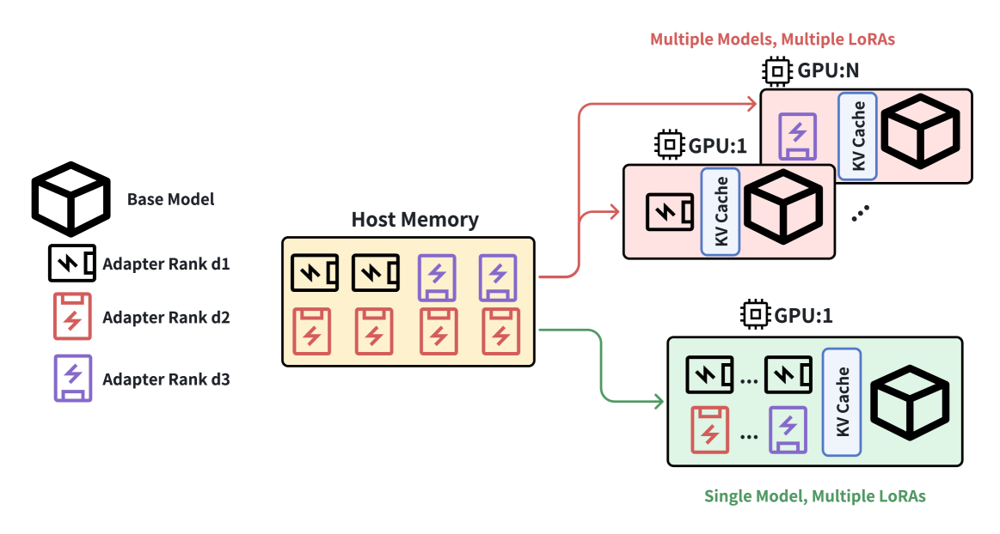
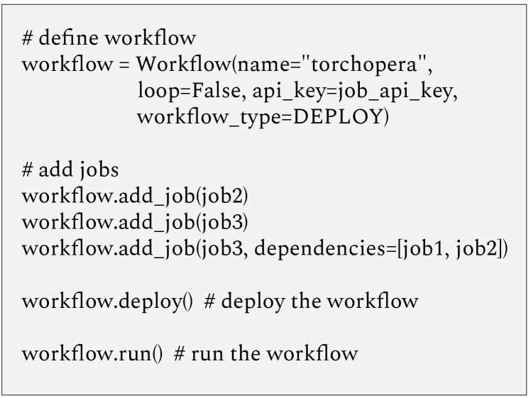
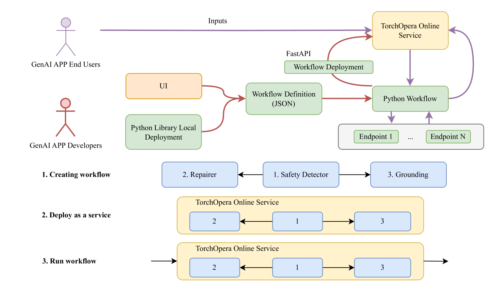

# TorchOpera：大型语言模型安全性的复合AI系统

发布时间：2024年06月16日

`LLM应用

理由：这篇论文介绍了一个名为 TorchOpera 的复合 AI 系统，该系统旨在提高大型语言模型（LLM）中提示与响应的安全性和质量。它通过使用向量数据库、规则包装器和专门的机制来识别和修正不安全或错误的内容，从而确保 LLM 的应用更加安全和高效。这与 LLM 的实际应用场景紧密相关，因此归类为LLM应用。` `人工智能` `安全技术`

> TorchOpera: A Compound AI System for LLM Safety

# 摘要

> 我们推出了 TorchOpera，这一复合 AI 系统致力于提升大型语言模型中提示与响应的安全性和质量。它确保用户提示既安全又贴合情境，且处理得当，同时使 LLM 的回应更加相关且品质上乘。TorchOpera 运用向量数据库实现情境基础，通过规则包装器灵活调整，并设有专门机制来识别和修正不安全或错误的内容。此外，我们还展示了如何通过复合 AI 系统降低计算成本。大量实验证明，TorchOpera 不仅保障了 LLMs 在实际应用中的安全、可靠与适用，还维持了其响应的高效性。

> We introduce TorchOpera, a compound AI system for enhancing the safety and quality of prompts and responses for Large Language Models. TorchOpera ensures that all user prompts are safe, contextually grounded, and effectively processed, while enhancing LLM responses to be relevant and high quality. TorchOpera utilizes the vector database for contextual grounding, rule-based wrappers for flexible modifications, and specialized mechanisms for detecting and adjusting unsafe or incorrect content. We also provide a view of the compound AI system to reduce the computational cost. Extensive experiments show that TorchOpera ensures the safety, reliability, and applicability of LLMs in real-world settings while maintaining the efficiency of LLM responses.

[Arxiv](https://arxiv.org/abs/2406.10847)