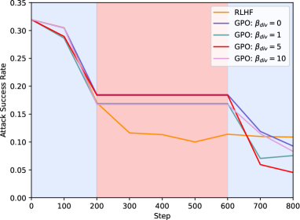

# 利用双人游戏策略，优化大型语言模型（LLM）的对齐效果

发布时间：2024年06月16日

`Agent

这篇论文探讨了通过双代理游戏的视角来解决大型语言模型的对齐问题，其中对抗性代理和防御性代理通过迭代交互进行游戏。这种方法涉及代理之间的交互和强化学习，因此属于Agent分类。` `人工智能`

> Toward Optimal LLM Alignments Using Two-Player Games

# 摘要

> 标准的人类反馈强化学习框架主要依赖预先收集的提示来提升大型语言模型的性能，但这种方法往往难以覆盖到模型最需改进的场景。本文通过双代理游戏的视角探讨了对齐问题，其中对抗性代理与防御性代理通过迭代交互进行游戏。对抗性代理的任务是生成揭示防御性代理弱点的提示，而防御性代理则根据奖励模型的反馈，改进对这些新提示的响应。理论上，我们证明了这种迭代强化学习优化能够达到由代理诱导的游戏的纳什均衡。实验结果显示，在竞争性环境中学习不仅使代理得到充分训练，还增强了对抗性和防御性代理的泛化能力。

> The standard Reinforcement Learning from Human Feedback (RLHF) framework primarily focuses on optimizing the performance of large language models using pre-collected prompts. However, collecting prompts that provide comprehensive coverage is both tedious and challenging, and often fails to include scenarios that LLMs need to improve on the most. In this paper, we investigate alignment through the lens of two-agent games, involving iterative interactions between an adversarial and a defensive agent. The adversarial agent's task at each step is to generate prompts that expose the weakness of the defensive agent. In return, the defensive agent seeks to improve its responses to these newly identified prompts it struggled with, based on feedback from the reward model. We theoretically demonstrate that this iterative reinforcement learning optimization converges to a Nash Equilibrium for the game induced by the agents. Experimental results in safety scenarios demonstrate that learning in such a competitive environment not only fully trains agents but also leads to policies with enhanced generalization capabilities for both adversarial and defensive agents.

[Arxiv](https://arxiv.org/abs/2406.10977)