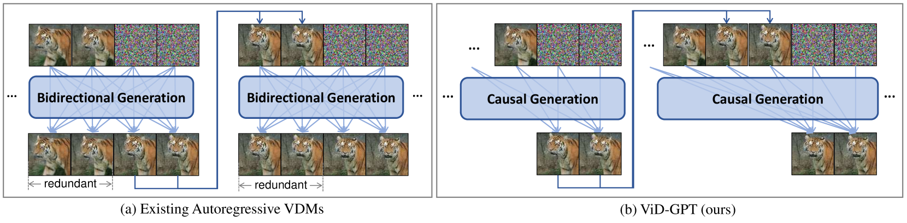
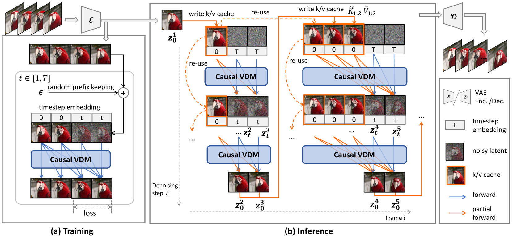
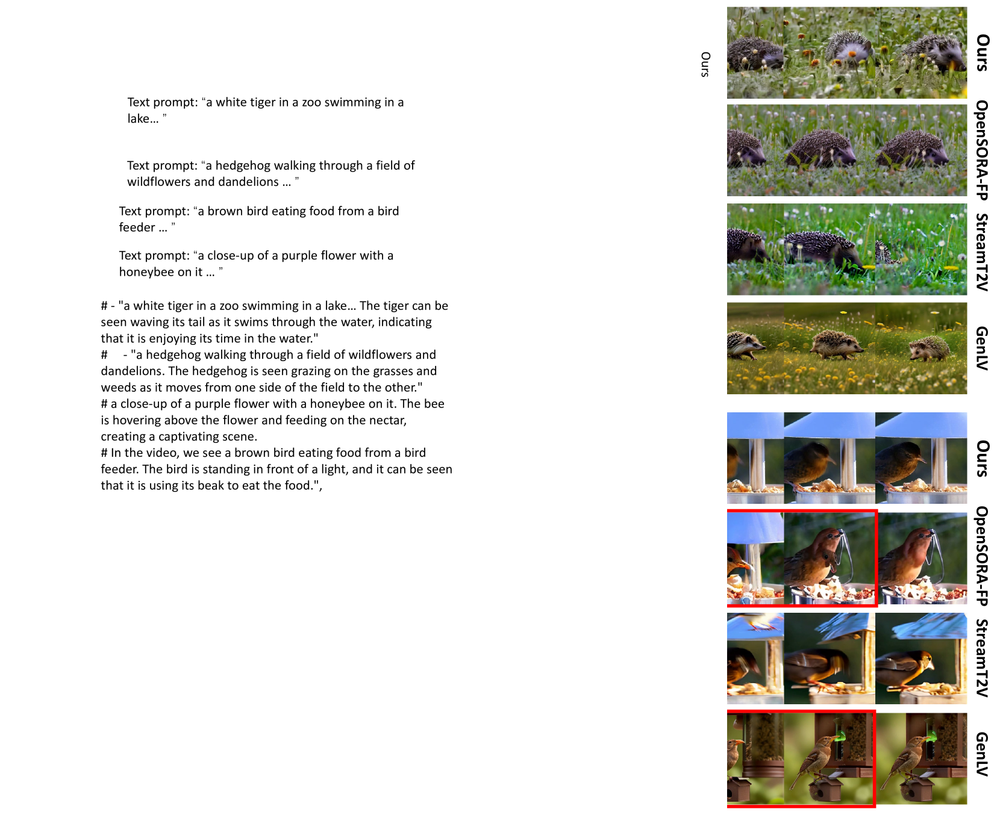
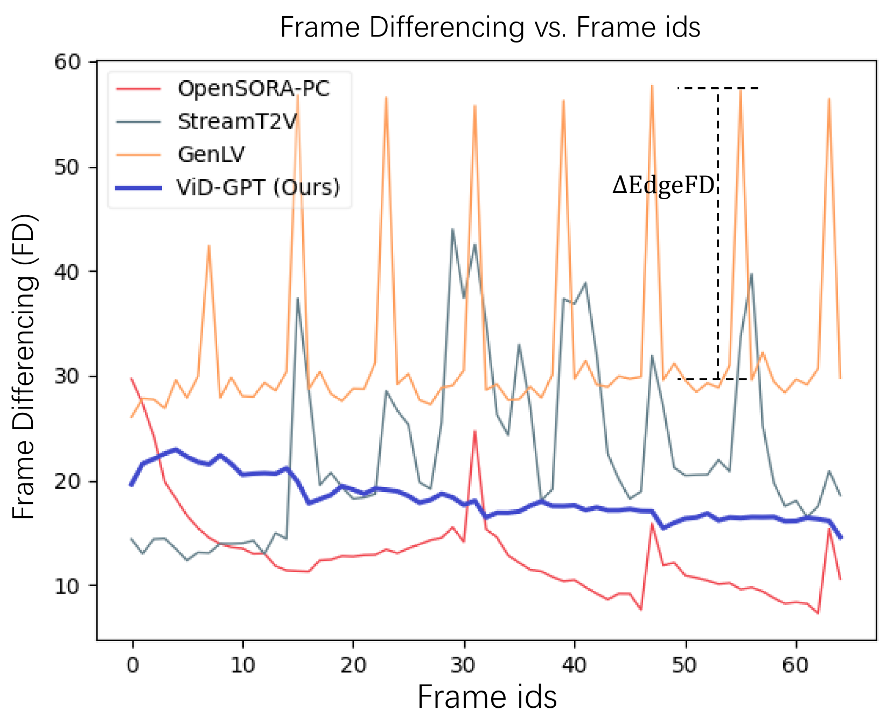
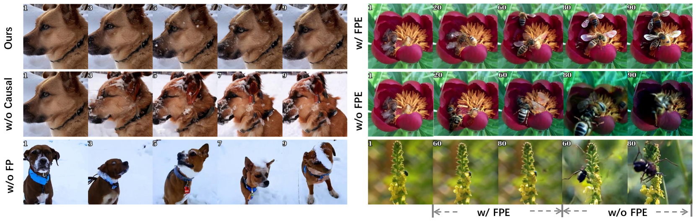
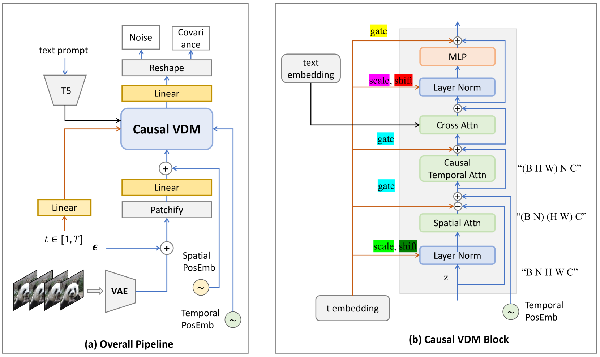

# ViD-GPT：将GPT风格的自动回归生成技术融入视频扩散模型

发布时间：2024年06月16日

`LLM应用

这篇论文主要探讨了如何将大型语言模型（LLMs）中的因果生成机制应用于视频扩散模型（VDMs）中，以改善视频生成的质量和时间一致性。通过引入因果时间注意力和kv-缓存机制，论文提出的视频扩散GPT（ViD-GPT）模型能够有效地生成时间一致的长视频，并在性能上达到了业界顶尖水平。这一应用展示了LLMs技术在视频生成领域的实际应用和改进，因此属于LLM应用分类。` `视频制作` `人工智能`

> ViD-GPT: Introducing GPT-style Autoregressive Generation in Video Diffusion Models

# 摘要

> 扩散模型的进步，使得视频生成质量显著提升，但生成时间一致的长视频依旧是一大挑战。多数视频扩散模型（VDMs）采用自回归方式，即以前一片段的最后一帧为条件生成后续片段。然而，现有方法的双向计算限制了每个自回归步骤的上下文视野，导致模型难以捕捉长期依赖。借鉴大型语言模型（LLMs）的成功，并沿用GPT（生成预训练变换器）的理念，我们将因果（单向）生成引入VDMs，利用过往帧作为提示生成未来帧。为此，我们在VDM中引入了因果时间注意力，确保每一帧都依赖于其前序帧。同时，我们将条件帧与待生成的噪声帧沿时间轴合并，以此作为提示。由此诞生的视频扩散GPT（ViD-GPT），在每个自回归步骤中，能从所有先前生成帧的合并提示中获取长期上下文。此外，我们还引入了kv-缓存机制，消除了重叠帧的冗余计算，大幅加快了推理速度。实验证明，ViD-GPT在长时间视频生成上，无论定量还是定性，均达到了业界顶尖水平。相关代码将发布于https://github.com/Dawn-LX/Causal-VideoGen。

> With the advance of diffusion models, today's video generation has achieved impressive quality. But generating temporal consistent long videos is still challenging. A majority of video diffusion models (VDMs) generate long videos in an autoregressive manner, i.e., generating subsequent clips conditioned on last frames of previous clip. However, existing approaches all involve bidirectional computations, which restricts the receptive context of each autoregression step, and results in the model lacking long-term dependencies. Inspired from the huge success of large language models (LLMs) and following GPT (generative pre-trained transformer), we bring causal (i.e., unidirectional) generation into VDMs, and use past frames as prompt to generate future frames. For Causal Generation, we introduce causal temporal attention into VDM, which forces each generated frame to depend on its previous frames. For Frame as Prompt, we inject the conditional frames by concatenating them with noisy frames (frames to be generated) along the temporal axis. Consequently, we present Video Diffusion GPT (ViD-GPT). Based on the two key designs, in each autoregression step, it is able to acquire long-term context from prompting frames concatenated by all previously generated frames. Additionally, we bring the kv-cache mechanism to VDMs, which eliminates the redundant computation from overlapped frames, significantly boosting the inference speed. Extensive experiments demonstrate that our ViD-GPT achieves state-of-the-art performance both quantitatively and qualitatively on long video generation. Code will be available at https://github.com/Dawn-LX/Causal-VideoGen.

[Arxiv](https://arxiv.org/abs/2406.10981)