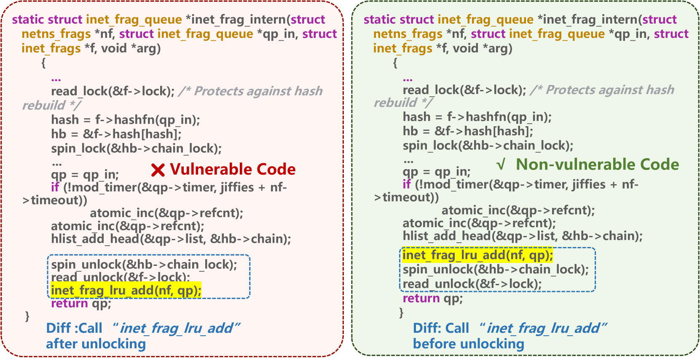
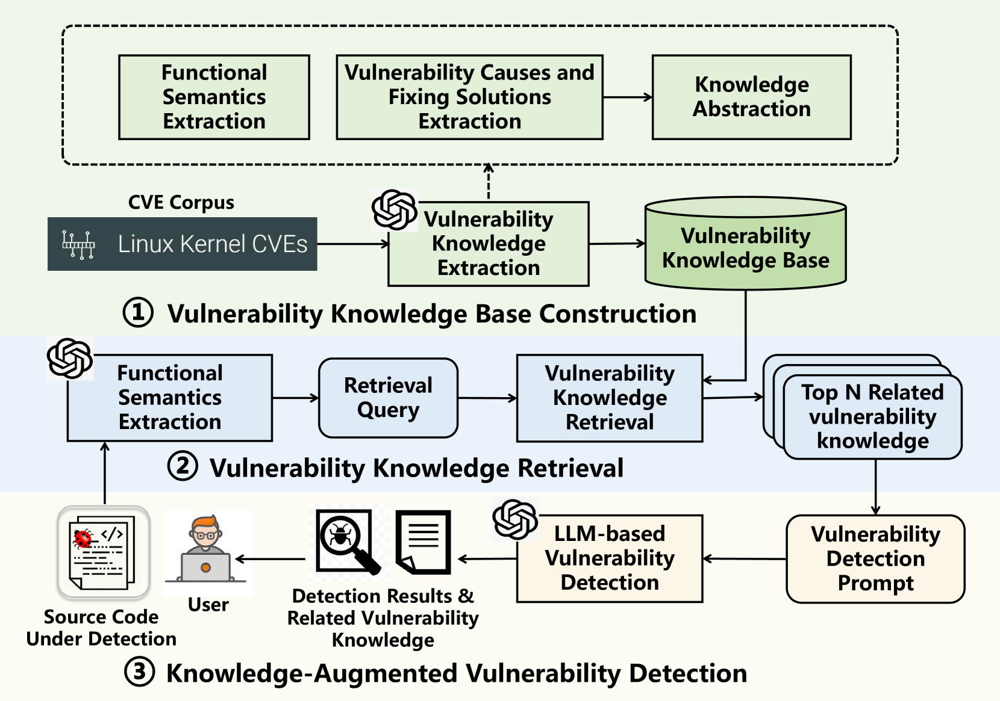
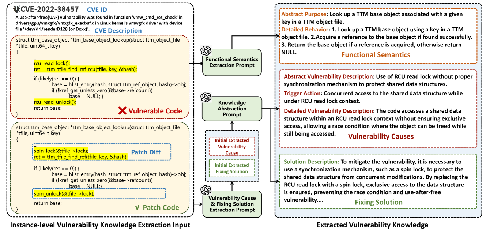
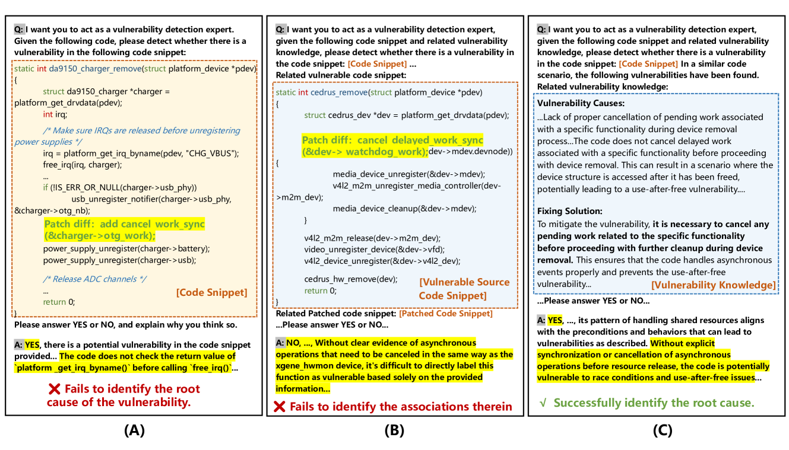
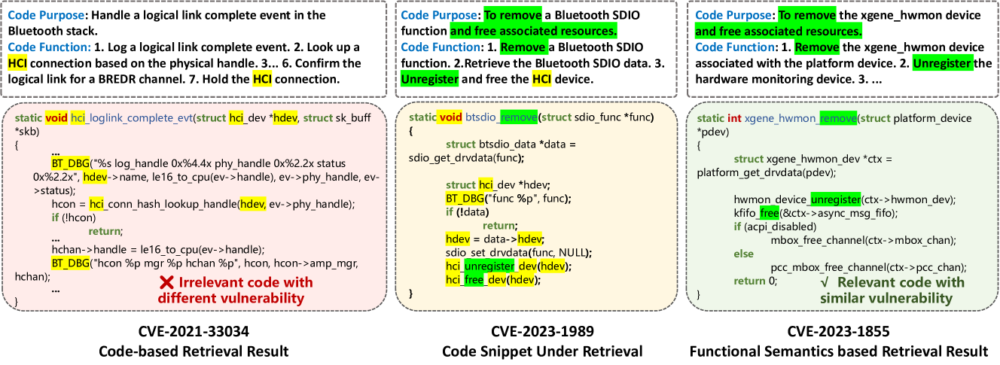

# Vul-RAG：借助知识级RAG提升LLM在漏洞检测中的效能

发布时间：2024年06月16日

`RAG

理由：这篇论文介绍了一种名为Vul-RAG的技术，它利用知识级检索增强生成框架来检测代码漏洞。这种方法涉及构建漏洞知识库、检索相关知识和使用大型语言模型（LLMs）进行推理，以识别漏洞原因及修复方案。这与RAG分类中的检索增强生成框架的概念相符，该框架通常用于增强语言模型的性能，特别是在需要特定知识检索的场景中。因此，这篇论文应归类于RAG。` `软件安全`

> Vul-RAG: Enhancing LLM-based Vulnerability Detection via Knowledge-level RAG

# 摘要

> 漏洞检测是软件质量保证的关键，而深度学习模型，特别是大型语言模型，在此领域展现出巨大潜力。我们提出的Vul-RAG技术，利用知识级检索增强生成框架，分三步精准检测代码漏洞：首先，构建漏洞知识库；其次，根据功能语义检索相关知识；最后，通过LLMs推理漏洞原因及修复方案。在PairVul基准测试中，Vul-RAG的性能显著优于其他方法，准确性和成对准确性分别提升12.96%和110%。用户研究还表明，Vul-RAG生成的漏洞知识能提供高质量解释，有效提升手动检测准确性，从0.60跃升至0.77。

> Vulnerability detection is essential for software quality assurance. In recent years, deep learning models (especially large language models) have shown promise in vulnerability detection. In this work, we propose a novel LLM-based vulnerability detection technique Vul-RAG, which leverages knowledge-level retrieval-augmented generation (RAG) framework to detect vulnerability for the given code in three phases. First, Vul-RAG constructs a vulnerability knowledge base by extracting multi-dimension knowledge via LLMs from existing CVE instances; second, for a given code snippet, Vul-RAG} retrieves the relevant vulnerability knowledge from the constructed knowledge base based on functional semantics; third, Vul-RAG leverages LLMs to check the vulnerability of the given code snippet by reasoning the presence of vulnerability causes and fixing solutions of the retrieved vulnerability knowledge. Our evaluation of Vul-RAG on our constructed benchmark PairVul shows that Vul-RAG substantially outperforms all baselines by 12.96\%/110\% relative improvement in accuracy/pairwise-accuracy. In addition, our user study shows that the vulnerability knowledge generated by Vul-RAG can serve as high-quality explanations which can improve the manual detection accuracy from 0.60 to 0.77.

[Arxiv](https://arxiv.org/abs/2406.11147)