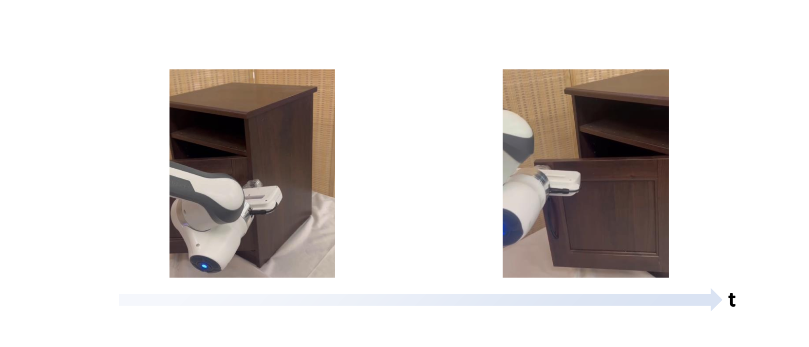

# 自主交互校正多语言大型语言模型（AIC MLLM）：助力机器人操作稳健前行

发布时间：2024年06月17日

`Agent

理由：这篇论文主要描述了一个名为自主交互修正（AIC）MLLM的系统，该系统能够通过学习和调整来改进机器人在与现实物体互动时的姿态预测和修正能力。这种系统涉及到机器人的自主决策和行为调整，符合Agent的定义，即一个能够感知环境并采取行动以达到目标的系统。此外，论文中提到的多模态大型语言模型（MLLMs）的应用，以及通过微调和反馈机制来优化机器人的交互性能，都强调了该系统作为Agent的特性。因此，这篇论文更适合归类为Agent。` `机器人技术` `自动化`

> AIC MLLM: Autonomous Interactive Correction MLLM for Robust Robotic Manipulation

# 摘要

> 机器人系统要稳定地与现实物体互动，反思并纠正错误的能力至关重要。以往研究尝试利用多模态大型语言模型（MLLMs）提升机器人性能，但多集中于高级规划修正，对低级接触姿态的调整利用不足。为此，我们开发了自主交互修正（AIC）MLLM，它借鉴以往的交互经验，精准调整姿态预测。AIC MLLM通过微调，掌握了姿态预测和反馈理解的双重能力。我们设计了两类交互式提示：视觉掩码突出不可移动部分以修正位置，文本描述指示旋转修正的方向。推理阶段，反馈信息提取模块识别失败原因，使AIC MLLM能根据相应提示灵活调整姿态。为增强稳定性，我们还推出了测试时间适应策略，让AIC MLLM更好地适应场景。实验在模拟与真实环境中验证了AIC MLLM的有效性，证明它能有效利用交互经验纠正错误。更多真实演示，请访问https://sites.google.com/view/aic-mllm。

> The ability to reflect on and correct failures is crucial for robotic systems to interact stably with real-life objects.Observing the generalization and reasoning capabilities of Multimodal Large Language Models (MLLMs), previous approaches have aimed to utilize these models to enhance robotic systems accordingly.However, these methods typically focus on high-level planning corrections using an additional MLLM, with limited utilization of failed samples to correct low-level contact poses. To address this gap, we propose an Autonomous Interactive Correction (AIC) MLLM, which makes use of previous low-level interaction experiences to correct SE(3) pose predictions. Specifically, AIC MLLM is initially fine-tuned to acquire both pose prediction and feedback prompt comprehension abilities.We carefully design two types of prompt instructions through interactions with objects: 1) visual masks to highlight unmovable parts for position correction, and 2)textual descriptions to indicate potential directions for rotation correction.During inference, a Feedback Information Extraction module is introduced to recognize the failure cause, allowing AIC MLLM to adaptively correct the pose prediction using the corresponding prompts.To further enhance manipulation stability, we devise a Test Time Adaptation strategy that enables AIC MLLM to better adapt to the current scene configuration.Finally, extensive experiments are conducted in both simulated and real-world environments to evaluate the proposed method. The results demonstrate that our AIC MLLM can efficiently correct failure samples by leveraging interaction experience prompts.Real-world demonstration can be found at https://sites.google.com/view/aic-mllm

[Arxiv](https://arxiv.org/abs/2406.11548)