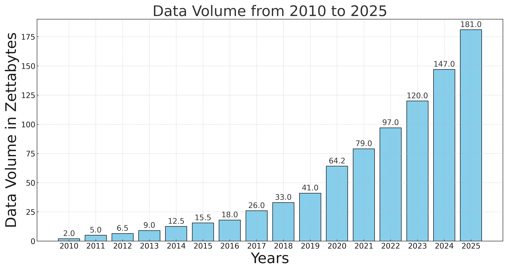
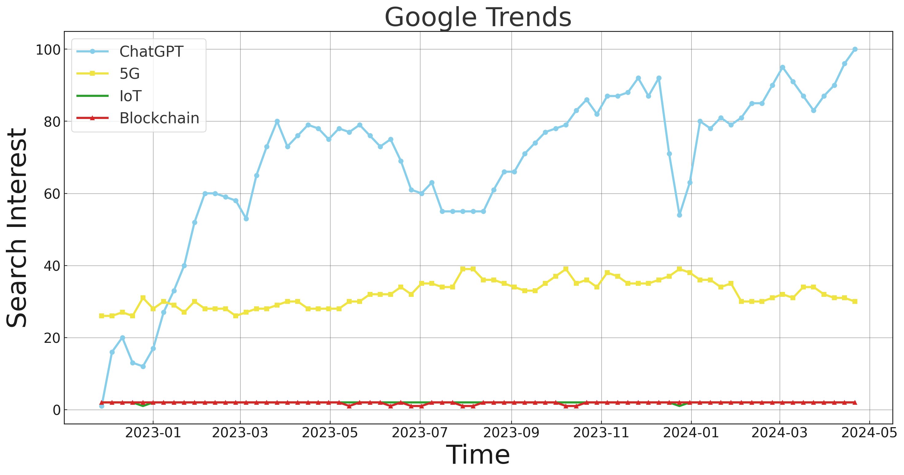
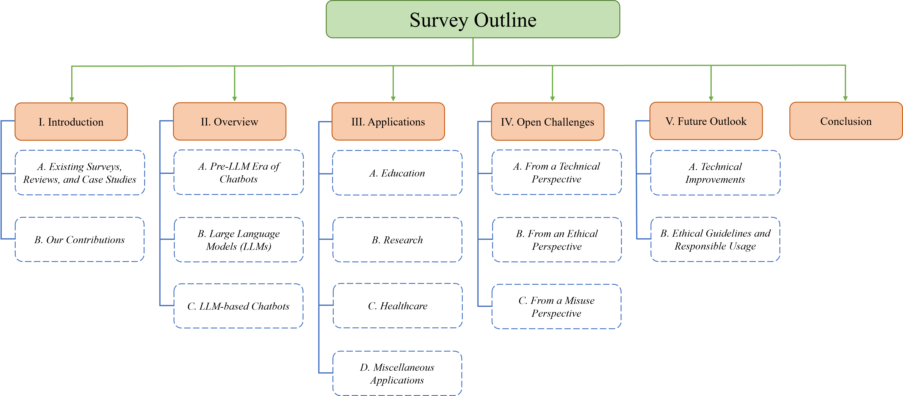
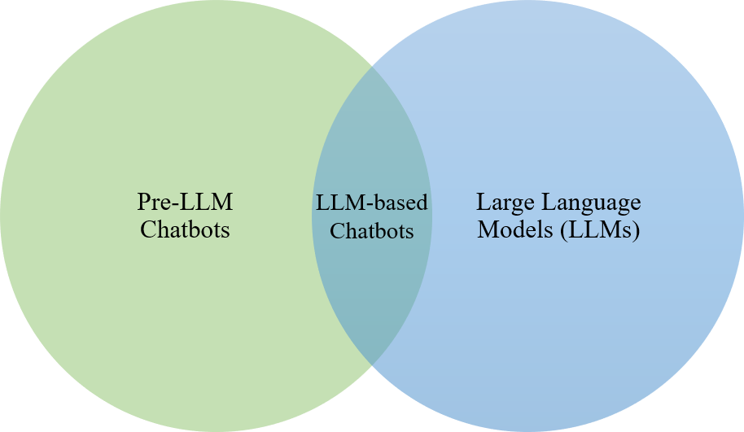
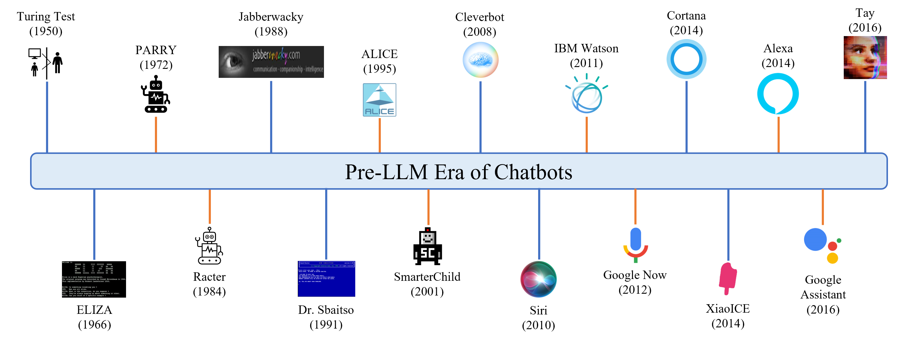
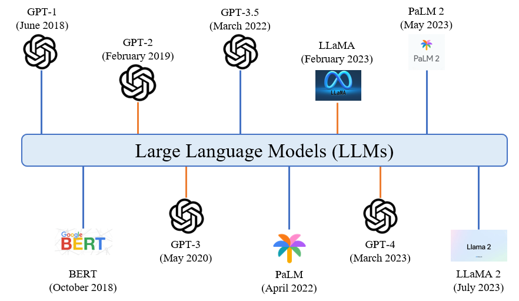
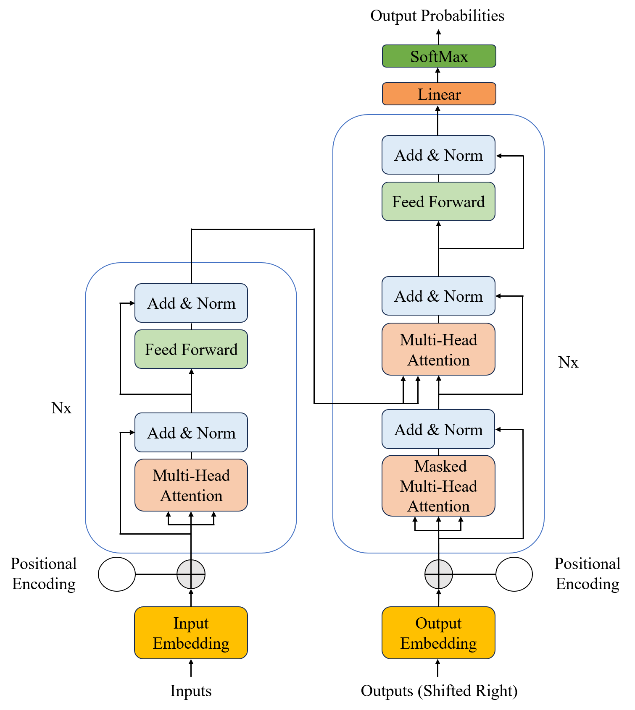
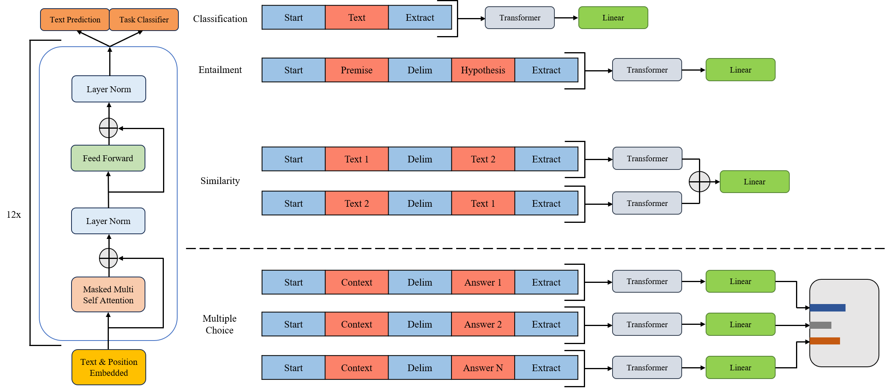
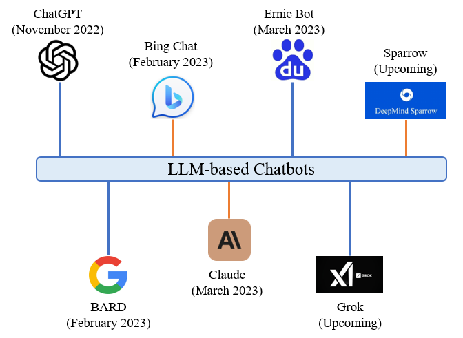
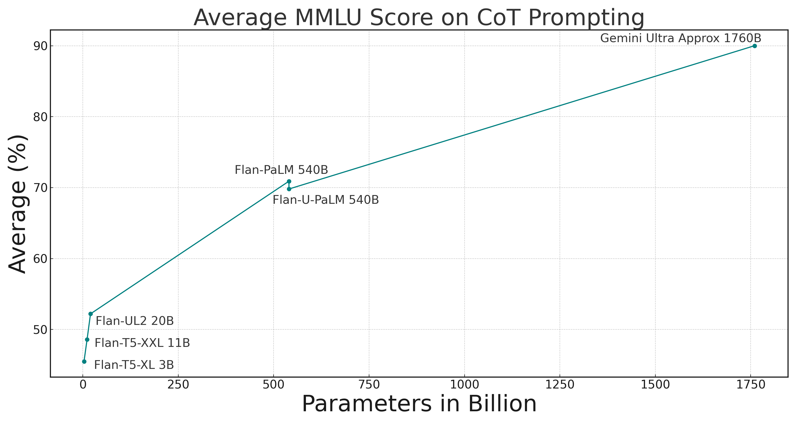

# 全面探究：基于LLM的AI聊天机器人研究综述

发布时间：2024年06月17日

`Agent

这篇论文主要关注的是基于大型语言模型（LLMs）的AI聊天机器人的发展和应用，特别是在多领域的应用。它探讨了聊天机器人的历史发展、当前状态、面临的挑战以及未来的发展方向。由于论文的核心是讨论AI聊天机器人作为对话代理的角色，以及它们如何生成新知识并应用于不同行业，因此最合适的分类是Agent。这个分类强调了聊天机器人作为智能代理的功能，它们通过与用户的交互来执行任务和提供服务。` `聊天机器人` `人工智能`

> A Complete Survey on LLM-based AI Chatbots

# 摘要

> 过去几十年，数据量的激增为数据驱动的AI技术奠定了基础。AI聊天机器人，作为对话代理，依赖大量数据训练大型语言模型（LLMs），并根据用户提示生成新知识。OpenAI的ChatGPT引领了基于LLM的聊天机器人的新标准。本文全面回顾了LLM基础聊天机器人在多领域的演变与应用。首先，我们概述了基础聊天机器人的发展历程和LLMs的演进，接着介绍了当前使用和开发中的基于LLM的聊天机器人。我们视AI聊天机器人为新知识的创造者，并探讨了其在各行业的广泛应用。随后，我们讨论了面临的挑战，包括训练LLMs的数据及生成知识的潜在滥用问题。最后，我们展望未来，探讨如何提升这些聊天机器人在多领域的效率与可靠性。通过聚焦LLM基础聊天机器人的关键进展和当前环境，本文邀请读者深入探索，思考下一代聊天机器人将如何革新对话AI领域。

> The past few decades have witnessed an upsurge in data, forming the foundation for data-hungry, learning-based AI technology. Conversational agents, often referred to as AI chatbots, rely heavily on such data to train large language models (LLMs) and generate new content (knowledge) in response to user prompts. With the advent of OpenAI's ChatGPT, LLM-based chatbots have set new standards in the AI community. This paper presents a complete survey of the evolution and deployment of LLM-based chatbots in various sectors. We first summarize the development of foundational chatbots, followed by the evolution of LLMs, and then provide an overview of LLM-based chatbots currently in use and those in the development phase. Recognizing AI chatbots as tools for generating new knowledge, we explore their diverse applications across various industries. We then discuss the open challenges, considering how the data used to train the LLMs and the misuse of the generated knowledge can cause several issues. Finally, we explore the future outlook to augment their efficiency and reliability in numerous applications. By addressing key milestones and the present-day context of LLM-based chatbots, our survey invites readers to delve deeper into this realm, reflecting on how their next generation will reshape conversational AI.

[Arxiv](https://arxiv.org/abs/2406.16937)