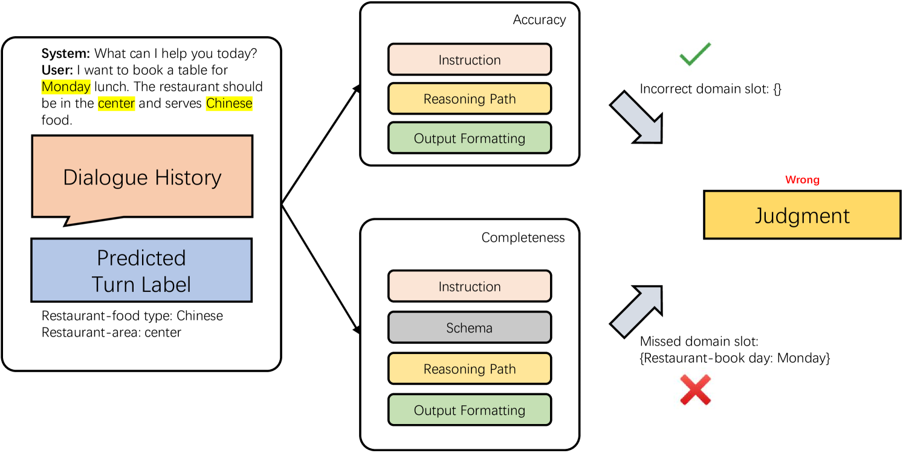
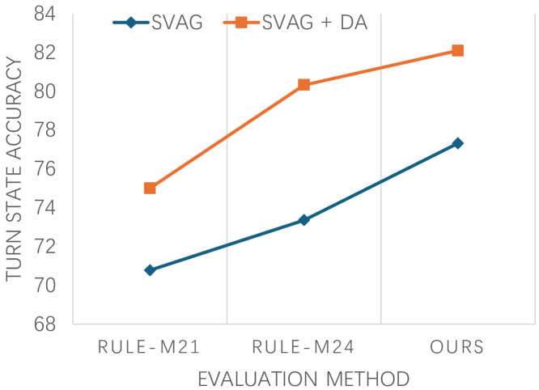
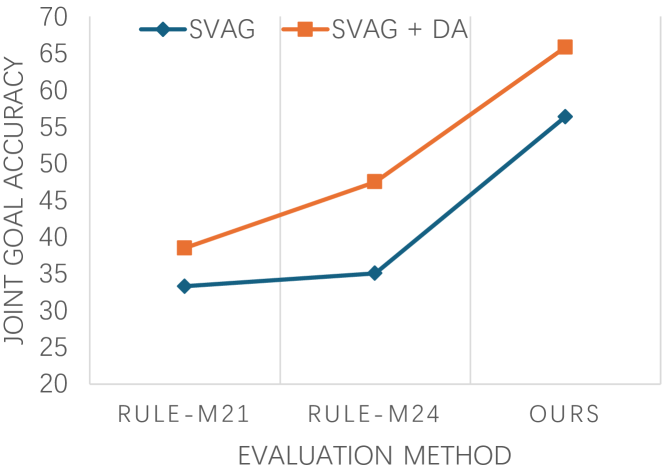

# GPT-4驱动的二维零-shot对话状态跟踪评估新方法

发布时间：2024年06月17日

`Agent

这篇论文主要关注的是对话状态跟踪（DST）的评估方法，特别是提出了一种基于GPT-4的二维零-shot评估方法。这种方法通过设计人工推理路径来增强评估的准确性，并在实验中证明了其优于现有基线。虽然涉及到了大型语言模型（LLM）的应用，但核心在于提出和验证一种新的评估方法，这种方法可以被视为一种智能代理（Agent）的行为，因为它在特定的任务（DST评估）中执行并优化了决策过程。因此，将其归类为Agent更为合适。` `对话系统`

> A Two-dimensional Zero-shot Dialogue State Tracking Evaluation Method using GPT-4

# 摘要

> 对话状态跟踪（DST）的评估通常依赖于大量标记数据，忽视了语义一致性，导致评估结果偏高。尽管大型语言模型（LLM）在自然语言处理任务的评估中已显示出潜力，但其在DST评估中的应用仍处于探索阶段。本文提出了一种基于GPT-4的二维零-shot评估方法，分别从准确性和完整性两个维度进行评估，并设计了两种人工推理路径以增强评估的准确性。实验证明，我们的方法不仅优于现有基线，而且与传统精确匹配方法保持一致。

> Dialogue state tracking (DST) is evaluated by exact matching methods, which rely on large amounts of labeled data and ignore semantic consistency, leading to over-evaluation. Currently, leveraging large language models (LLM) in evaluating natural language processing tasks has achieved promising results. However, using LLM for DST evaluation is still under explored. In this paper, we propose a two-dimensional zero-shot evaluation method for DST using GPT-4, which divides the evaluation into two dimensions: accuracy and completeness. Furthermore, we also design two manual reasoning paths in prompting to further improve the accuracy of evaluation. Experimental results show that our method achieves better performance compared to the baselines, and is consistent with traditional exact matching based methods.

[Arxiv](https://arxiv.org/abs/2406.11651)