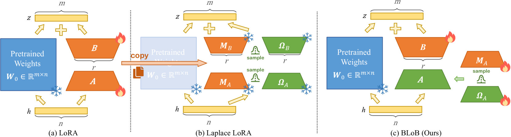
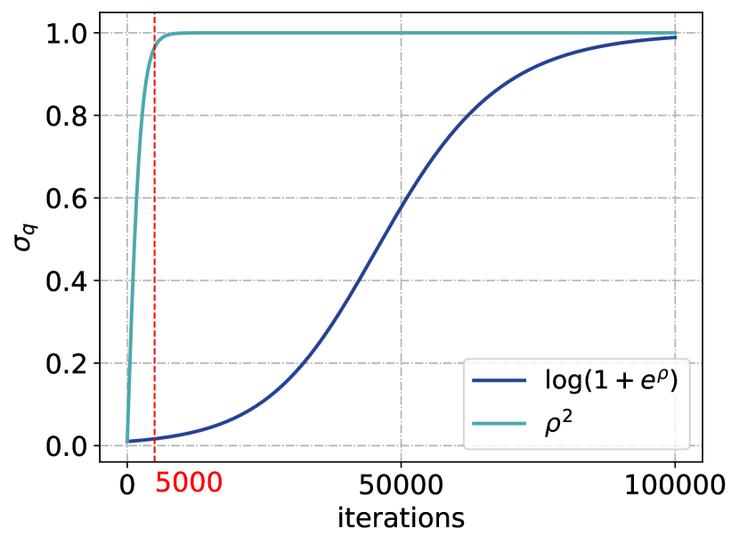
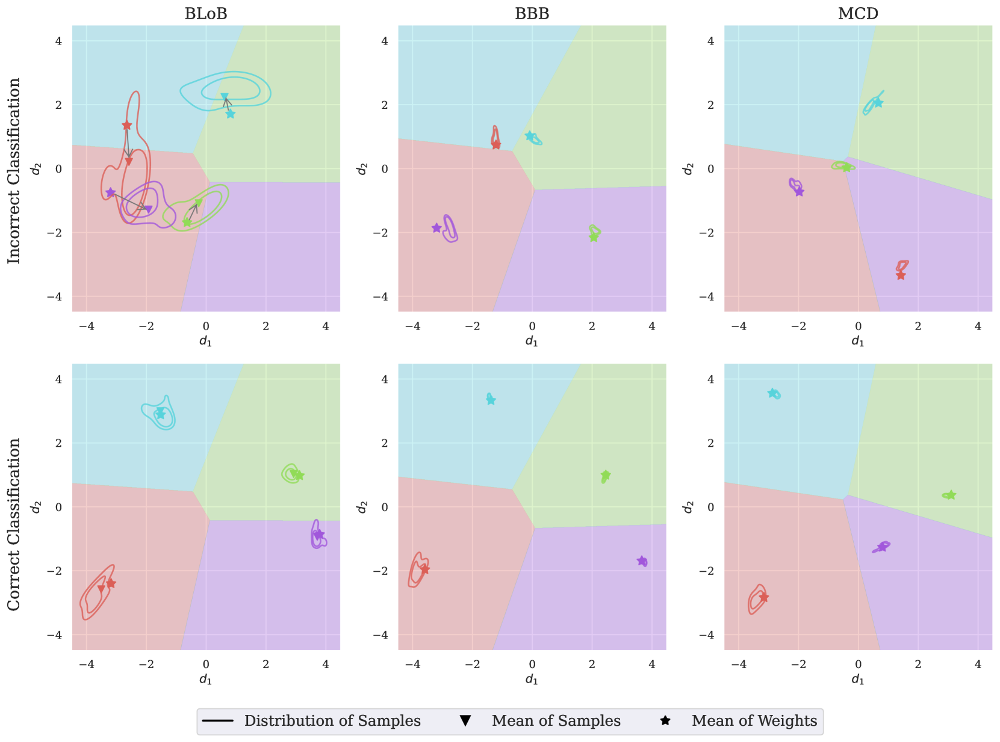

# BLoB：大型语言模型的贝叶斯低秩适应——反向传播之道

发布时间：2024年06月17日

`LLM理论

这篇论文主要探讨了大型语言模型（LLMs）在处理特定领域任务时的不确定性量化问题，并提出了一种新的算法——贝叶斯低秩适应反向传播（BLoB）。该算法旨在通过微调过程中调整模型参数的均值与协方差来提升模型的泛化能力和不确定性评估。这一研究属于对LLM理论的深入探讨，因为它关注的是模型内部机制的改进和理论上的不确定性处理，而不是直接的应用或特定的Agent行为。因此，它更适合归类于LLM理论。` `机器学习` `不确定性量化`

> BLoB: Bayesian Low-Rank Adaptation by Backpropagation for Large Language Models

# 摘要

> 大型语言模型（LLMs）在处理特定领域任务时，常因数据有限而显得过于自信。传统方法通过训练后的近似贝叶斯估计来量化不确定性，但受限于训练阶段学得的参数。本文提出了一种创新的贝叶斯低秩适应反向传播（BLoB）算法，它能在微调过程中同步调整模型参数的均值与协方差，有效提升了模型在不同数据分布下的泛化能力和不确定性评估。实证结果表明，BLoB在处理分布内与分布外数据时均表现出色。

> Large Language Models (LLMs) often suffer from overconfidence during inference, particularly when adapted to downstream domain-specific tasks with limited data. Previous work addresses this issue by employing approximate Bayesian estimation after the LLMs are trained, enabling them to quantify uncertainty. However, such post-training approaches' performance is severely limited by the parameters learned during training. In this paper, we go beyond post-training Bayesianization and propose Bayesian Low-Rank Adaptation by Backpropagation (BLoB), an algorithm that continuously and jointly adjusts both the mean and covariance of LLM parameters throughout the whole fine-tuning process. Our empirical results verify the effectiveness of BLoB in terms of generalization and uncertainty estimation, when evaluated on both in-distribution and out-of-distribution data.

[Arxiv](https://arxiv.org/abs/2406.11675)