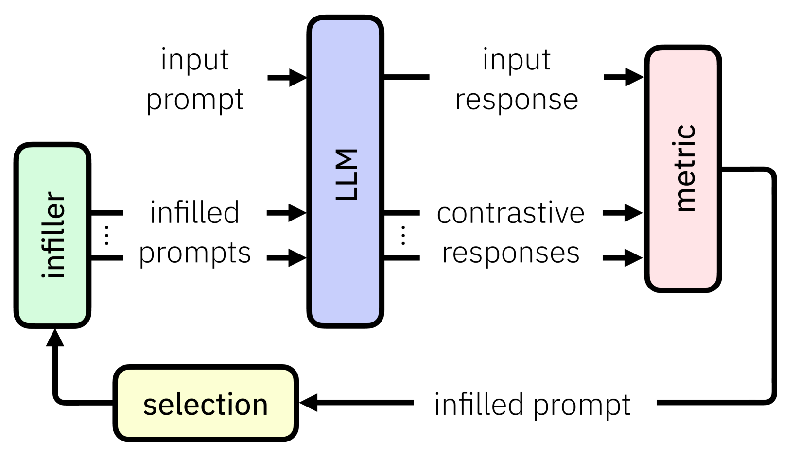
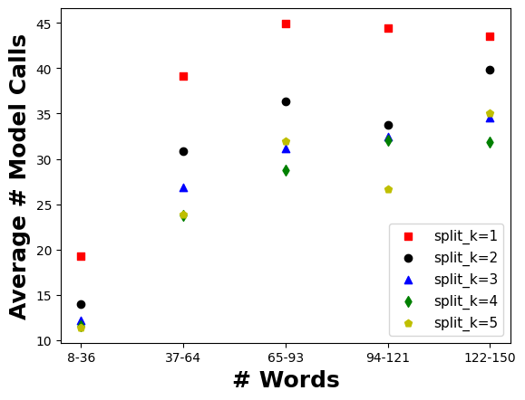
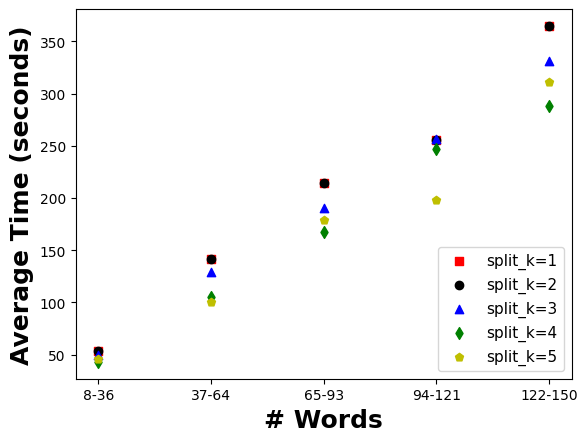

# 大型语言模型的对比解释之道：CELL模型解析

发布时间：2024年06月17日

`Agent

这篇论文主要关注的是大型语言模型（LLMs）对特定提示的响应解释问题，并提出了一种新的对比解释方法。这种方法旨在解释为何LLM对特定提示作出特定回应，而不是进行类别预测。论文中提出的两种算法（短视算法和预算算法）都是为了寻找对比解释，这些解释是通过对比不同提示下的模型响应来实现的。这种方法的核心在于理解模型在不同输入下的行为，而不是直接应用于模型的分类或生成任务。因此，这种研究更偏向于理解模型行为和决策过程，属于Agent的范畴，即研究如何理解和解释模型的行为。` `人工智能解释性`

> CELL your Model: Contrastive Explanation Methods for Large Language Models

# 摘要

> 随着黑盒深度神经网络分类模型的兴起，对其决策的解释需求日益增长。然而，对于生成式AI，如大型语言模型（LLMs），并无类别预测可解释。我们更关心的是，为何LLM对特定提示作出如此回应。本文中，我们首次提出了一种仅需黑盒/查询访问的对比解释方法，以解答此问题。我们的解释揭示，LLM之所以如此回应，是因为若提示稍有变动，LLM可能给出截然不同的答案，或与原答案相悖。关键在于，对比解释仅需一个对用户有意义的距离函数，而非特定答案的真实值表示。我们提供了两种算法以寻找对比解释：一是短视算法，虽能有效创建对比，但需多次模型调用；二是预算算法，我们的主要算法贡献，它智能地创建对比，同时遵守查询预算，适用于更长的上下文。我们在开放文本生成、自动化红队测试及解释对话退化等多样自然语言任务上，验证了这些方法的有效性。

> The advent of black-box deep neural network classification models has sparked the need to explain their decisions. However, in the case of generative AI such as large language models (LLMs), there is no class prediction to explain. Rather, one can ask why an LLM output a particular response to a given prompt. In this paper, we answer this question by proposing, to the best of our knowledge, the first contrastive explanation methods requiring simply black-box/query access. Our explanations suggest that an LLM outputs a reply to a given prompt because if the prompt was slightly modified, the LLM would have given a different response that is either less preferable or contradicts the original response. The key insight is that contrastive explanations simply require a distance function that has meaning to the user and not necessarily a real valued representation of a specific response (viz. class label). We offer two algorithms for finding contrastive explanations: i) A myopic algorithm, which although effective in creating contrasts, requires many model calls and ii) A budgeted algorithm, our main algorithmic contribution, which intelligently creates contrasts adhering to a query budget, necessary for longer contexts. We show the efficacy of these methods on diverse natural language tasks such as open-text generation, automated red teaming, and explaining conversational degradation.

[Arxiv](https://arxiv.org/abs/2406.11785)