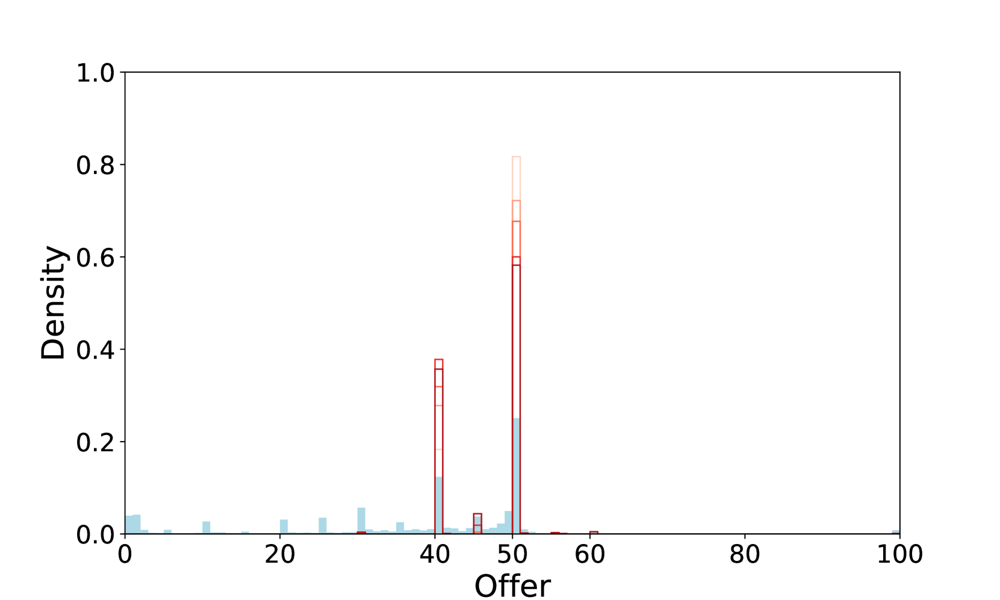

# AI的高推理能力是否足以在经济实验中模拟人类的决策行为？

发布时间：2024年06月17日

`Agent

这篇论文主要关注使用大型语言模型（LLMs）驱动的生成代理进行经济实验的模拟，以降低成本并研究代理的推理能力。研究通过多代理模拟和提示方法提升了生成代理的推理能力，并探讨了代理角色设定对模拟真实实验结果的影响。这些内容与Agent分类相关，因为它们涉及使用代理进行实验和模拟，以及代理的推理能力的提升。` `经济实验` `人工智能`

> Can AI with High Reasoning Ability Replicate Human-like Decision Making in Economic Experiments?

# 摘要

> 经济实验为研究人类决策提供了受控环境，但招募大量参与者成本高昂。随着大型语言模型（LLMs）的进步，一些研究者正尝试用LLMs驱动的生成代理进行模拟实验，以降低成本。尽管此类模拟框架尚未成型，本研究关注生成代理的推理能力，视其为构建新方法论框架的关键。通过多代理模拟和提示方法，我们提升了生成代理的推理能力，并成功复现了最后通牒游戏的经济实验结果。结果显示，代理推理能力越强，结果越接近理论预期而非实际实验。此外，设定代理的角色对于模拟真实实验结果至关重要。这些发现为未来LLMs发展中，用生成代理替代人类参与者的经济实验框架提供了宝贵见解。

> Economic experiments offer a controlled setting for researchers to observe human decision-making and test diverse theories and hypotheses; however, substantial costs and efforts are incurred to gather many individuals as experimental participants. To address this, with the development of large language models (LLMs), some researchers have recently attempted to develop simulated economic experiments using LLMs-driven agents, called generative agents. If generative agents can replicate human-like decision-making in economic experiments, the cost problem of economic experiments can be alleviated. However, such a simulation framework has not been yet established. Considering the previous research and the current evolutionary stage of LLMs, this study focuses on the reasoning ability of generative agents as a key factor toward establishing a framework for such a new methodology. A multi-agent simulation, designed to improve the reasoning ability of generative agents through prompting methods, was developed to reproduce the result of an actual economic experiment on the ultimatum game. The results demonstrated that the higher the reasoning ability of the agents, the closer the results were to the theoretical solution than to the real experimental result. The results also suggest that setting the personas of the generative agents may be important for reproducing the results of real economic experiments. These findings are valuable for the future definition of a framework for replacing human participants with generative agents in economic experiments when LLMs are further developed.

[Arxiv](https://arxiv.org/abs/2406.11426)