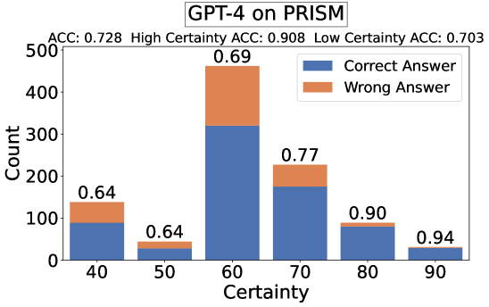
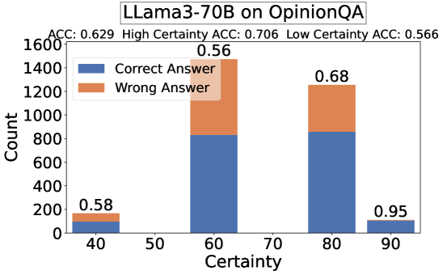

# 大型语言模型（LLM）是否具备成为个性化裁判的潜力？

发布时间：2024年06月17日

`LLM应用

这篇论文探讨了大型语言模型（LLMs）在个性化评估中的应用，特别是在评估用户偏好方面的可靠性。研究通过让LLMs依据用户角色来评估用户偏好，并引入了口头不确定性估计来提高模型的判断准确性。这一研究不仅关注了LLM在个性化评估中的有效性，还提出了改进方法，以提高LLM作为个性化评判者的可靠性。因此，这篇论文属于LLM应用类别，因为它专注于LLM在实际应用中的性能和改进，而不是理论研究或Agent、RAG的相关研究。` `个性化技术` `人工智能评估`

> Can LLM be a Personalized Judge?

# 摘要

> 随着大型语言模型（LLMs）用户基础的全球化，确保它们反映多样化的用户价值观和偏好变得至关重要。研究界对LLM个性化的兴趣日益浓厚，这令人振奋。然而，目前的研究多依赖于LLM作为评判者的方法进行评估，而未深入探讨其有效性。本文探讨了LLM作为个性化评判者的可靠性，通过让LLMs依据用户角色来评估用户偏好。研究发现，直接使用LLM作为个性化评判者的可靠性低于预期，与人类基准的匹配度低且不稳定。常用的用户角色往往过于简化，预测能力有限。为此，我们引入了口头不确定性估计，使模型能在不确定的判断中表达低信心。这一改进显著提升了高确定性样本的匹配度（超过80%）。人类评估显示，LLM作为个性化评判者的表现与第三方人类评估相当，甚至在某些高确定性样本上超越了人类。我们的研究表明，通过增强确定性的LLM个性化评判方法，为开发更可靠、可扩展的LLM个性化评估提供了新方向。

> Ensuring that large language models (LLMs) reflect diverse user values and preferences is crucial as their user bases expand globally. It is therefore encouraging to see the growing interest in LLM personalization within the research community. However, current works often rely on the LLM-as-a-Judge approach for evaluation without thoroughly examining its validity. In this paper, we investigate the reliability of LLM-as-a-Personalized-Judge, asking LLMs to judge user preferences based on personas. Our findings suggest that directly applying LLM-as-a-Personalized-Judge is less reliable than previously assumed, showing low and inconsistent agreement with human ground truth. The personas typically used are often overly simplistic, resulting in low predictive power. To address these issues, we introduce verbal uncertainty estimation into the LLM-as-a-Personalized-Judge pipeline, allowing the model to express low confidence on uncertain judgments. This adjustment leads to much higher agreement (above 80%) on high-certainty samples for binary tasks. Through human evaluation, we find that the LLM-as-a-Personalized-Judge achieves comparable performance to third-party humans evaluation and even surpasses human performance on high-certainty samples. Our work indicates that certainty-enhanced LLM-as-a-Personalized-Judge offers a promising direction for developing more reliable and scalable methods for evaluating LLM personalization.

[Arxiv](https://arxiv.org/abs/2406.11657)