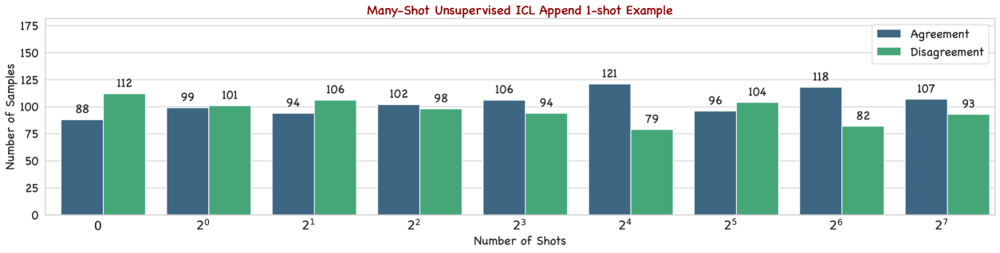

# 多示例情境学习能否助力长上下文 LLM 判断者提升判断力？视野更广，判断更精准！

发布时间：2024年06月17日

`LLM应用

这篇论文探讨了使用大型语言模型（LLMs）作为评估工具的问题，特别是关注了如何通过改进提示方法来提高评估的准确性和减少偏见。研究集中在提升GPT-4o-as-a-Judge的评分准确性，并通过实验验证了改进方法的有效性。这属于LLM的具体应用，即利用LLM进行模型评估和改进，因此归类为LLM应用。` `模型评估`

> Can Many-Shot In-Context Learning Help Long-Context LLM Judges? See More, Judge Better!

# 摘要

> 近期，利用大型语言模型（LLMs）作为评估工具来评判其他LLMs的性能已成为研究热点。但这种方法可能带来LLMs自身的偏见，从而影响评估的可靠性。为此，我们开发了两种many-shot in-context提示方法——Reinforced和Unsupervised ICL，旨在提升GPT-4o-as-a-Judge的评分准确性。通过这些提示，我们探讨了增加上下文示例数量对评估一致性和质量的影响。我们还首次发现了GPT-4o-as-a-Judge在成对比较中的符号偏差，并提出了一种简单有效的缓解策略。实验表明，GPT-4o等高级长上下文LLMs在many-shot模式下的表现显著优于zero-shot模式，并且我们的偏差缓解策略效果显著。

> Leveraging Large Language Models (LLMs) as judges for evaluating the performance of LLMs has recently garnered attention. Nonetheless, this type of approach concurrently introduces potential biases from LLMs, raising concerns about the reliability of the evaluation results. To mitigate this issue, we propose and study two versions of many-shot in-context prompts, Reinforced and Unsupervised ICL, for helping GPT-4o-as-a-Judge in single answer grading. Based on the designed prompts, we investigate the impact of scaling the number of in-context examples on the agreement and quality of the evaluation. Furthermore, we first reveal the symbol bias in GPT-4o-as-a-Judge for pairwise comparison and then propose a simple yet effective approach to mitigate it. Experimental results show that advanced long-context LLMs, such as GPT-4o, perform better in the many-shot regime than in the zero-shot regime. Meanwhile, the experimental results further verify the effectiveness of the symbol bias mitigation approach.

[Arxiv](https://arxiv.org/abs/2406.11629)