# ChildDiffusion：借助稳定扩散与大型语言模型，我们开启了生成式AI与可控增强技术在儿童面部数据领域的无限可能。

发布时间：2024年06月17日

`Agent

理由：该论文介绍了一种名为ChildDiffusion的高级框架，该框架能够生成逼真的儿童面部图像，并通过文本提示和大型语言模型的指导进行智能增强。这个框架可以被视为一个智能Agent，因为它能够根据输入的文本提示执行任务（生成图像），并且能够适应不同的机器学习任务。此外，它还涉及到数据隐私问题的处理，这进一步强调了其作为Agent的功能，即在遵守伦理和隐私规定的同时执行任务。因此，这篇论文更适合归类为Agent。` `儿童安全` `机器学习`

> ChildDiffusion: Unlocking the Potential of Generative AI and Controllable Augmentations for Child Facial Data using Stable Diffusion and Large Language Models

# 摘要

> 本研究提出了一种名为ChildDiffusion的高级框架，能够生成逼真的儿童面部图像，并通过简短文本提示、大型语言模型的详细指导以及文本控制的图像转换技术，在儿童面部数据上实现智能增强。这一框架不仅能够生成包含多种特征的儿童面部图像，还能有效应对儿童数据隐私问题，适用于多种机器学习任务。我们通过开放源代码，提供了包含2.5k样本的五类儿童种族数据，并通过严格的测试验证了其有效性，进一步优化了Yolo架构以识别和分类儿童种族。

> In this research work we have proposed high-level ChildDiffusion framework capable of generating photorealistic child facial samples and further embedding several intelligent augmentations on child facial data using short text prompts, detailed textual guidance from LLMs, and further image to image transformation using text guidance control conditioning thus providing an opportunity to curate fully synthetic large scale child datasets. The framework is validated by rendering high-quality child faces representing ethnicity data, micro expressions, face pose variations, eye blinking effects, facial accessories, different hair colours and styles, aging, multiple and different child gender subjects in a single frame. Addressing privacy concerns regarding child data acquisition requires a comprehensive approach that involves legal, ethical, and technological considerations. Keeping this in view this framework can be adapted to synthesise child facial data which can be effectively used for numerous downstream machine learning tasks. The proposed method circumvents common issues encountered in generative AI tools, such as temporal inconsistency and limited control over the rendered outputs. As an exemplary use case we have open-sourced child ethnicity data consisting of 2.5k child facial samples of five different classes which includes African, Asian, White, South Asian/ Indian, and Hispanic races by deploying the model in production inference phase. The rendered data undergoes rigorous qualitative as well as quantitative tests to cross validate its efficacy and further fine-tuning Yolo architecture for detecting and classifying child ethnicity as an exemplary downstream machine learning task.

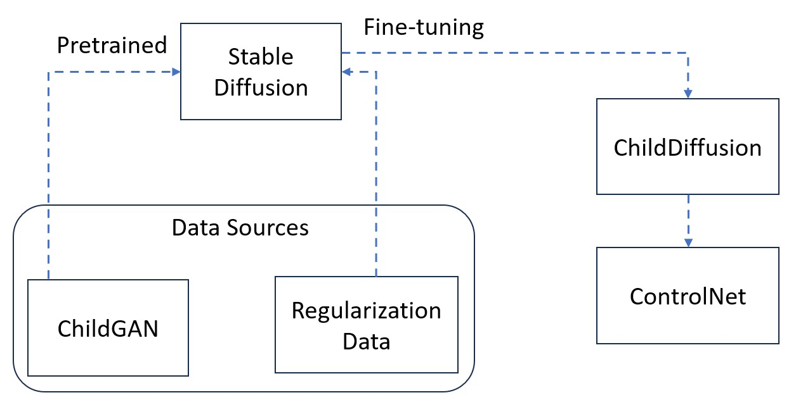

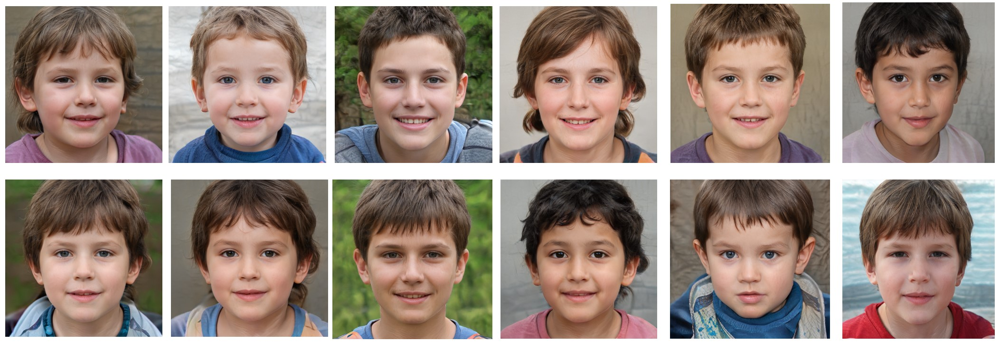

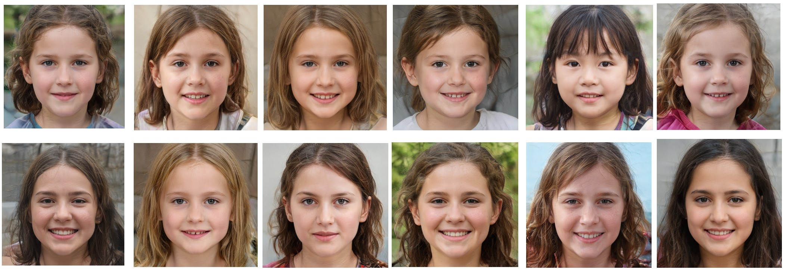

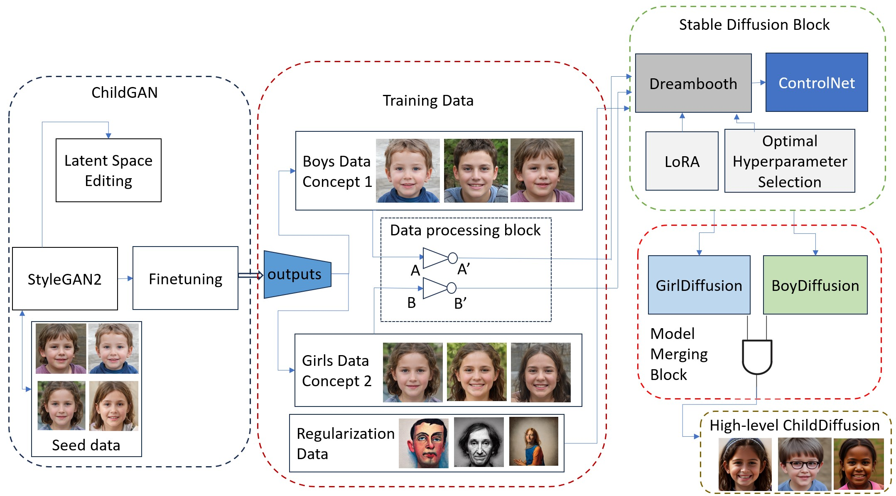

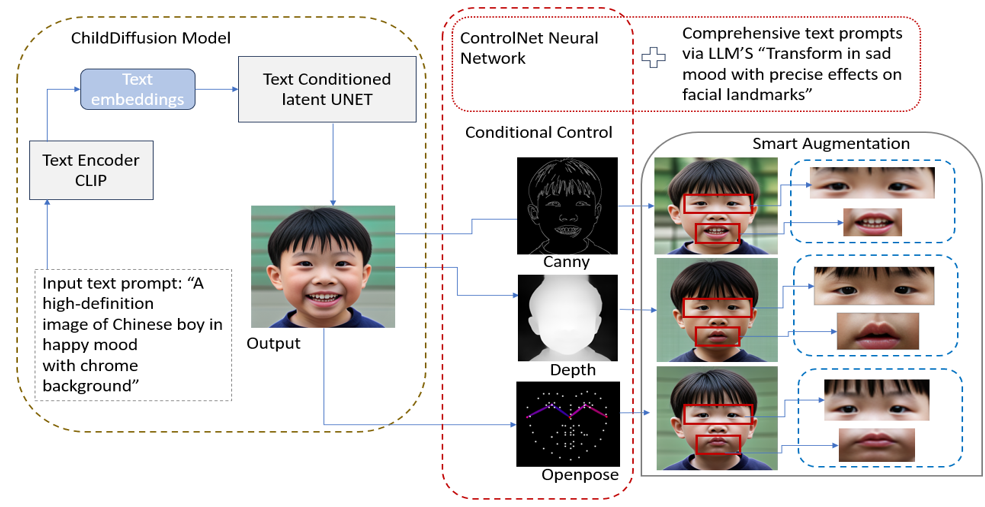

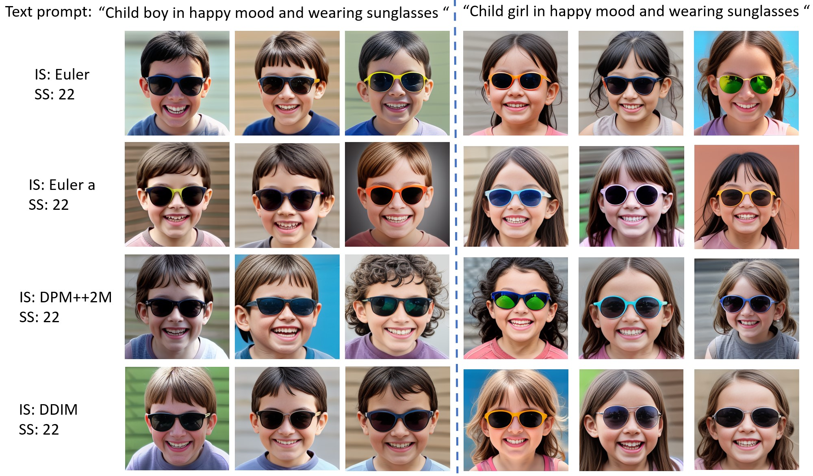

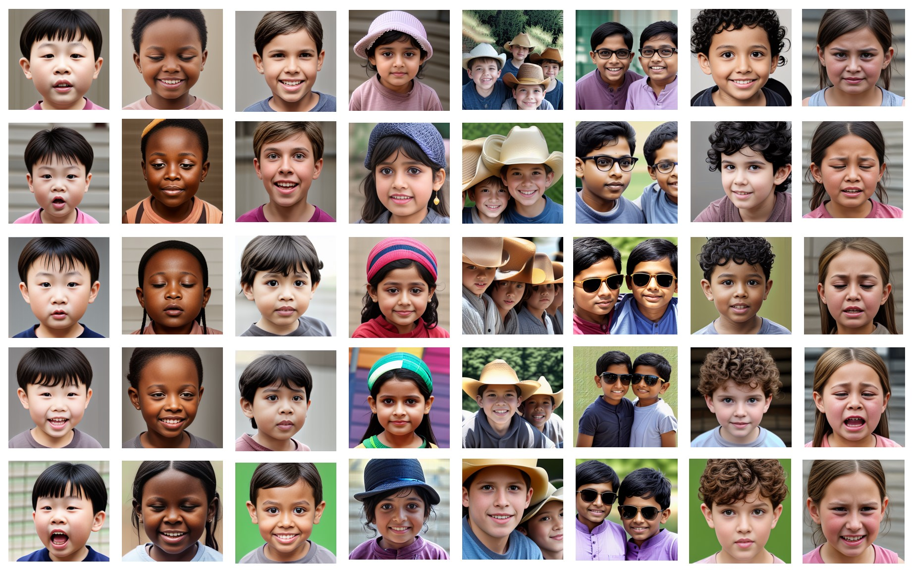

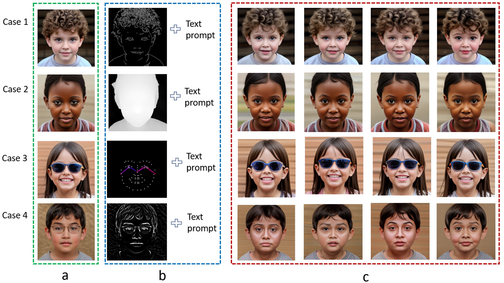

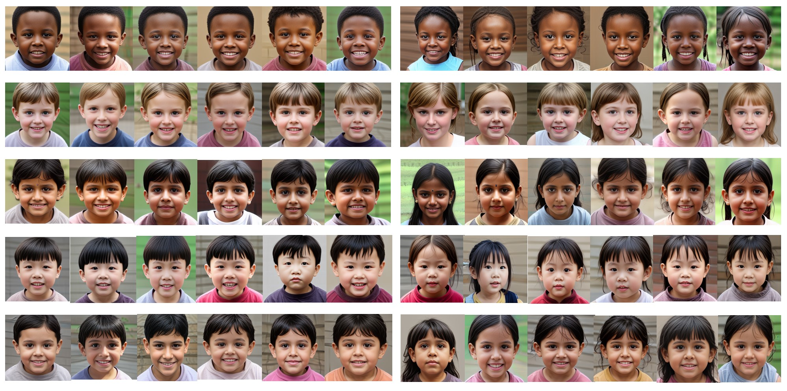

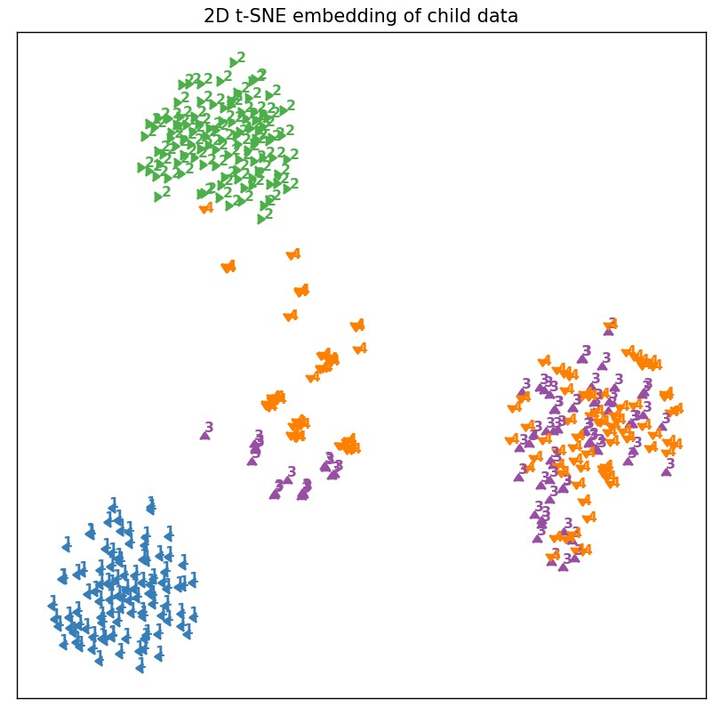

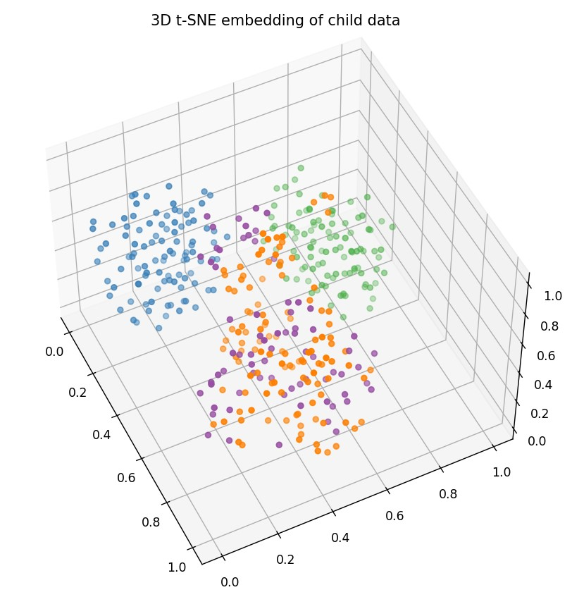

[Arxiv](https://arxiv.org/abs/2406.11592)