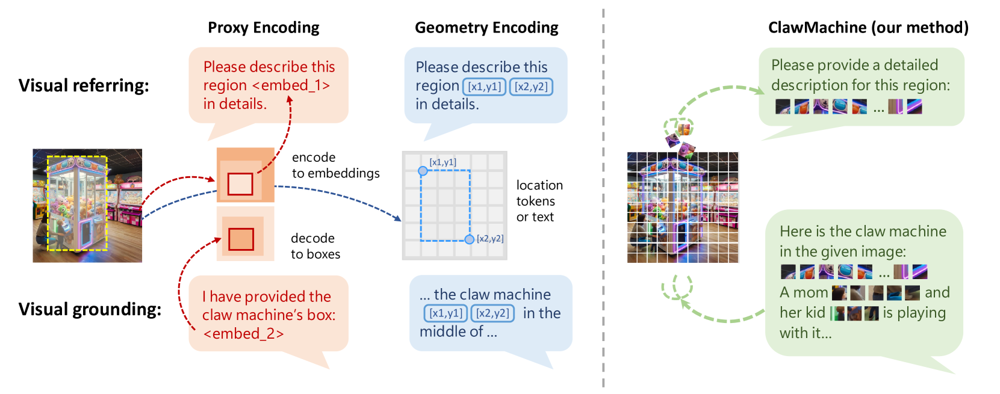
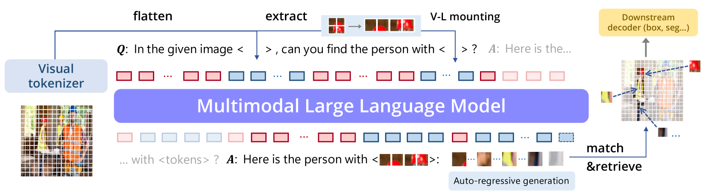
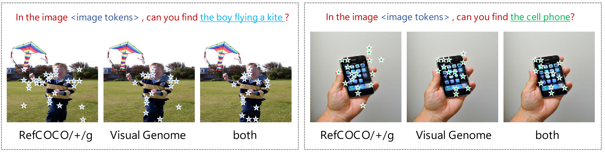
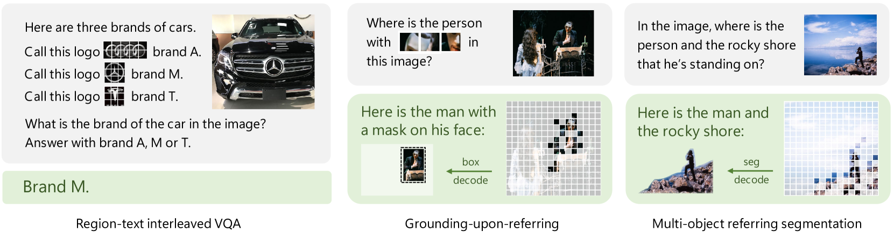
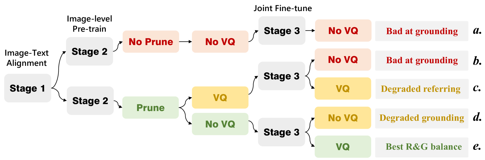

# ClawMachine：捕捉视觉令牌，作为实体用于指称与定位

发布时间：2024年06月17日

`Agent

理由：这篇论文介绍了一种新的方法（ClawMachine），用于处理多模态大型语言模型（MLLMs）中的视觉与语言概念融合问题。这种方法通过直接使用视觉令牌表示实体，简化了模型训练的复杂性，并有效地整合了视觉参照任务。虽然这种方法涉及到了语言模型的应用，但其核心在于开发一个能够处理多模态输入的“代理”或“智能体”，即一个能够理解和处理视觉和语言信息的系统。因此，将其归类为Agent更为合适。` `计算机视觉`

> ClawMachine: Fetching Visual Tokens as An Entity for Referring and Grounding

# 摘要

> 多模态大型语言模型（MLLMs）的核心挑战在于精细地融合视觉与语言概念。我们专注于为指称和定位等任务编码视觉参照信息。现有方法如代理编码和几何编码，虽能通过额外语法定位物体，却增加了模型训练的复杂性。本研究推出的ClawMachine，采用直接以视觉令牌表示实体的新策略，无需额外语法即可统一视觉参照任务的输入与输出。基于联合视觉-语言词汇，ClawMachine将这些任务整合为自回归模式，并采用单一解码器架构进行学习。实验表明，ClawMachine不仅在视觉指称和定位任务上表现出色，且对训练数据的需求降低，更展现了整合多源信息进行复杂视觉推理的天然优势，这是以往MLLMs难以企及的。

> An essential topic for multimodal large language models (MLLMs) is aligning vision and language concepts at a finer level. In particular, we devote efforts to encoding visual referential information for tasks such as referring and grounding. Existing methods, including proxy encoding and geometry encoding, incorporate additional syntax to encode the object's location, bringing extra burdens in training MLLMs to communicate between language and vision. This study presents ClawMachine, offering a new methodology that notates an entity directly using the visual tokens. It allows us to unify the prompt and answer of visual referential tasks without additional syntax. Upon a joint vision-language vocabulary, ClawMachine unifies visual referring and grounding into an auto-regressive format and learns with a decoder-only architecture. Experiments validate that our model achieves competitive performance across visual referring and grounding tasks with a reduced demand for training data. Additionally, ClawMachine demonstrates a native ability to integrate multi-source information for complex visual reasoning, which prior MLLMs can hardly perform without specific adaptions.

[Arxiv](https://arxiv.org/abs/2406.11327)