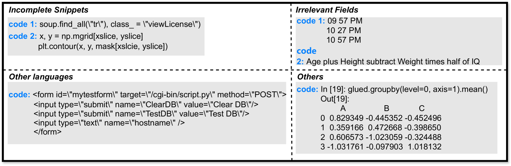

# CoSQA+：借助匹配代码，优化代码搜索数据集

发布时间：2024年06月17日

`LLM应用

这篇论文主要介绍了如何利用大型语言模型（LLMs）来改进语义代码搜索的数据集，并通过自动配对、筛选及代码生成来提高数据集的质量。此外，论文还提出了一个新的评估指标 MMRR，用于一对多代码搜索的评估。这些应用层面的改进和创新直接关联到LLM的实际应用，因此将其归类为LLM应用。` `软件工程` `代码搜索`

> CoSQA+: Enhancing Code Search Dataset with Matching Code

# 摘要

> 语义代码搜索旨在通过自然语言查询找到匹配的代码，对提升软件工程效率至关重要。然而，现有数据集存在缺陷：查询不真实、代码不匹配，且常采用一对一配对，忽略了查询可能对应多段有效代码的现实。为此，我们推出了 CoSQA+，它结合了来自 CoSQA 的高质量查询与多段匹配代码。我们从多个渠道搜集代码候选，并利用 LLMs 自动完成配对、筛选及代码生成。实验证明，CoSQA+ 的质量超越了 CoSQA，训练出的模型性能更佳。我们还创新性地提出了 MMRR 指标，用于一对多代码搜索的评估。相关代码和数据已公开在 GitHub 上。

> Semantic code search, retrieving code that matches a given natural language query, is an important task to improve productivity in software engineering. Existing code search datasets are problematic: either using unrealistic queries, or with mismatched codes, and typically using one-to-one query-code pairing, which fails to reflect the reality that a query might have multiple valid code matches. This paper introduces CoSQA+, pairing high-quality queries (reused from CoSQA) with multiple suitable codes. We collect code candidates from diverse sources and form candidate pairs by pairing queries with these codes. Utilizing the power of large language models (LLMs), we automate pair annotation, filtering, and code generation for queries without suitable matches. Through extensive experiments, CoSQA+ has demonstrated superior quality over CoSQA. Models trained on CoSQA+ exhibit improved performance. Furthermore, we propose a new metric Mean Multi-choice Reciprocal Rank (MMRR), to assess one-to-N code search performance. We provide the code and data at https://github.com/DeepSoftwareAnalytics/CoSQA_Plus.

[Arxiv](https://arxiv.org/abs/2406.11589)