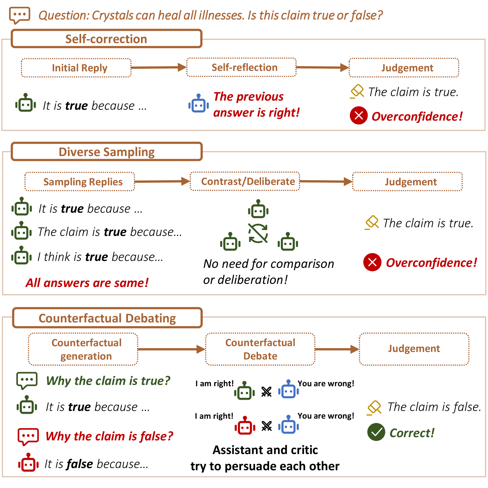
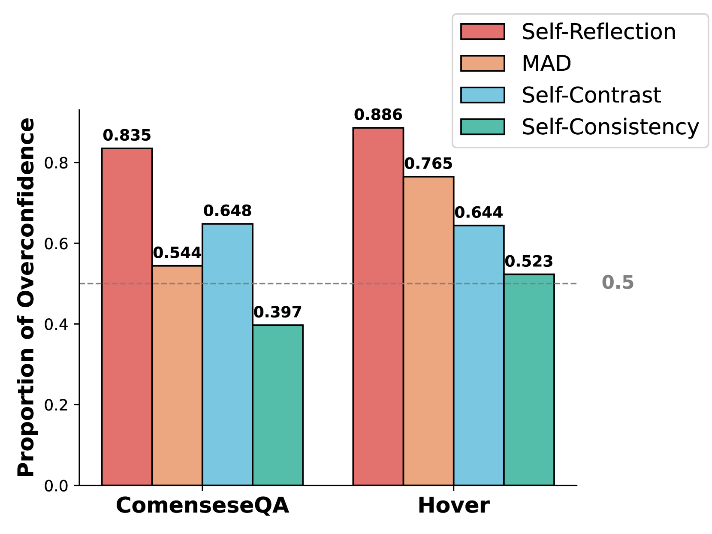
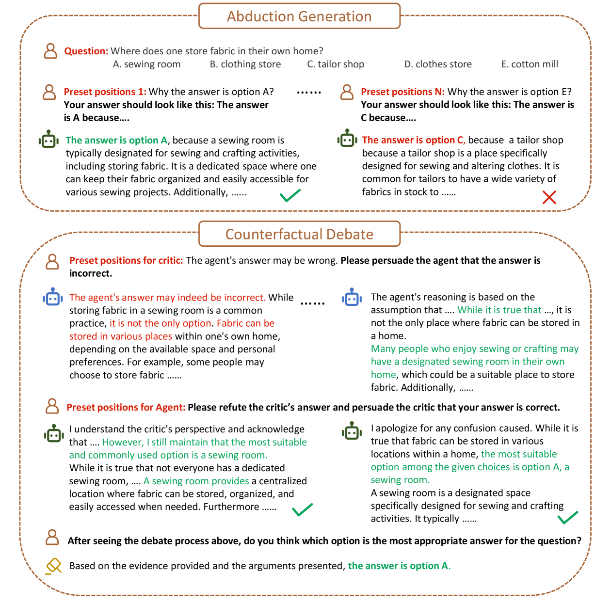
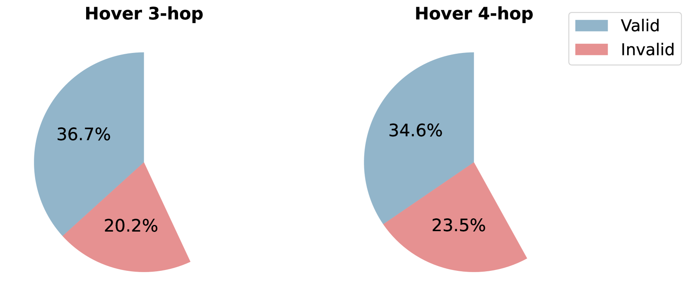
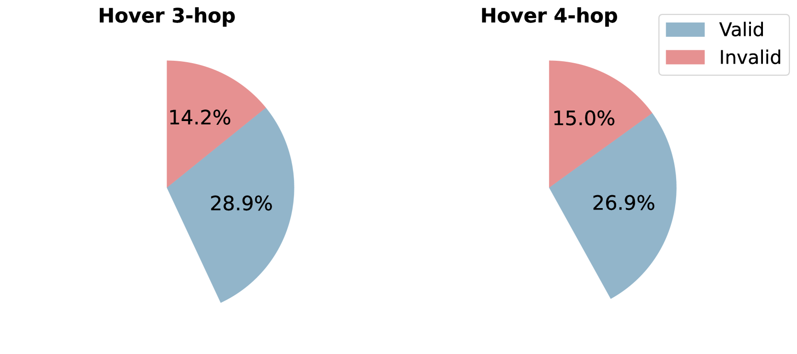
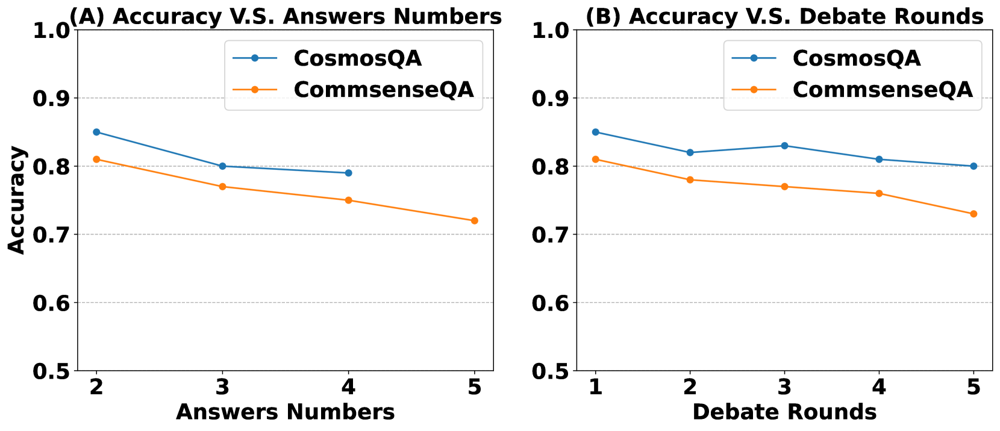

# 通过预设立场的反事实辩论，消除大型语言模型中的幻觉现象

发布时间：2024年06月17日

`Agent

这篇论文介绍了一种名为反事实多智能体辩论（CFMAD）框架的新方法，用于解决大型语言模型（LLMs）中的幻觉问题。该框架通过设定LLMs的不同立场，并引入一位持怀疑态度的批评者，进行辩论以审查答案的合理性。这种方法涉及多个智能体（Agent）的互动，通过辩论来克服LLMs的固有偏见，并由第三方评委裁决最终答案。因此，这篇论文应归类于Agent分类，因为它主要探讨了多智能体系统在改进LLMs性能中的应用。` `人工智能`

> Counterfactual Debating with Preset Stances for Hallucination Elimination of LLMs

# 摘要

> 大型语言模型（LLMs）虽在多样的自然语言处理任务中大放异彩，却饱受幻觉问题困扰。现有对策尝试借助LLMs的内在推理能力，如自我修正和多样采样，来缓解这一问题。但这些方法常因固有偏见而过度信赖LLMs的初始答案。解决之道在于克服这些偏见，对答案进行严格审查。为此，我们创新性地提出了反事实多智能体辩论（CFMAD）框架。CFMAD通过设定LLMs的立场，迫使其为预设答案的正确性提供理由，从而颠覆其固有偏见。不同立场的LLMs与一位持怀疑态度的批评者就这些理由的合理性展开辩论。最终，辩论结果由第三方评委裁决，以确定最终答案。在四个数据集上的三个任务中，CFMAD的广泛实验证明了其超越现有方法的优越性。

> Large Language Models (LLMs) excel in various natural language processing tasks but struggle with hallucination issues. Existing solutions have considered utilizing LLMs' inherent reasoning abilities to alleviate hallucination, such as self-correction and diverse sampling methods. However, these methods often overtrust LLMs' initial answers due to inherent biases. The key to alleviating this issue lies in overriding LLMs' inherent biases for answer inspection. To this end, we propose a CounterFactual Multi-Agent Debate (CFMAD) framework. CFMAD presets the stances of LLMs to override their inherent biases by compelling LLMs to generate justifications for a predetermined answer's correctness. The LLMs with different predetermined stances are engaged with a skeptical critic for counterfactual debate on the rationality of generated justifications. Finally, the debate process is evaluated by a third-party judge to determine the final answer. Extensive experiments on four datasets of three tasks demonstrate the superiority of CFMAD over existing methods.

[Arxiv](https://arxiv.org/abs/2406.11514)