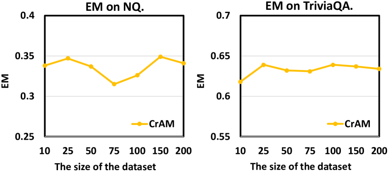

# CrAM：大型语言模型中对抗错误信息的可信度感知注意力修正机制

发布时间：2024年06月17日

`RAG

这篇论文主要关注的是RAG（Retrieval-Augmented Generation）模型的改进，特别是通过引入可信度感知机制来减少外部文档中错误信息对大型语言模型输出的影响。论文中提出的“可信度感知RAG”和“可信度感知注意力修改（CrAM）”方法，旨在提高模型对文档可信度的敏感性，从而优化模型的输出质量。这一研究方向属于对现有RAG模型的改进和优化，因此应归类为RAG。` `问答系统`

> CrAM: Credibility-Aware Attention Modification in LLMs for Combating Misinformation in RAG

# 摘要

> 通过参考外部文档，RAG能有效减少大型语言模型（LLMs）的幻觉问题。但外部文档中的错误信息可能误导模型输出。为此，我们提出了“可信度感知RAG”，让LLMs根据文档可信度自动调整其影响，以抵御错误信息。我们开发了可信度感知注意力修改（CrAM），这一方法能识别并调整LLMs中关键注意力头的分数，依据文档可信度，降低不可信文档的影响。实验结果显示，在Natural Questions和TriviaQA数据集上，使用Llama2-13B、Llama3-8B和Qwen-7B模型，CrAM使RAG性能提升了超过20%，甚至超越了传统的监督微调方法。

> Retrieval-Augmented Generation (RAG) can alleviate hallucinations of Large Language Models (LLMs) by referencing external documents. However, the misinformation in external documents may mislead LLMs' generation. To address this issue, we explore the task of "credibility-aware RAG", in which LLMs automatically adjust the influence of retrieved documents based on their credibility scores to counteract misinformation. To this end, we introduce a plug-and-play method named $\textbf{Cr}$edibility-aware $\textbf{A}$ttention $\textbf{M}$odification (CrAM). CrAM identifies influential attention heads in LLMs and adjusts their attention scores based on the credibility of the documents, thereby reducing the impact of low-credibility documents. Experiments on Natual Questions and TriviaQA using Llama2-13B, Llama3-8B, and Qwen-7B show that CrAM improves the RAG performance of LLMs against misinformation pollution by over 20%, even surpassing supervised fine-tuning methods.

[Arxiv](https://arxiv.org/abs/2406.11497)