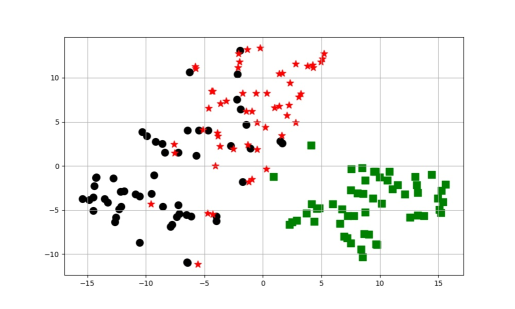
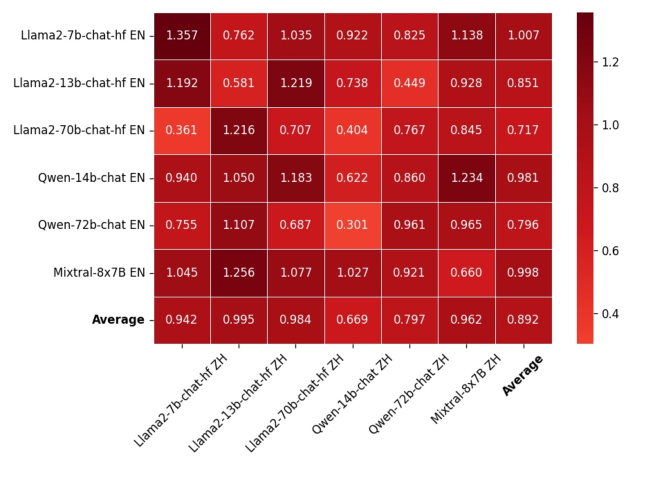

# LLM 的文化价值差异体现在提示、语言和模型大小上。

发布时间：2024年06月17日

`LLM应用` `人工智能`

> Cultural Value Differences of LLMs: Prompt, Language, and Model Size

# 摘要

> 本研究探索了大型语言模型 (LLM) 在文化价值观展现上的行为模式，涉及问题顺序、提示语言和模型大小等变量。实验发现，LLM 能灵活展现多样文化价值观，且存在以下有趣现象：(i) 单一语言提示下，LLM 的文化价值观表现较为一致；(ii) 提示语言如中文或英文，能显著影响文化价值观的表达，同一问题在不同语言中询问同一模型，会得到不同的文化价值观回应；(iii) 模型大小差异（如 Llama2 的 7B、13B 和 70B 版本）比模型类型差异（如 Llama2 与 Mixtral）对文化价值观展现的影响更为显著。实验结果表明，LLM 的查询语言和模型大小是造成文化价值观差异的关键因素。

> Our study aims to identify behavior patterns in cultural values exhibited by large language models (LLMs). The studied variants include question ordering, prompting language, and model size. Our experiments reveal that each tested LLM can efficiently behave with different cultural values. More interestingly: (i) LLMs exhibit relatively consistent cultural values when presented with prompts in a single language. (ii) The prompting language e.g., Chinese or English, can influence the expression of cultural values. The same question can elicit divergent cultural values when the same LLM is queried in a different language. (iii) Differences in sizes of the same model (e.g., Llama2-7B vs 13B vs 70B) have a more significant impact on their demonstrated cultural values than model differences (e.g., Llama2 vs Mixtral). Our experiments reveal that query language and model size of LLM are the main factors resulting in cultural value differences.

[Arxiv](https://arxiv.org/abs/2407.16891)