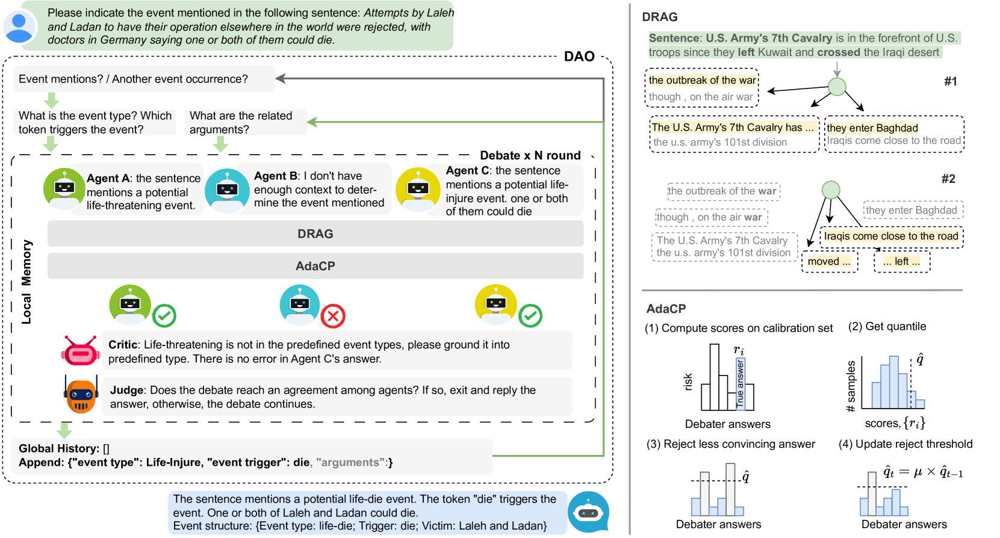
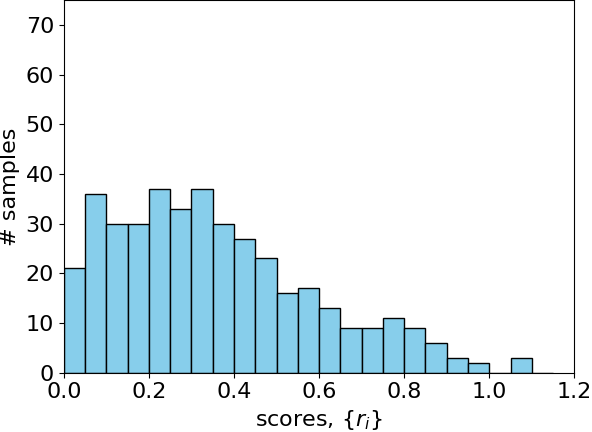
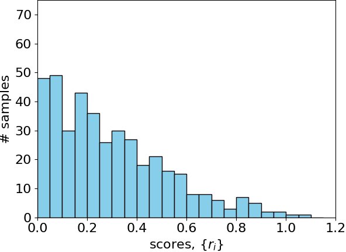
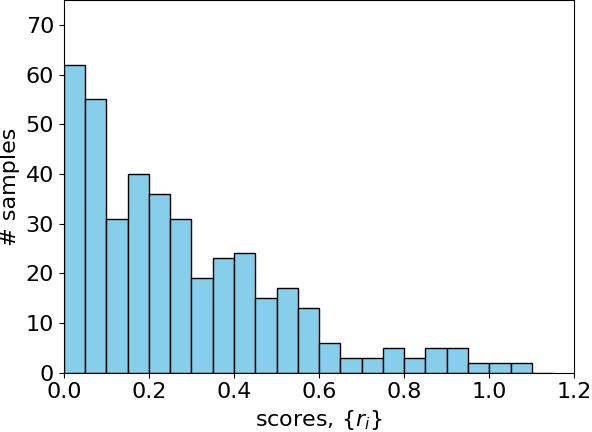

# 辩论优化：事件抽取中的自适应共形预测与多样化检索策略

发布时间：2024年06月17日

`Agent

理由：这篇论文介绍了一个名为多代理辩论优化（DAO）的系统，该系统通过辩论机制来精炼大型语言模型（LLMs）的输出。这个系统涉及多个代理（agents），它们通过辩论过程来优化输出，而不是直接调整模型参数。因此，这个系统更符合Agent分类，因为它涉及多个代理的交互和协作，以改进语言模型的性能。` `事件检测`

> Debate as Optimization: Adaptive Conformal Prediction and Diverse Retrieval for Event Extraction

# 摘要

> 我们设计了一个名为多代理辩论优化（DAO）的系统，旨在通过辩论不断精炼大型语言模型（LLMs）的输出，而无需调整模型参数。DAO系统包含两个新颖模块：多样性检索与辩论（DRAG）和自适应共形预测（AdaCP）。DRAG负责检索与辩论最相关的信息，AdaCP则通过筛选低质量答案提升事件提取的准确性和可靠性。实验表明，在事件检测和论点提取任务上，我们的方法在ACE05和CASIE数据集上分别将性能差距缩小了18.1%、17.8%和17.9%、15.2%，显著优于传统监督学习方法。

> We propose a multi-agent debate as optimization (DAO) system for event extraction, where the primary objective is to iteratively refine the large language models (LLMs) outputs through debating without parameter tuning. In DAO, we introduce two novel modules: the Diverse-RAG (DRAG) module and the Adaptive Conformal Prediction (AdaCP) module. DRAG systematically retrieves supporting information that best fits the debate discussion, while AdaCP enhances the accuracy and reliability of event extraction by effectively rejecting less promising answers. Experimental results demonstrate a significant reduction in the performance gap between supervised approaches and tuning-free LLM-based methods by 18.1% and 17.8% on ACE05 and 17.9% and 15.2% on CASIE for event detection and argument extraction respectively.

[Arxiv](https://arxiv.org/abs/2406.12197)