# DocGenome：开放的大型科学文档基准，专为训练与测试多模态大型语言模型而设

发布时间：2024年06月17日

`LLM应用

这篇论文介绍了DocGenome，一个针对科学文档处理的大型模型基准。它通过自动标注管道对大量科学文档进行结构化处理，并评估了大型模型在处理这些文档上的能力。这表明论文主要关注的是大型语言模型（LLM）在实际应用中的性能和挑战，特别是在处理多模态数据和复杂文档格式方面。因此，它属于LLM应用分类。` `科学研究` `文档处理`

> DocGenome: An Open Large-scale Scientific Document Benchmark for Training and Testing Multi-modal Large Language Models

# 摘要

> 科学文档是研究成果和人类知识的宝库，蕴含着大量高质量数据。利用这些文档中的多模态数据，并检验大型模型在处理科学文档相关任务上的能力，具有重要意义。尽管大型模型已取得进展，但在处理多页科学文档及文档内复杂数据格式（如图表和方程）方面，仍有不足。为此，我们推出了DocGenome，这是一个通过自动标注管道对arXiv开放获取社区中153个学科的50万份科学文档进行结构化处理的基准。DocGenome的四大特点包括：完整性——首次整合了13种布局属性及其LaTeX源码；逻辑性——揭示了文档内不同实体间的6种逻辑关系；多样性——覆盖了文档分类、视觉定位等多种任务；正确性——经过专业团队严格的质量把关。通过广泛实验，我们验证了DocGenome的优势，并客观评价了大型模型在此基准上的表现。

> Scientific documents record research findings and valuable human knowledge, comprising a vast corpus of high-quality data. Leveraging multi-modality data extracted from these documents and assessing large models' abilities to handle scientific document-oriented tasks is therefore meaningful. Despite promising advancements, large models still perform poorly on multi-page scientific document extraction and understanding tasks, and their capacity to process within-document data formats such as charts and equations remains under-explored. To address these issues, we present DocGenome, a structured document benchmark constructed by annotating 500K scientific documents from 153 disciplines in the arXiv open-access community, using our custom auto-labeling pipeline. DocGenome features four key characteristics: 1) Completeness: It is the first dataset to structure data from all modalities including 13 layout attributes along with their LaTeX source codes. 2) Logicality: It provides 6 logical relationships between different entities within each scientific document. 3) Diversity: It covers various document-oriented tasks, including document classification, visual grounding, document layout detection, document transformation, open-ended single-page QA and multi-page QA. 4) Correctness: It undergoes rigorous quality control checks conducted by a specialized team. We conduct extensive experiments to demonstrate the advantages of DocGenome and objectively evaluate the performance of large models on our benchmark.

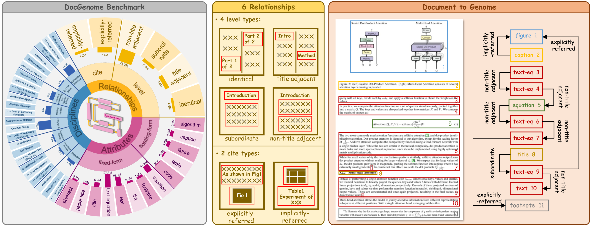

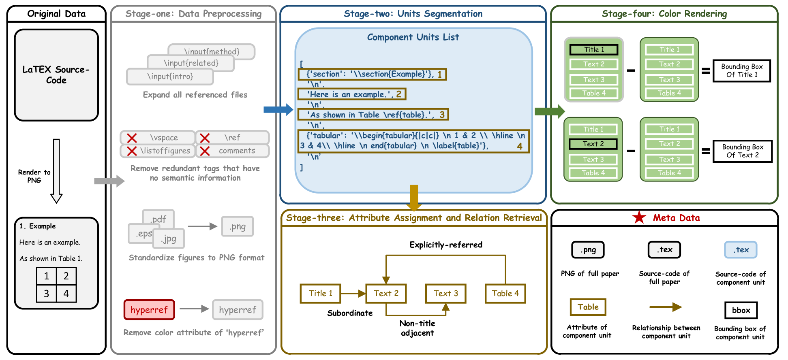

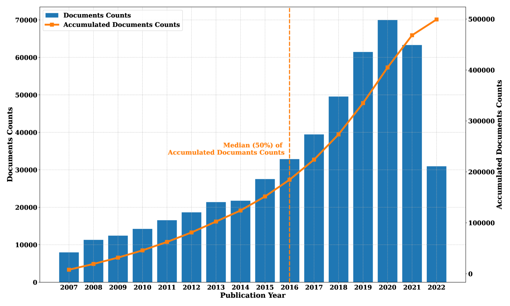

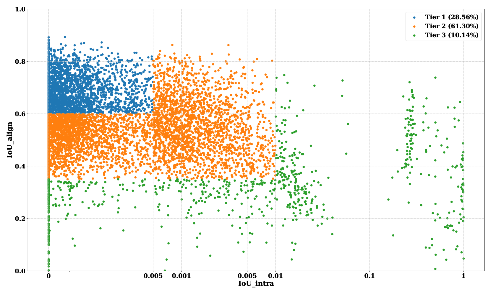

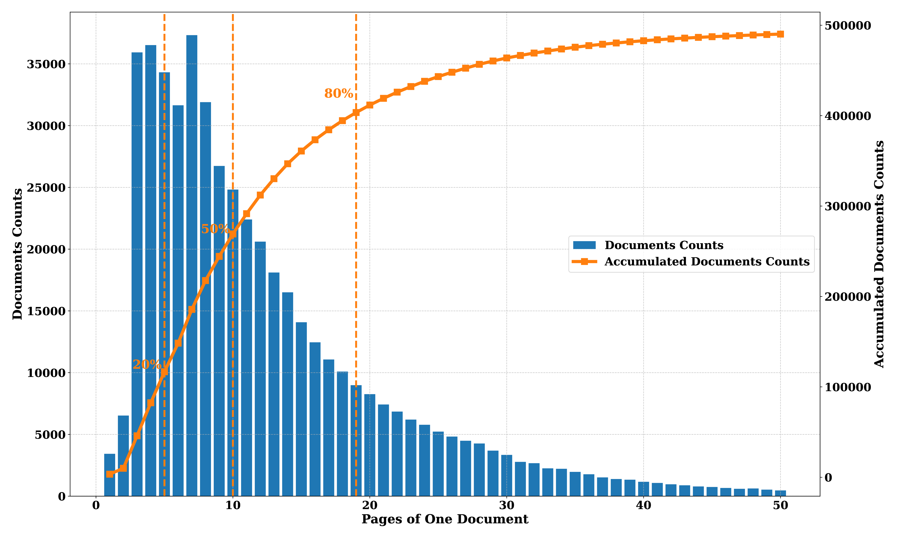

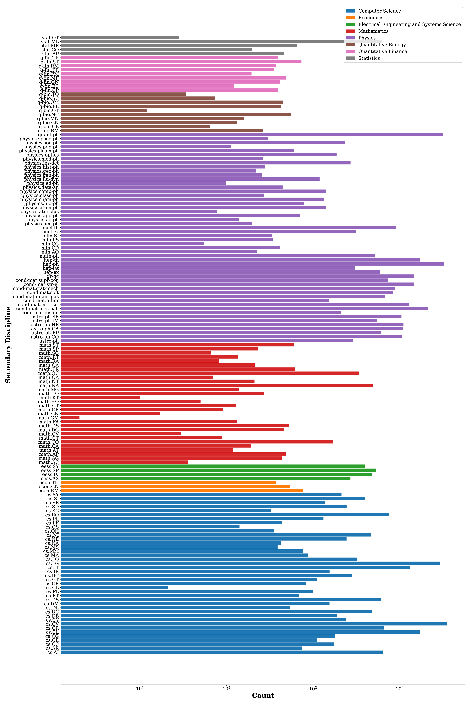

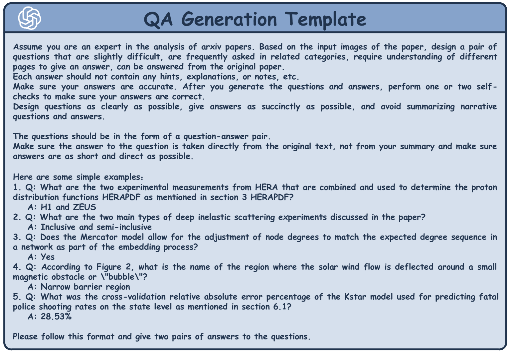

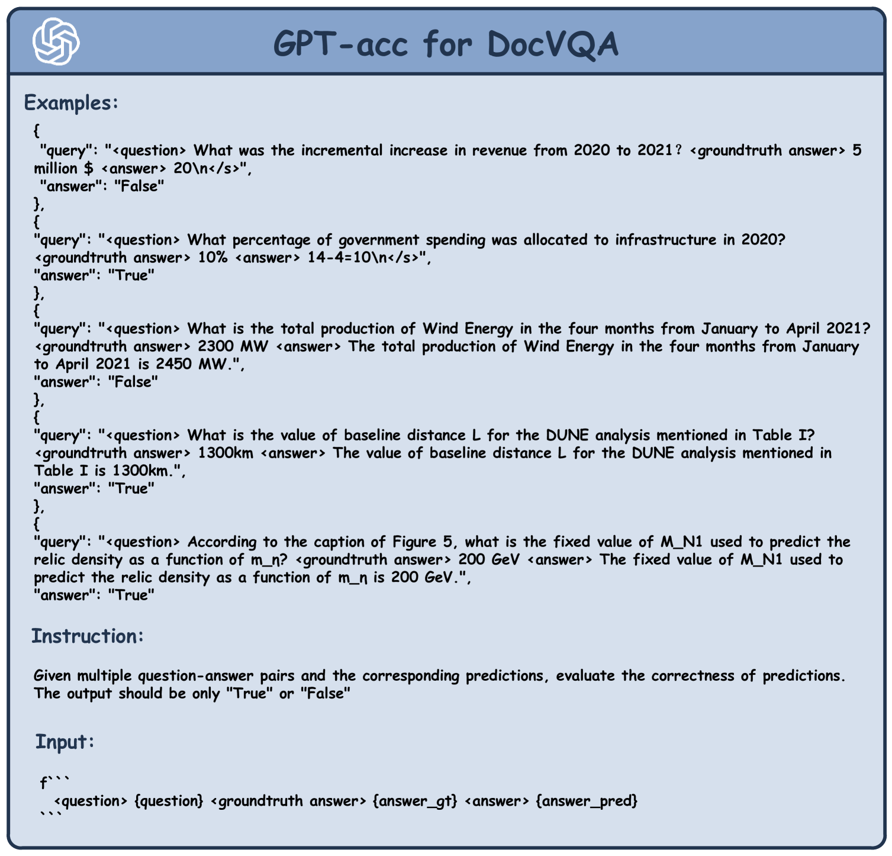

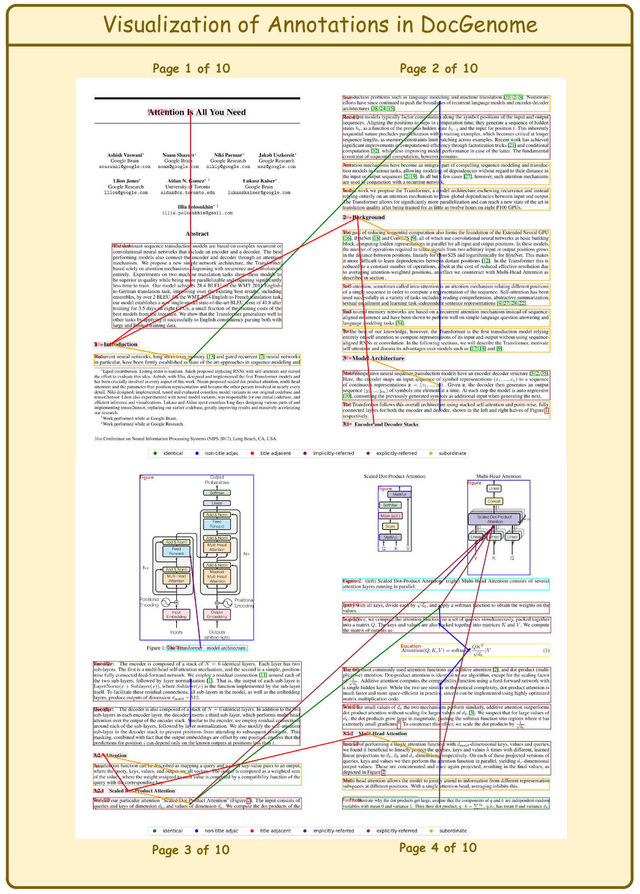

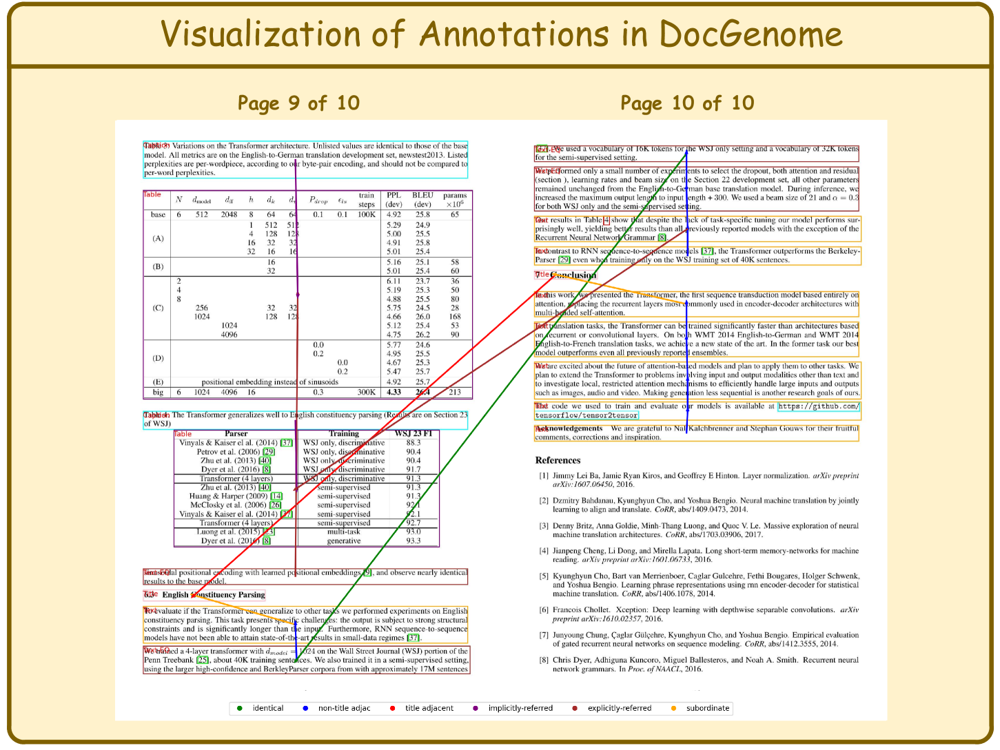

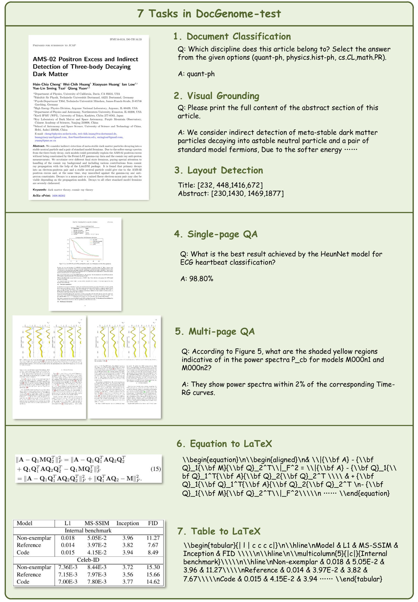

[Arxiv](https://arxiv.org/abs/2406.11633)