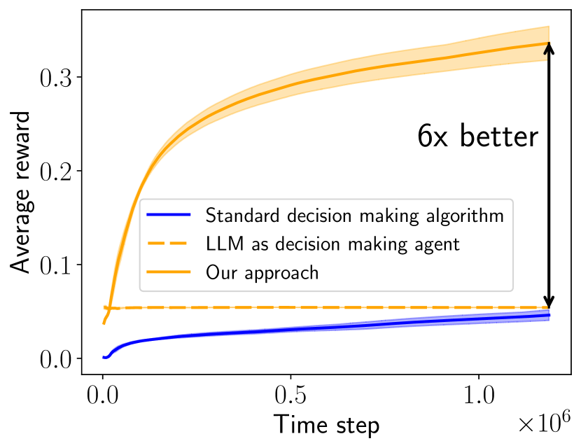
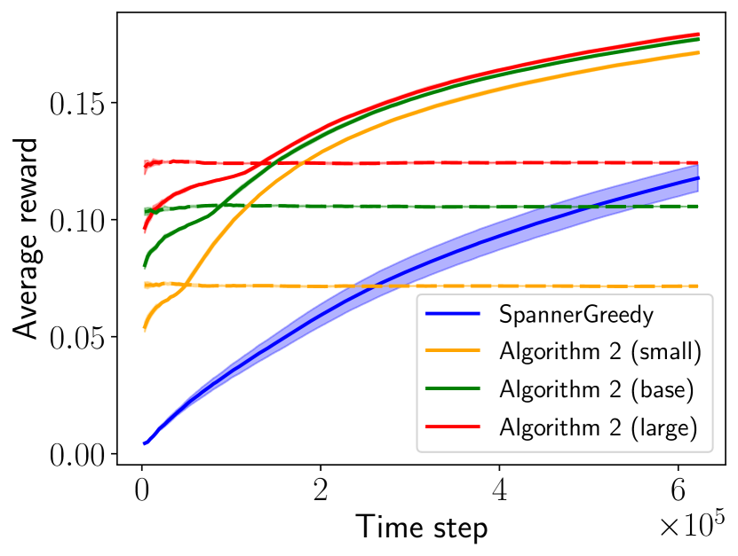
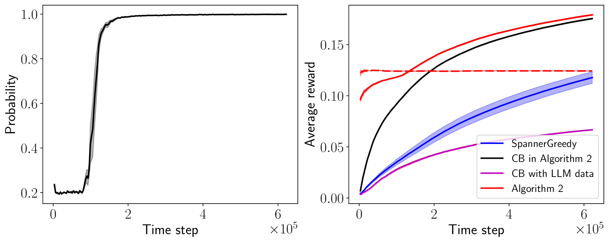

# 大型语言模型在序列决策中的高效应用

发布时间：2024年06月17日

`Agent

理由：这篇论文探讨了如何将大型语言模型（LLMs）应用于序列决策领域，并提出了一种创新方法，通过在线模型选择算法高效地将LLMs整合进序列决策过程。这种方法涉及到创建和使用智能代理（Agent）来执行序列决策任务，因此属于Agent分类。论文中提到的在线模型选择算法和序列决策过程都是智能代理在实际应用中的具体体现，强调了LLMs在代理系统中的应用和优化。` `序列决策` `人工智能`

> Efficient Sequential Decision Making with Large Language Models

# 摘要

> 本文探讨了如何将大型语言模型（LLMs）的强大能力应用于序列决策领域。目前的方法主要有两种：一是对LLMs进行重新训练或微调以适应决策任务，二是为预训练的LLMs设计特定的提示。前者因计算成本高昂而受限，后者则效果不佳。为此，我们提出了一种创新方法，通过在线模型选择算法，高效地将LLMs整合进序列决策过程。实验证明，我们的方法不仅在统计上显著超越了传统算法和未经优化的LLMs，而且在计算上也避免了繁重的梯度更新，仅需在决策过程中少量调用LLMs。例如，在一个大规模的亚马逊数据集上，我们的方法在仅使用LLMs的1.5%时间步内，就实现了超过6倍的性能提升。

> This paper focuses on extending the success of large language models (LLMs) to sequential decision making. Existing efforts either (i) re-train or finetune LLMs for decision making, or (ii) design prompts for pretrained LLMs. The former approach suffers from the computational burden of gradient updates, and the latter approach does not show promising results. In this paper, we propose a new approach that leverages online model selection algorithms to efficiently incorporate LLMs agents into sequential decision making. Statistically, our approach significantly outperforms both traditional decision making algorithms and vanilla LLM agents. Computationally, our approach avoids the need for expensive gradient updates of LLMs, and throughout the decision making process, it requires only a small number of LLM calls. We conduct extensive experiments to verify the effectiveness of our proposed approach. As an example, on a large-scale Amazon dataset, our approach achieves more than a $6$x performance gain over baselines while calling LLMs in only $1.5$\% of the time steps.

[Arxiv](https://arxiv.org/abs/2406.12125)