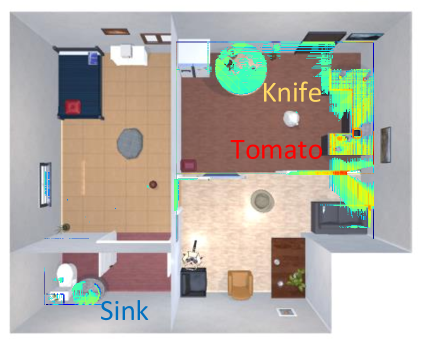
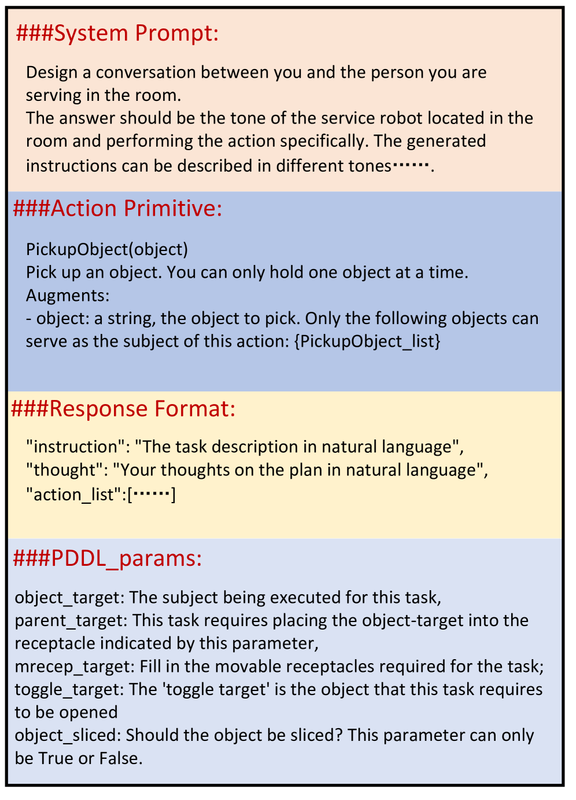

# 未知环境下的具身指令执行

发布时间：2024年06月17日

`Agent

这篇论文主要关注的是具身代理（Agent）在家庭服务自主系统中的应用，特别是在未知环境中理解和执行自然语言指令的能力。论文提出了一种新的具身指令跟随（EIF）方法，该方法利用多模态大型语言模型来生成和执行抽象指令，并通过高级任务规划器和低级探索控制器来实现。这与Agent的分类相符，因为它涉及到了自主系统中的代理行为和决策过程。` `家庭服务` `自主系统`

> Embodied Instruction Following in Unknown Environments

# 摘要

> 在家庭服务自主系统中，让具身代理理解并执行复杂的自然语言指令至关重要。传统方法受限于已知环境，无法应对未知环境中的挑战。为此，我们提出了一种新颖的具身指令跟随（EIF）方法，它能在未知环境中，通过高效探索和利用现有资源，生成并执行抽象指令。我们的框架结合了高级任务规划器和低级探索控制器，并利用多模态大型语言模型，构建了一个语义丰富的场景地图，确保任务规划与人类指令的目标一致。实验证明，我们的方法在处理如制作早餐、整理房间等复杂任务时，成功率高达45.09%。

> Enabling embodied agents to complete complex human instructions from natural language is crucial to autonomous systems in household services. Conventional methods can only accomplish human instructions in the known environment where all interactive objects are provided to the embodied agent, and directly deploying the existing approaches for the unknown environment usually generates infeasible plans that manipulate non-existing objects. On the contrary, we propose an embodied instruction following (EIF) method for complex tasks in the unknown environment, where the agent efficiently explores the unknown environment to generate feasible plans with existing objects to accomplish abstract instructions. Specifically, we build a hierarchical embodied instruction following framework including the high-level task planner and the low-level exploration controller with multimodal large language models. We then construct a semantic representation map of the scene with dynamic region attention to demonstrate the known visual clues, where the goal of task planning and scene exploration is aligned for human instruction. For the task planner, we generate the feasible step-by-step plans for human goal accomplishment according to the task completion process and the known visual clues. For the exploration controller, the optimal navigation or object interaction policy is predicted based on the generated step-wise plans and the known visual clues. The experimental results demonstrate that our method can achieve 45.09% success rate in 204 complex human instructions such as making breakfast and tidying rooms in large house-level scenes.

[Arxiv](https://arxiv.org/abs/2406.11818)