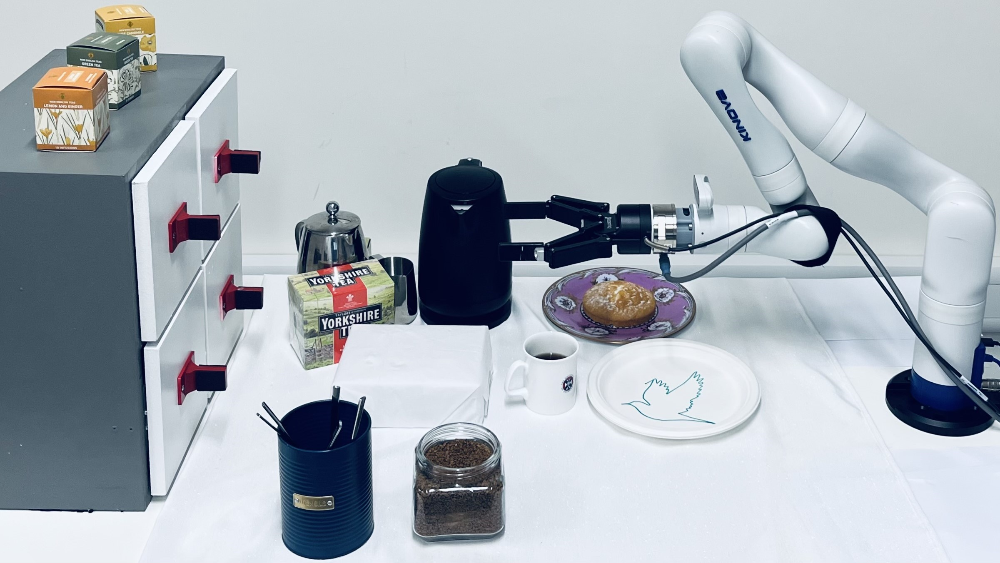
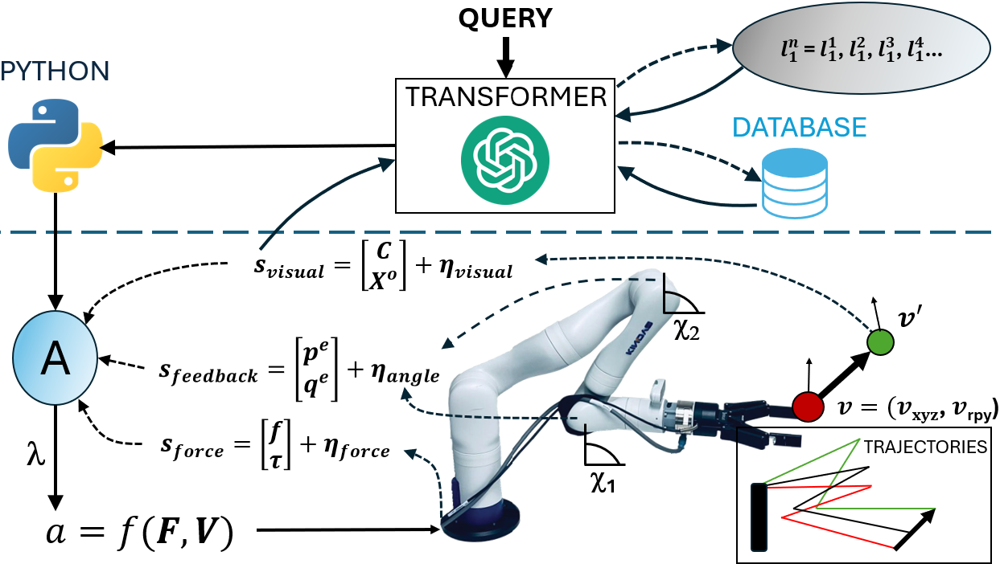
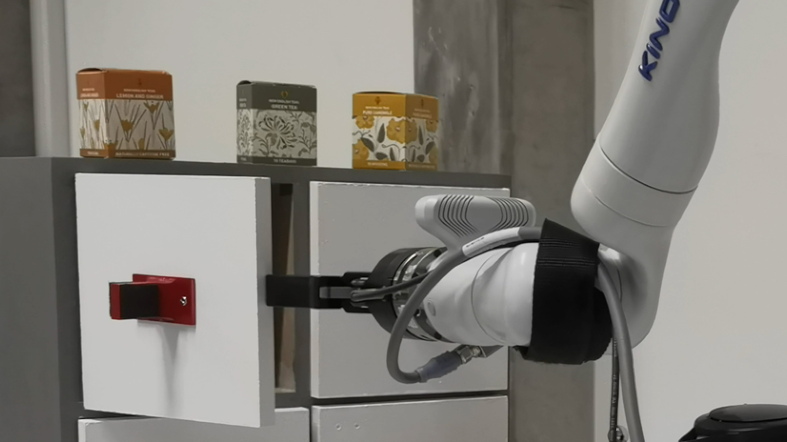
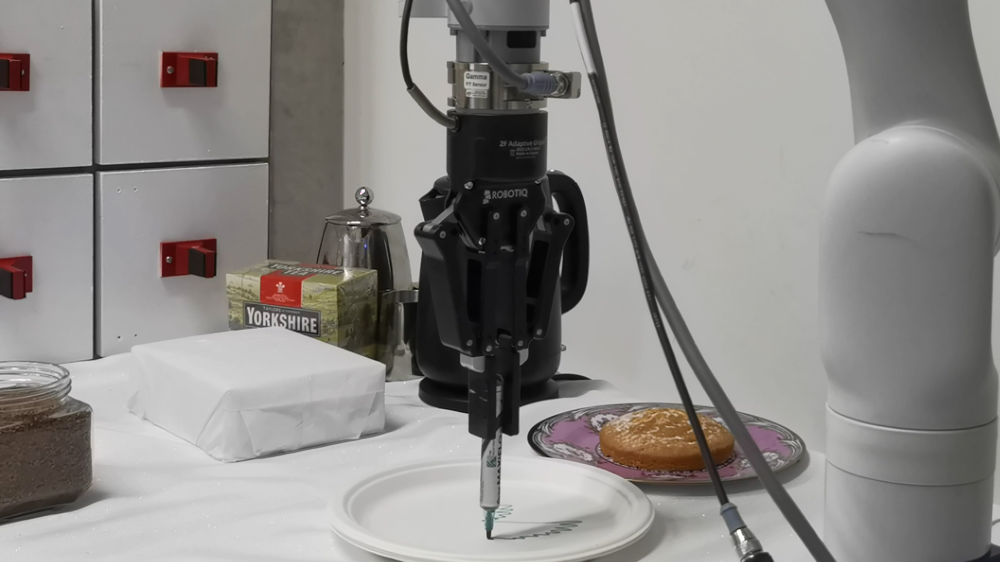
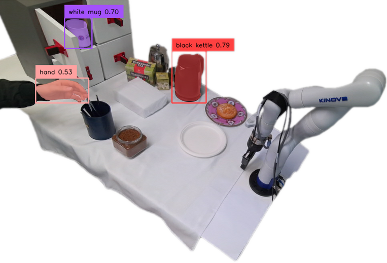
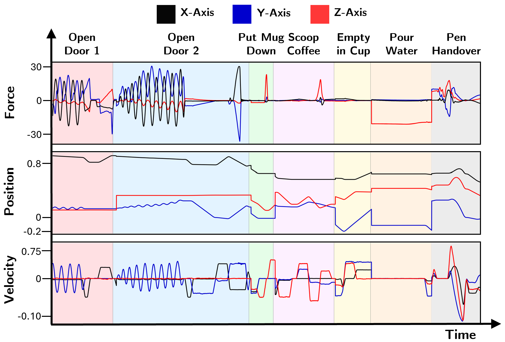
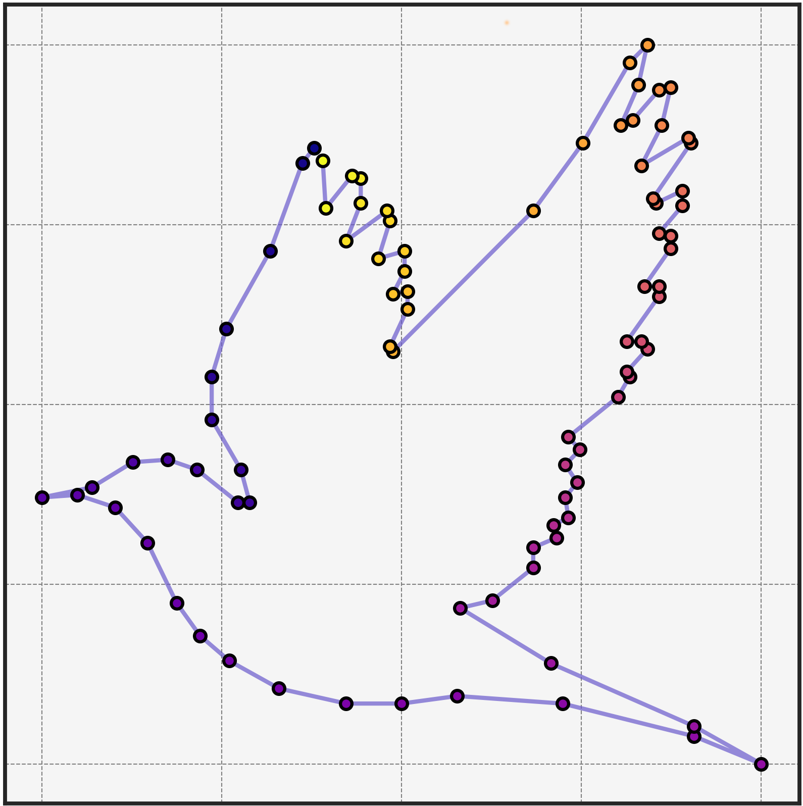
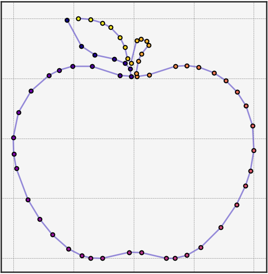
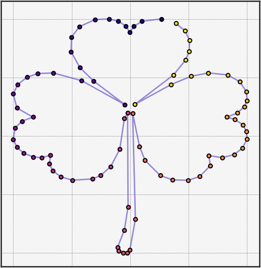

# 赋予机器人遵循抽象指令、执行复杂动态任务的能力

发布时间：2024年06月17日

`Agent

理由：这篇论文介绍了一种新框架，该框架结合了大型语言模型（如GPT-4）、精选知识库和集成力与视觉反馈，用于在不可预测的环境中（如家庭厨房）指导机器人完成复杂任务。这个框架能够解读抽象指令，执行长期任务，并应对不确定性。这种集成多种技术和反馈机制的系统，旨在增强机器人在复杂环境中的自主操作能力，因此属于Agent类别的研究。` `机器人技术` `家庭自动化`

> Enabling robots to follow abstract instructions and complete complex dynamic tasks

# 摘要

> 在家庭厨房这类不可预测环境中，机器人完成复杂任务面临诸多挑战，如理解“制作热饮”等高级指令，以及精确倒水等动作。为此，我们提出了一种结合大型语言模型、精选知识库和集成力与视觉反馈的新框架。该框架能解读抽象指令，执行长期任务，并应对不确定性。它利用GPT-4分析用户需求及环境，生成代码以调用精选数据库中的功能，将指令转化为具体步骤。每一步都通过检索增强泛化从知识库提取相关示例，生成定制代码。IFVF使机器人能应对执行中的噪声和干扰。我们通过制作咖啡和装饰盘子展示了这一方法，涵盖了从倒水到开抽屉的多项操作，每项都得益于特定的反馈类型和方法。这一创新标志着向可扩展、高效的机器人框架迈出了重要一步，使机器人能在不确定环境中高效完成复杂任务。相关成果已通过视频展示，并将在论文接受后在GitHub上开源。

> Completing complex tasks in unpredictable settings like home kitchens challenges robotic systems. These challenges include interpreting high-level human commands, such as "make me a hot beverage" and performing actions like pouring a precise amount of water into a moving mug. To address these challenges, we present a novel framework that combines Large Language Models (LLMs), a curated Knowledge Base, and Integrated Force and Visual Feedback (IFVF). Our approach interprets abstract instructions, performs long-horizon tasks, and handles various uncertainties. It utilises GPT-4 to analyse the user's query and surroundings, then generates code that accesses a curated database of functions during execution. It translates abstract instructions into actionable steps. Each step involves generating custom code by employing retrieval-augmented generalisation to pull IFVF-relevant examples from the Knowledge Base. IFVF allows the robot to respond to noise and disturbances during execution. We use coffee making and plate decoration to demonstrate our approach, including components ranging from pouring to drawer opening, each benefiting from distinct feedback types and methods. This novel advancement marks significant progress toward a scalable, efficient robotic framework for completing complex tasks in uncertain environments. Our findings are illustrated in an accompanying video and supported by an open-source GitHub repository (released upon paper acceptance).

[Arxiv](https://arxiv.org/abs/2406.11231)