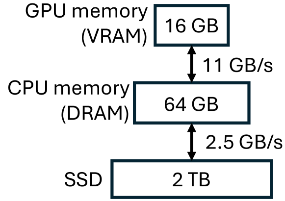
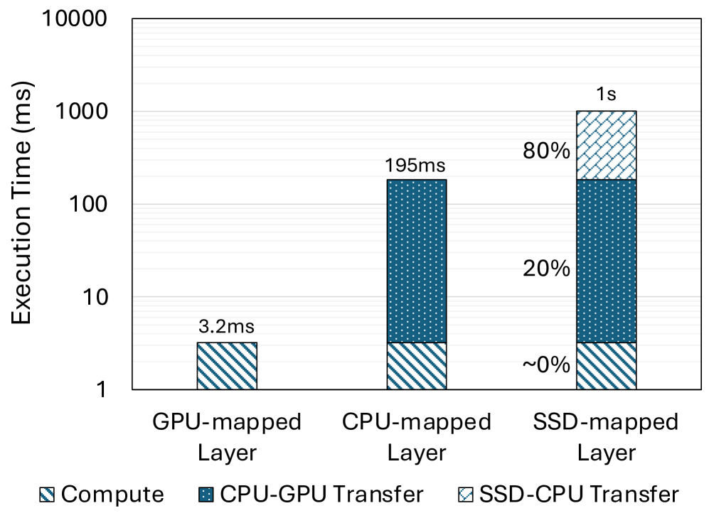
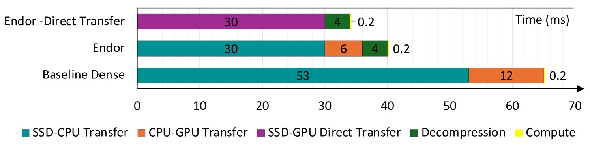

# Endor：专为 LLM 推理卸载设计的硬件友好型稀疏格式

发布时间：2024年06月17日

`LLM应用

这篇论文主要探讨了大型语言模型（LLMs）在资源受限平台上的应用问题，特别是关于如何通过卸载技术和新型稀疏格式来优化LLM权重的存储和传输，以减少延迟并提高性能。这些问题和解决方案直接关联到LLM的实际应用场景，因此将其归类为LLM应用。` `人工智能` `高性能计算`

> Endor: Hardware-Friendly Sparse Format for Offloaded LLM Inference

# 摘要

> 大型语言模型（LLMs）的规模日益庞大，给资源受限平台上的应用带来了挑战。例如，现代GPU的内存难以容纳数百GB的LLMs。为此，卸载技术应运而生，它将LLM的权重存储在CPU内存和SSD中，使用前再传输至GPU。在我们的研究中，发现由于存储设备与GPU间带宽不足，权重传输延迟成为性能瓶颈，而实际计算时间几乎可以忽略不计。为了解决这一问题，我们开发了一种新型稀疏格式，它能高效压缩修剪后的LLM权重，实现高压缩比且解压缩开销低。Endor利用位图精确标记非零元素位置，与传统Huggingface Accelerate相比，Endor让OPT-66B和Llama2-70B分别提速1.70倍和1.78倍。若直接从SSD向GPU传输权重，Endor更能为OPT-66B和Llama2-70B分别带来2.25倍和2.37倍的加速效果。

> The increasing size of large language models (LLMs) challenges their usage on resource-constrained platforms. For example, memory on modern GPUs is insufficient to hold LLMs that are hundreds of Gigabytes in size. Offloading is a popular method to escape this constraint by storing weights of an LLM model to host CPU memory and SSD, then loading each weight to GPU before every use. In our case study of offloaded inference, we found that due to the low bandwidth between storage devices and GPU, the latency of transferring large model weights from its offloaded location to GPU memory becomes the critical bottleneck with actual compute taking nearly 0% of runtime. To effectively reduce the weight transfer latency, we propose a novel sparse format that compresses the unstructured sparse pattern of pruned LLM weights to non-zero values with high compression ratio and low decompression overhead. Endor achieves this by expressing the positions of non-zero elements with a bitmap. Compared to offloaded inference using the popular Huggingface Accelerate, applying Endor accelerates OPT-66B by 1.70x and Llama2-70B by 1.78x. When direct weight transfer from SSD to GPU is leveraged, Endor achieves 2.25x speedup on OPT-66B and 2.37x speedup on Llama2-70B.

[Arxiv](https://arxiv.org/abs/2406.11674)