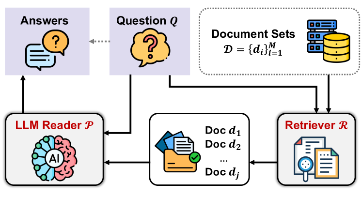
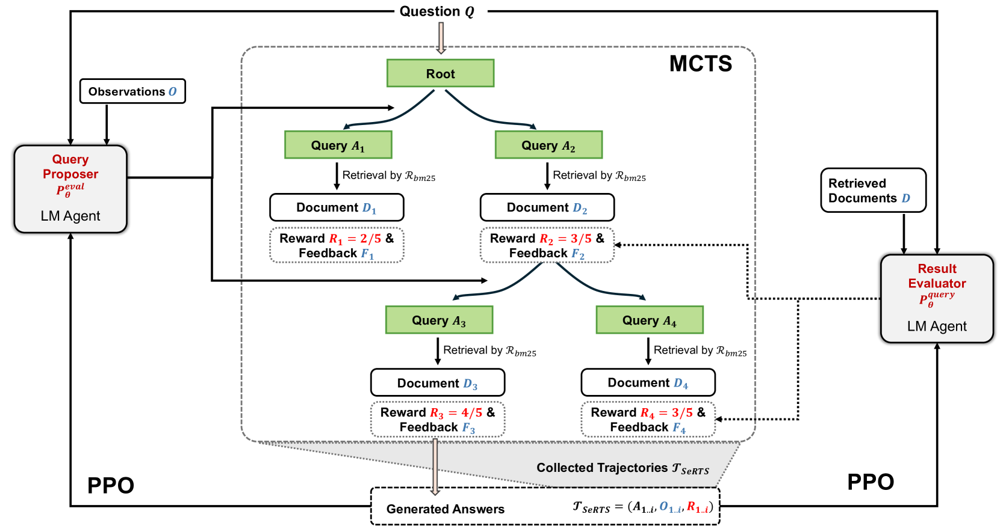
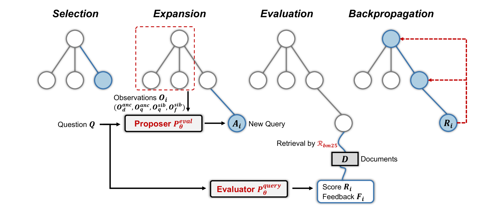

# 利用自奖励树搜索与近端策略优化，提升生物医学知识检索增强生成的效果

发布时间：2024年06月17日

`RAG

理由：这篇论文主要讨论了检索增强生成（RAG）技术在生物医学领域的应用，并提出了一种新的检索方法——自我奖励树搜索（SeRTS），旨在提升大型语言模型（LLMs）在处理医学知识查询时的性能。该方法结合了蒙特卡洛树搜索（MCTS）和自我奖励机制，并通过近端策略优化（PPO）对LLMs进行微调，以优化检索性能。因此，这篇论文的内容主要集中在RAG技术的改进和应用上，属于RAG分类。` `生物医学` `问答系统`

> Enhancing Biomedical Knowledge Retrieval-Augmented Generation with Self-Rewarding Tree Search and Proximal Policy Optimization

# 摘要

> 随着检索增强生成（RAG）技术的发展，大型语言模型（LLMs）在生物医学领域展现出巨大潜力。然而，现有检索增强方法在处理多样化的医学知识查询时，面临性能挑战。为此，我们提出了一种基于蒙特卡洛树搜索（MCTS）和自我奖励机制的新型检索方法——自我奖励树搜索（SeRTS），该方法结合了LLMs的推理能力与树搜索的效率，显著提升了RAG中零-shot检索的质量。通过使用SeRTS收集的反馈，我们采用近端策略优化（PPO）对LLMs进行微调，进一步优化了检索性能。在BioASQ-QA数据集上的实验证明，我们的方法不仅大幅提升了BM25检索器的性能，还在效率和可扩展性上超越了自我反思基线。SeRTS为PPO训练提供了更高质量的反馈。我们的方法有效增强了LLMs在医学知识查询中为RAG检索相关文档的能力，标志着在利用LLMs进行精确和全面的生物医学问答方面取得了重要进展。

> Large Language Models (LLMs) have shown great potential in the biomedical domain with the advancement of retrieval-augmented generation (RAG). However, existing retrieval-augmented approaches face challenges in addressing diverse queries and documents, particularly for medical knowledge queries, resulting in sub-optimal performance. To address these limitations, we propose a novel plug-and-play LLM-based retrieval method called Self-Rewarding Tree Search (SeRTS) based on Monte Carlo Tree Search (MCTS) and a self-rewarding paradigm. By combining the reasoning capabilities of LLMs with the effectiveness of tree search, SeRTS boosts the zero-shot performance of retrieving high-quality and informative results for RAG. We further enhance retrieval performance by fine-tuning LLMs with Proximal Policy Optimization (PPO) objectives using the trajectories collected by SeRTS as feedback. Controlled experiments using the BioASQ-QA dataset with GPT-3.5-Turbo and LLama2-7b demonstrate that our method significantly improves the performance of the BM25 retriever and surpasses the strong baseline of self-reflection in both efficiency and scalability. Moreover, SeRTS generates higher-quality feedback for PPO training than self-reflection. Our proposed method effectively adapts LLMs to document retrieval tasks, enhancing their ability to retrieve highly relevant documents for RAG in the context of medical knowledge queries. This work presents a significant step forward in leveraging LLMs for accurate and comprehensive biomedical question answering.

[Arxiv](https://arxiv.org/abs/2406.11258)