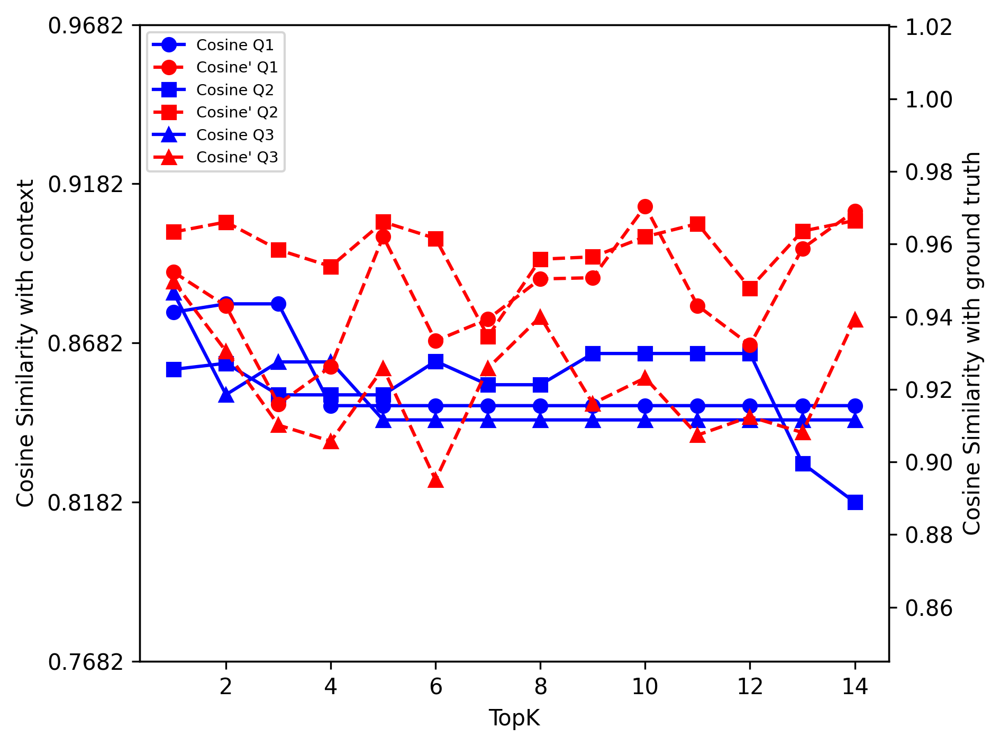

# 探究开源LLMs在企业定制RAG系统中的效能与扩展性：一场性能与可扩展性的较量

发布时间：2024年06月17日

`RAG

理由：这篇论文主要关注的是开源大型语言模型（LLMs）在企业特定数据集上的应用，特别是在基于检索增强生成（RAG）任务中的表现和优化。它探讨了如何通过不同的开源嵌入技术来提升RAG系统的性能，这直接关联到RAG框架的优化和应用。因此，将其分类为RAG是合适的。`

> Evaluating the Efficacy of Open-Source LLMs in Enterprise-Specific RAG Systems: A Comparative Study of Performance and Scalability

# 摘要

> 本文深入分析了开源大型语言模型（LLMs）在企业特定数据集上的应用，特别是在基于检索增强生成（RAG）任务中。随着LLMs在自然语言处理中的日益重要，评估其在特定组织环境中的表现、可及性和整合能力变得尤为关键。研究涵盖了多种开源LLMs，并探讨了它们如何与企业数据结合，优化RAG框架。通过评估不同的开源嵌入技术，我们发现这些技术能显著提升RAG系统的性能，为企业提供了一个高效且经济的替代方案。

> This paper presents an analysis of open-source large language models (LLMs) and their application in Retrieval-Augmented Generation (RAG) tasks, specific for enterprise-specific data sets scraped from their websites. With the increasing reliance on LLMs in natural language processing, it is crucial to evaluate their performance, accessibility, and integration within specific organizational contexts. This study examines various open-source LLMs, explores their integration into RAG frameworks using enterprise-specific data, and assesses the performance of different open-source embeddings in enhancing the retrieval and generation process. Our findings indicate that open-source LLMs, combined with effective embedding techniques, can significantly improve the accuracy and efficiency of RAG systems, offering a viable alternative to proprietary solutions for enterprises.

[Arxiv](https://arxiv.org/abs/2406.11424)