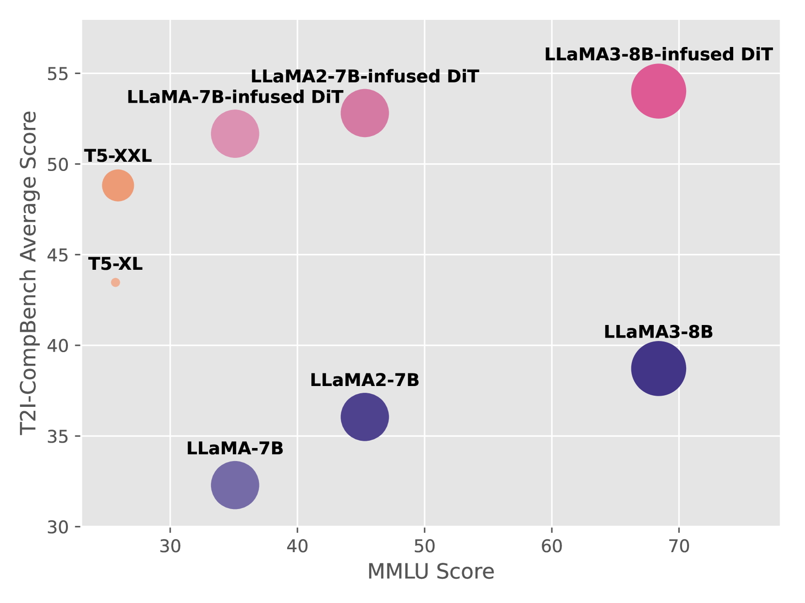
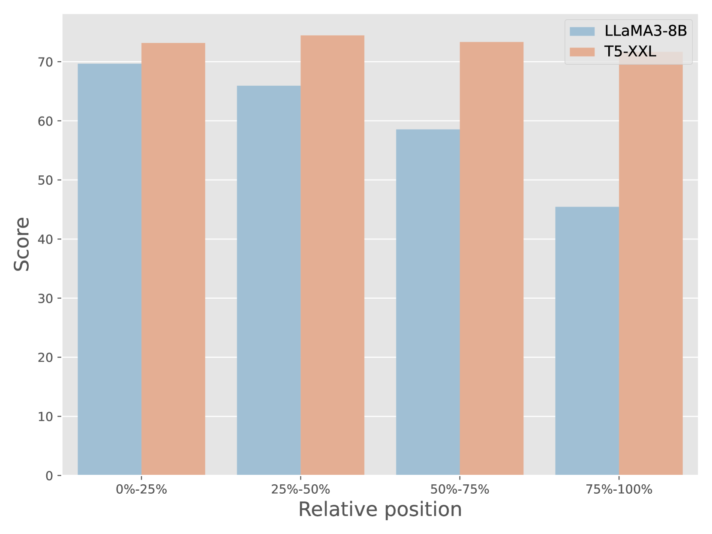
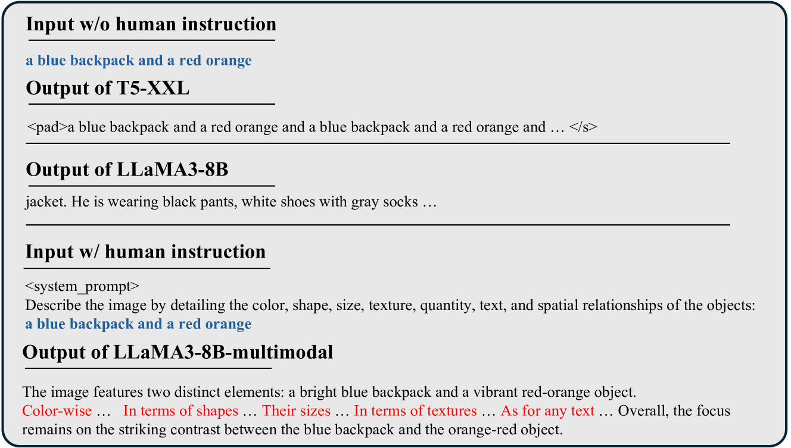
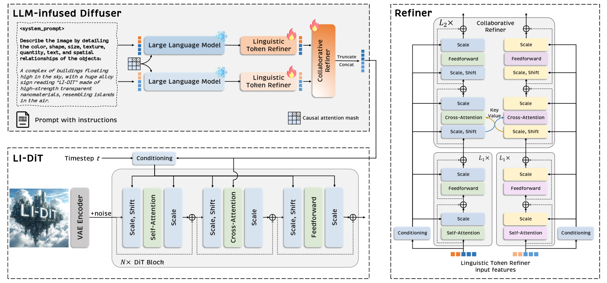
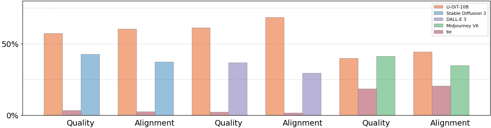

# 探究大型语言模型在扩散模型提示编码中的关键角色

发布时间：2024年06月17日

`LLM应用

这篇论文主要探讨了如何将大型语言模型（LLMs）有效地应用于文本到图像的生成模型中，特别是在解决由于LLM训练与扩散模型需求之间的不匹配以及解码器-仅架构带来的位置偏差问题。论文提出了一种新的框架，即LLM注入扩散变压器（LI-DiT），并通过实验证明了其在提升文本到图像生成模型性能方面的有效性。因此，这篇论文属于LLM应用类别，因为它专注于将LLMs应用于特定的技术问题和解决方案中，而不是理论研究或Agent、RAG相关的研究。` `图像生成` `人工智能`

> Exploring the Role of Large Language Models in Prompt Encoding for Diffusion Models

# 摘要

> 解码器-仅变压器的大型语言模型（LLMs）在文本理解上超越了CLIP和T5系列，但在文本到图像扩散模型中的应用仍需探索。我们发现，直接将大型语言模型用作提示编码器会削弱图像生成中的提示跟随能力。这一问题源于LLM训练与扩散模型需求之间的不匹配，以及解码器-仅架构带来的位置偏差。为此，我们提出了一种新框架，通过精心设计的指导，提升文本表示能力，消除位置偏差，从而灵活地将顶尖LLMs融入文本到图像生成模型。我们还开发了融合多个LLMs的有效方法。基于变压器的卓越性能和扩展性，我们设计了LLM注入扩散变压器（LI-DiT）。实验证明，LI-DiT在不同规模上均表现出色，其提示理解能力超越了包括稳定扩散3、DALL-E 3和Midjourney V6在内的顶尖开源和闭源模型。经过优化和安全审查后，强大的LI-DiT-10B将面世。

> Large language models (LLMs) based on decoder-only transformers have demonstrated superior text understanding capabilities compared to CLIP and T5-series models. However, the paradigm for utilizing current advanced LLMs in text-to-image diffusion models remains to be explored. We observed an unusual phenomenon: directly using a large language model as the prompt encoder significantly degrades the prompt-following ability in image generation. We identified two main obstacles behind this issue. One is the misalignment between the next token prediction training in LLM and the requirement for discriminative prompt features in diffusion models. The other is the intrinsic positional bias introduced by the decoder-only architecture. To deal with this issue, we propose a novel framework to fully harness the capabilities of LLMs. Through the carefully designed usage guidance, we effectively enhance the text representation capability for prompt encoding and eliminate its inherent positional bias. This allows us to integrate state-of-the-art LLMs into the text-to-image generation model flexibly. Furthermore, we also provide an effective manner to fuse multiple LLMs into our framework. Considering the excellent performance and scaling capabilities demonstrated by the transformer architecture, we further design an LLM-Infused Diffusion Transformer (LI-DiT) based on the framework. We conduct extensive experiments to validate LI-DiT across model size and data size. Benefiting from the inherent ability of the LLMs and our innovative designs, the prompt understanding performance of LI-DiT easily surpasses state-of-the-art open-source models as well as mainstream closed-source commercial models including Stable Diffusion 3, DALL-E 3, and Midjourney V6. The powerful LI-DiT-10B will be available after further optimization and security checks.

[Arxiv](https://arxiv.org/abs/2406.11831)