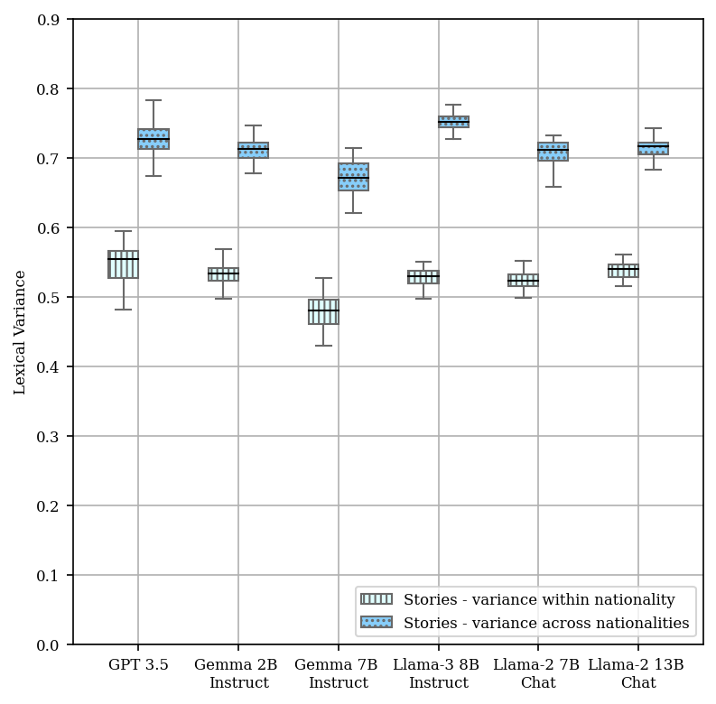
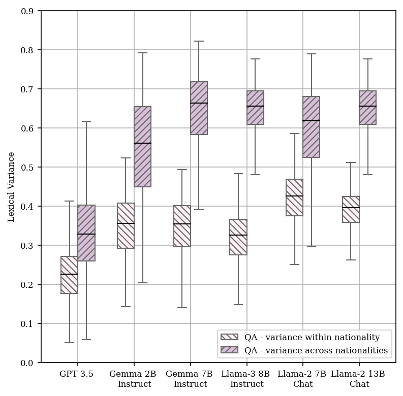
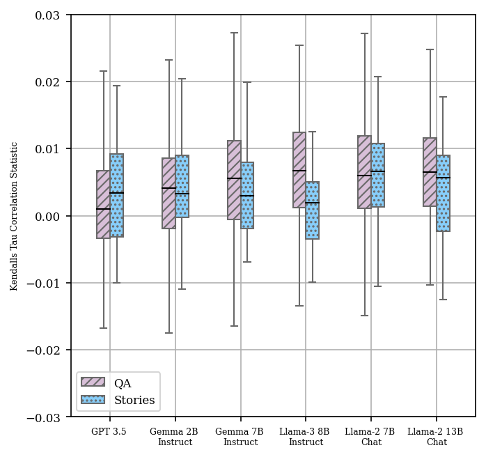
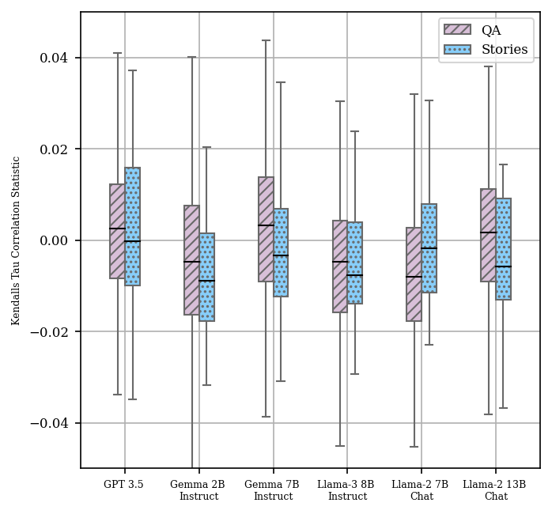
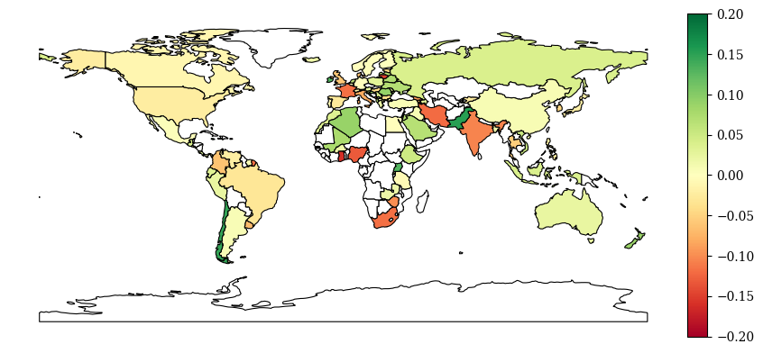
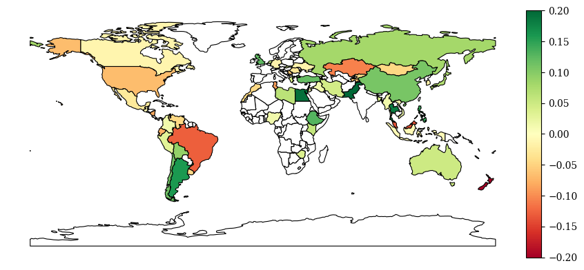

# 大型语言模型文化素养的外部评测

发布时间：2024年06月17日

`Agent

理由：这篇论文主要关注的是语言模型在处理不同文化背景下的用户时的表现，特别是在开放式问答和故事生成任务中模型的文化能力。它探讨了模型如何理解和适应不同的文化规范、价值观和文物，并评估了这些理解如何影响模型的实际应用。这涉及到模型的适应性和交互能力，更偏向于Agent的范畴，即模型作为一个智能体如何与多元文化环境中的用户有效互动。虽然这涉及到LLM的应用，但其核心在于模型的交互和文化适应性，因此更适合归类为Agent。` `文化研究` `问答系统`

> Extrinsic Evaluation of Cultural Competence in Large Language Models

# 摘要

> 为了确保语言技术与多元用户之间的互动富有成效，其输出必须紧贴文化并保持敏感。以往研究虽已评估模型对文化规范、价值观及文物的理解，但未深入探讨这些知识如何影响实际应用。本研究聚焦于开放式问答与故事生成两项任务，对模型的文化能力进行外在评估。我们通过定量与定性分析，发现当提示中的国籍这一明确文化线索发生变化时，模型输出不仅随之变化，且包含相关文化词汇，但不同国家输出文本的相似度与各自文化价值观之间的关联并不紧密。最后，我们探讨了在设计面向用户任务的文化能力全面评估时需考虑的关键因素。

> Productive interactions between diverse users and language technologies require outputs from the latter to be culturally relevant and sensitive. Prior works have evaluated models' knowledge of cultural norms, values, and artifacts, without considering how this knowledge manifests in downstream applications. In this work, we focus on extrinsic evaluation of cultural competence in two text generation tasks, open-ended question answering and story generation. We quantitatively and qualitatively evaluate model outputs when an explicit cue of culture, specifically nationality, is perturbed in the prompts. Although we find that model outputs do vary when varying nationalities and feature culturally relevant words, we also find weak correlations between text similarity of outputs for different countries and the cultural values of these countries. Finally, we discuss important considerations in designing comprehensive evaluation of cultural competence in user-facing tasks.

[Arxiv](https://arxiv.org/abs/2406.11565)