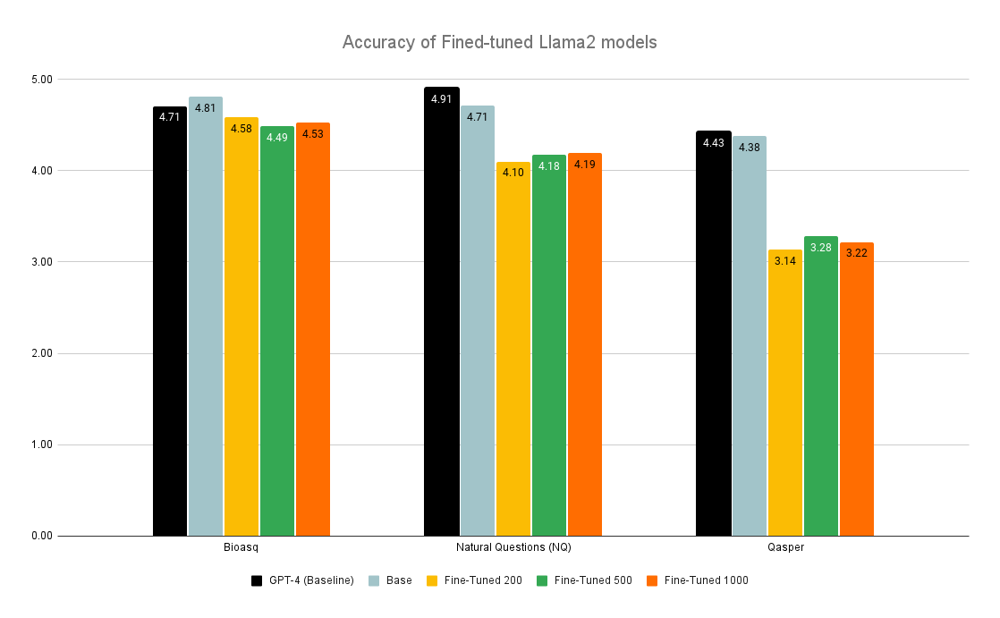
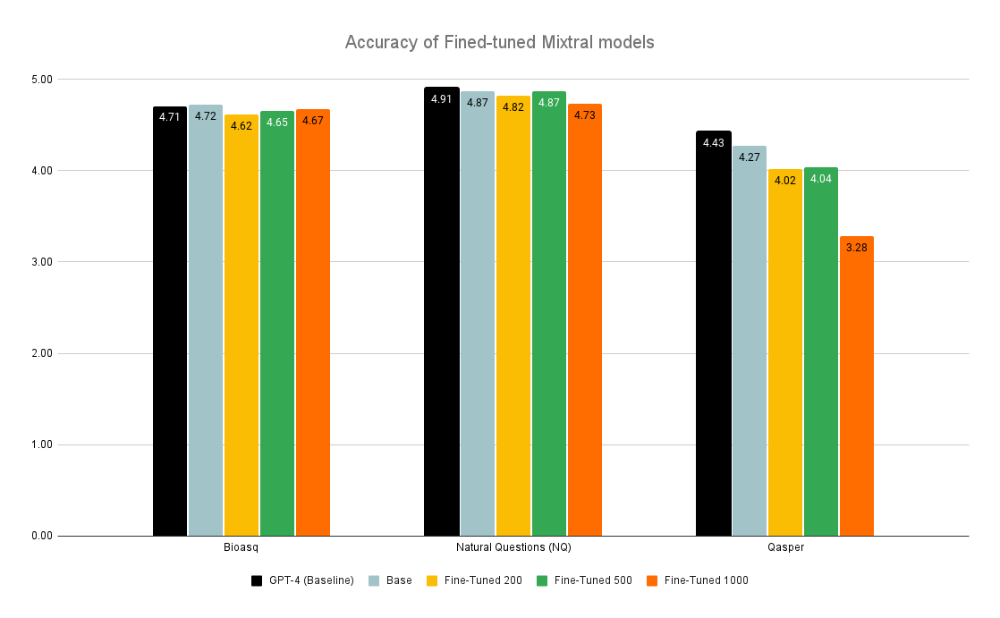
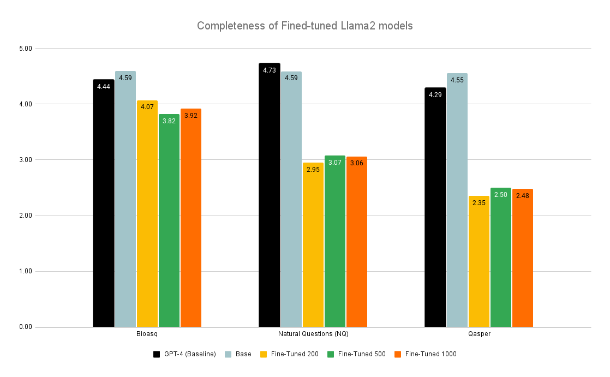
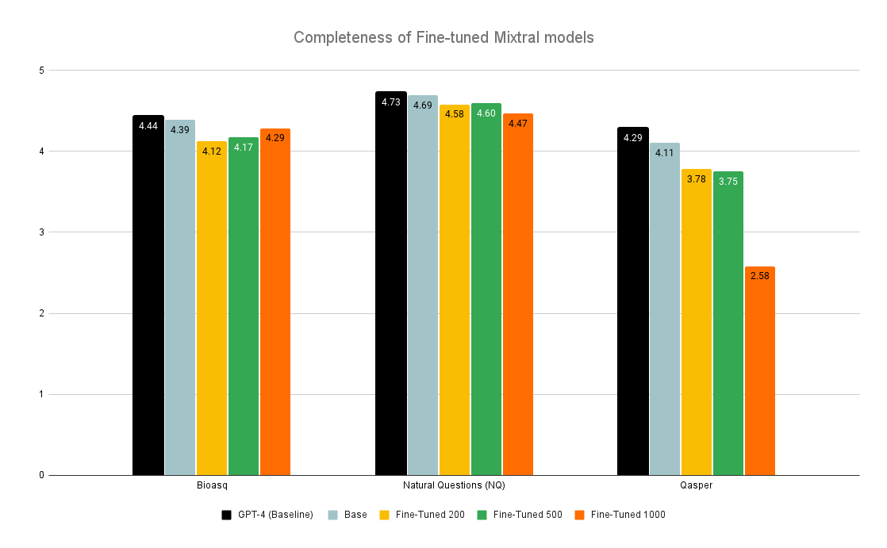

# 微调还是微败？探究大型语言模型性能背后的真相

发布时间：2024年06月17日

`RAG

理由：这篇论文主要探讨了大型语言模型（LLMs）在检索增强生成（RAG）系统中的应用，特别是在微调对LLMs在提取和整合上下文数据以提升RAG性能的影响。论文的研究重点是微调如何影响RAG系统的性能，这是一个具体的应用场景，因此归类为RAG。` `信息检索`

> Fine-Tuning or Fine-Failing? Debunking Performance Myths in Large Language Models

# 摘要

> 大型语言模型（LLMs）能够理解并生成类似人类的文本，经过微调后，它们在特定领域的查询上表现更佳。OpenAI指出，微调通常需要50到100个训练示例，但具体数量取决于使用场景。本研究探讨了LLMs在检索增强生成（RAG）系统中的应用，该系统通过外部数据检索提升准确性和相关性。尽管RAG在复杂查询中表现不佳，本研究特别关注微调如何影响LLMs提取和整合上下文数据以提升RAG在多领域的性能。我们通过比较微调模型与基准模型在多个数据集上的表现，发现微调并未如预期那样提升性能，反而有所下降。这表明对于特定领域任务，微调模型的效果需要更深入的验证和研究。

> Large Language Models (LLMs) have the unique capability to understand and generate human-like text from input queries. When fine-tuned, these models show enhanced performance on domain-specific queries. OpenAI highlights the process of fine-tuning, stating: "To fine-tune a model, you are required to provide at least 10 examples. We typically see clear improvements from fine-tuning on 50 to 100 training examples, but the right number varies greatly based on the exact use case." This study extends this concept to the integration of LLMs within Retrieval-Augmented Generation (RAG) pipelines, which aim to improve accuracy and relevance by leveraging external corpus data for information retrieval. However, RAG's promise of delivering optimal responses often falls short in complex query scenarios. This study aims to specifically examine the effects of fine-tuning LLMs on their ability to extract and integrate contextual data to enhance the performance of RAG systems across multiple domains. We evaluate the impact of fine-tuning on the LLMs' capacity for data extraction and contextual understanding by comparing the accuracy and completeness of fine-tuned models against baseline performances across datasets from multiple domains. Our findings indicate that fine-tuning resulted in a decline in performance compared to the baseline models, contrary to the improvements observed in standalone LLM applications as suggested by OpenAI. This study highlights the need for vigorous investigation and validation of fine-tuned models for domain-specific tasks.

[Arxiv](https://arxiv.org/abs/2406.11201)