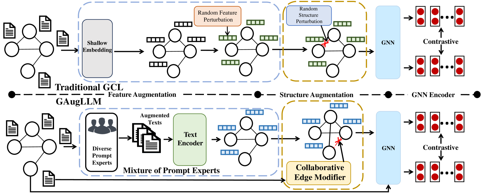
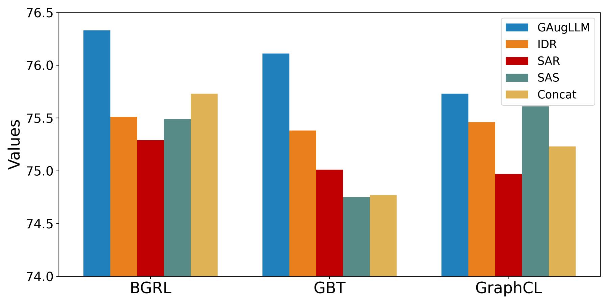
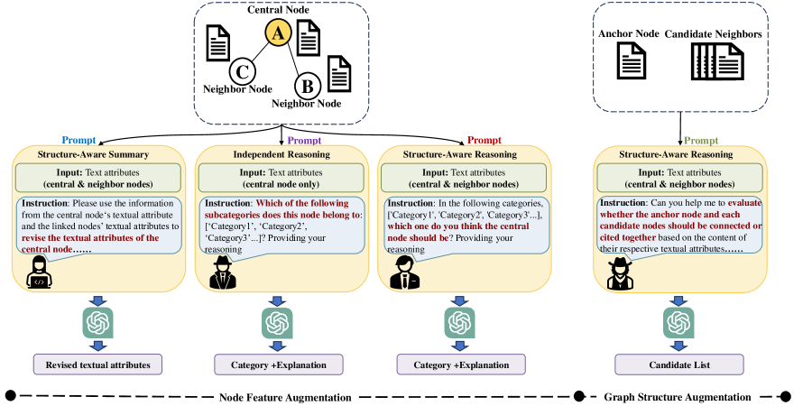

# GAugLLM：借助大型语言模型，优化文本属性图的图对比学习技术

发布时间：2024年06月17日

`LLM应用

这篇论文摘要描述了一种新的自监督图学习方法，特别针对文本属性图（TAGs）。研究中使用了大型语言模型（如Mistral）来优化图视图生成，并提出了GAugLLM框架，该框架利用混合提示专家技术生成节点特征，并通过协作边缘修改器增强图结构。这种方法不仅提升了对比学习方法的性能，还增强了生成模型和图神经网络的表现。由于该研究主要关注于利用大型语言模型在图学习领域的应用，因此将其归类为LLM应用。` `图学习`

> GAugLLM: Improving Graph Contrastive Learning for Text-Attributed Graphs with Large Language Models

# 摘要

> 本研究针对文本属性图（TAGs），探索了一种新的自监督图学习方法。与传统方法不同，我们通过语言监督而非数值特征空间的扰动来优化图视图生成，充分利用了文本属性在实际应用中的丰富语义信息。面临的挑战包括文本属性的长度和质量不一致，以及文本与图结构之间的自然对齐问题。为此，我们提出了GAugLLM框架，利用Mistral等大型语言模型进行自监督图学习。该框架采用混合提示专家技术生成节点特征，并通过协作边缘修改器增强图结构。实验证明，GAugLLM不仅提升了对比学习方法的性能，还增强了生成模型和图神经网络的表现。我们的GAugLLM代码已在Github上开源。

> This work studies self-supervised graph learning for text-attributed graphs (TAGs) where nodes are represented by textual attributes. Unlike traditional graph contrastive methods that perturb the numerical feature space and alter the graph's topological structure, we aim to improve view generation through language supervision. This is driven by the prevalence of textual attributes in real applications, which complement graph structures with rich semantic information. However, this presents challenges because of two major reasons. First, text attributes often vary in length and quality, making it difficulty to perturb raw text descriptions without altering their original semantic meanings. Second, although text attributes complement graph structures, they are not inherently well-aligned. To bridge the gap, we introduce GAugLLM, a novel framework for augmenting TAGs. It leverages advanced large language models like Mistral to enhance self-supervised graph learning. Specifically, we introduce a mixture-of-prompt-expert technique to generate augmented node features. This approach adaptively maps multiple prompt experts, each of which modifies raw text attributes using prompt engineering, into numerical feature space. Additionally, we devise a collaborative edge modifier to leverage structural and textual commonalities, enhancing edge augmentation by examining or building connections between nodes. Empirical results across five benchmark datasets spanning various domains underscore our framework's ability to enhance the performance of leading contrastive methods as a plug-in tool. Notably, we observe that the augmented features and graph structure can also enhance the performance of standard generative methods, as well as popular graph neural networks. The open-sourced implementation of our GAugLLM is available at Github.

[Arxiv](https://arxiv.org/abs/2406.11945)