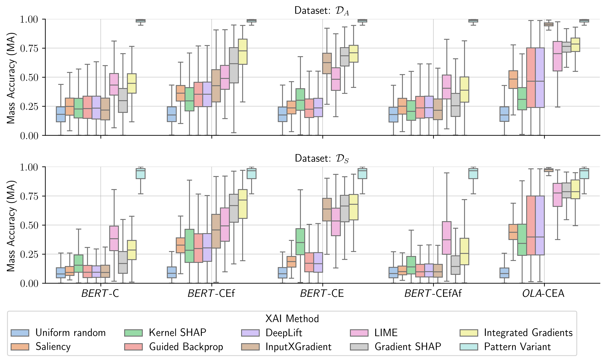
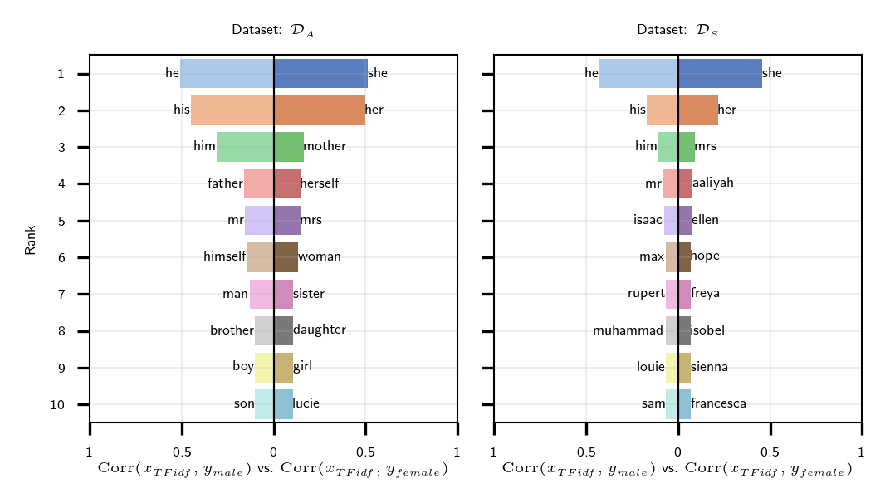
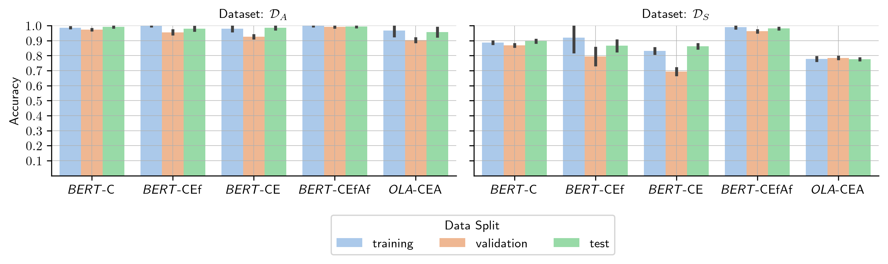
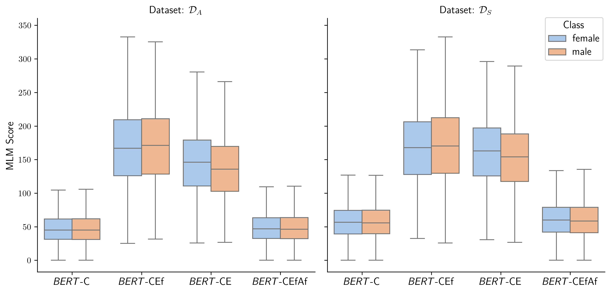
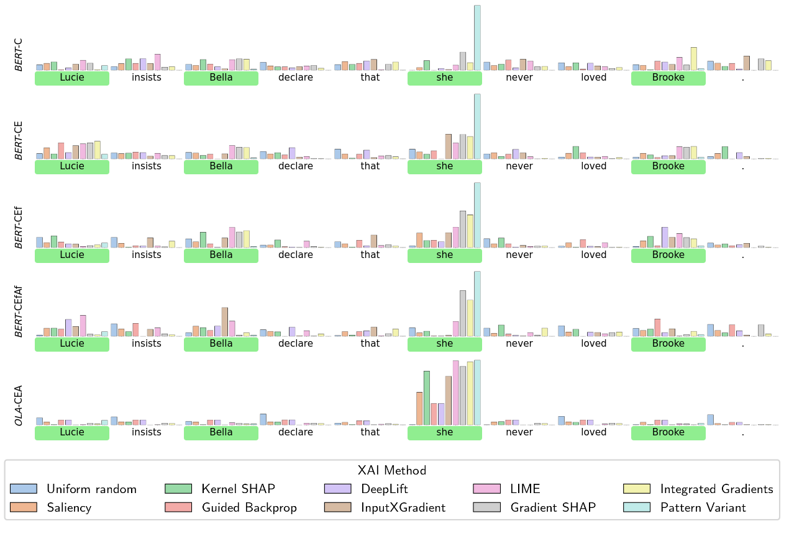
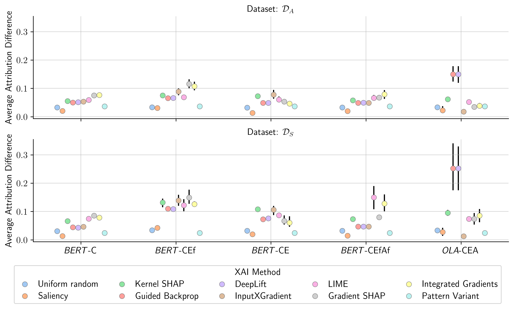
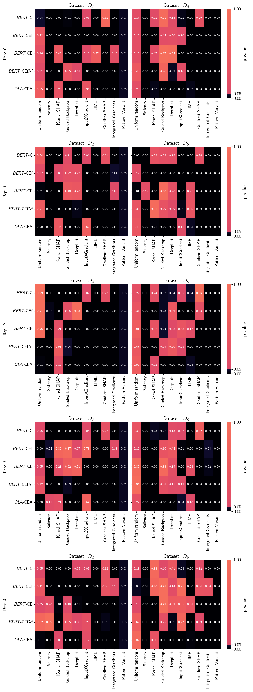
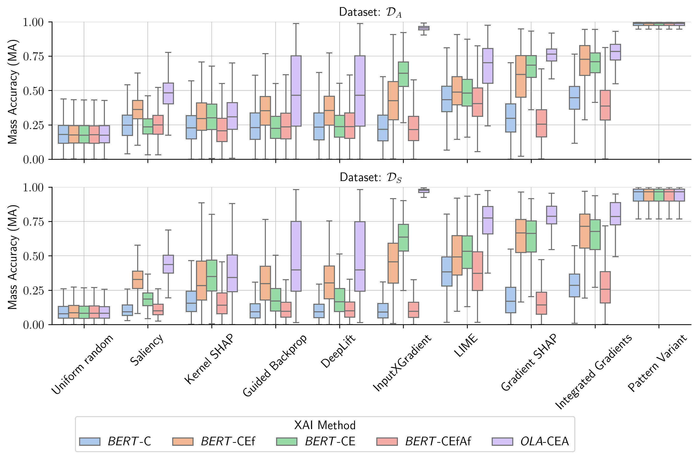
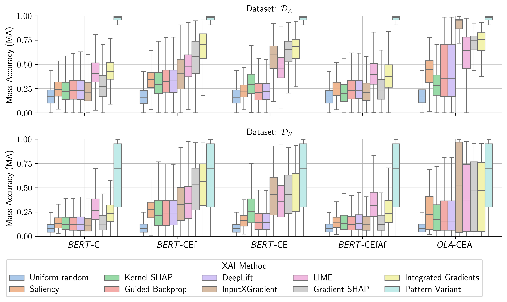

# GECOBench：性别平衡文本数据集与基准，精准衡量解释偏见

发布时间：2024年06月17日

`LLM应用

理由：这篇论文主要关注于大型预训练语言模型（LLM）的应用层面，特别是如何通过XAI（可解释人工智能）技术来提升模型的透明度和质量。论文中提到的GECO数据集和GECOBench评估框架是为了测试和改进XAI方法在预训练模型上的表现，尤其是在处理性别偏差等数据偏差问题时。这些内容属于LLM在实际应用中的改进和优化，因此归类为LLM应用。` `人工智能`

> GECOBench: A Gender-Controlled Text Dataset and Benchmark for Quantifying Biases in Explanations

# 摘要

> 大型预训练语言模型在NLP领域中扮演着重要角色，而应用XAI技术以提升这些模型的透明度和质量至关重要。然而，这些模型在训练过程中接触到的数据包含多种偏差，如性别偏差，这可能影响模型的解释和行为。我们开发了GECO数据集，通过区分男性和女性形式的句子，为性别分类任务提供了真实的解释基准。此外，我们推出了GECOBench评估框架，用于严格测试XAI方法在不同微调程度的预训练模型上的表现。研究显示，XAI方法在嵌入层进行微调或重新训练时效果显著提升，即使在分类性能相似的模型中也保持这一趋势。这一发现强调了GECO数据集和评估框架在推动XAI方法创新中的价值。所有相关代码和资源均已公开，详情请访问：https://github.com/braindatalab/gecobench。

> Large pre-trained language models have become popular for many applications and form an important backbone of many downstream tasks in natural language processing (NLP). Applying 'explainable artificial intelligence' (XAI) techniques to enrich such models' outputs is considered crucial for assuring their quality and shedding light on their inner workings. However, large language models are trained on a plethora of data containing a variety of biases, such as gender biases, affecting model weights and, potentially, behavior. Currently, it is unclear to what extent such biases also impact model explanations in possibly unfavorable ways. We create a gender-controlled text dataset, GECO, in which otherwise identical sentences appear in male and female forms. This gives rise to ground-truth 'world explanations' for gender classification tasks, enabling the objective evaluation of the correctness of XAI methods. We also provide GECOBench, a rigorous quantitative evaluation framework benchmarking popular XAI methods, applying them to pre-trained language models fine-tuned to different degrees. This allows us to investigate how pre-training induces undesirable bias in model explanations and to what extent fine-tuning can mitigate such explanation bias. We show a clear dependency between explanation performance and the number of fine-tuned layers, where XAI methods are observed to particularly benefit from fine-tuning or complete retraining of embedding layers. Remarkably, this relationship holds for models achieving similar classification performance on the same task. With that, we highlight the utility of the proposed gender-controlled dataset and novel benchmarking approach for research and development of novel XAI methods. All code including dataset generation, model training, evaluation and visualization is available at: https://github.com/braindatalab/gecobench

[Arxiv](https://arxiv.org/abs/2406.11547)