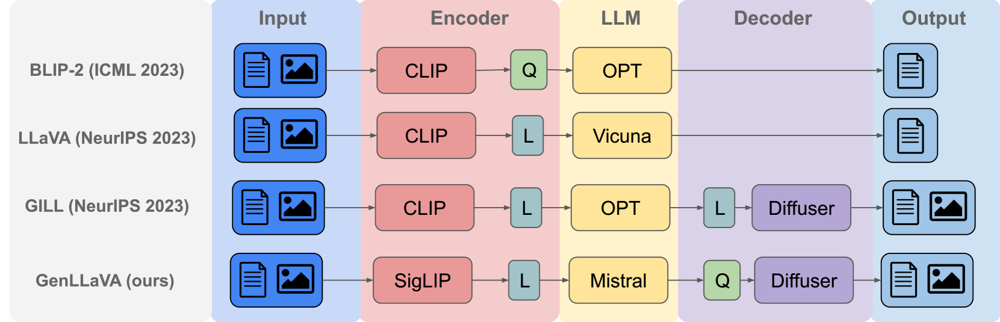
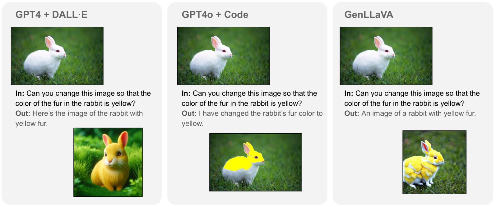
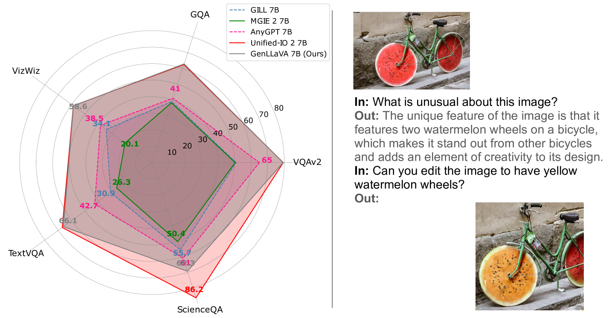
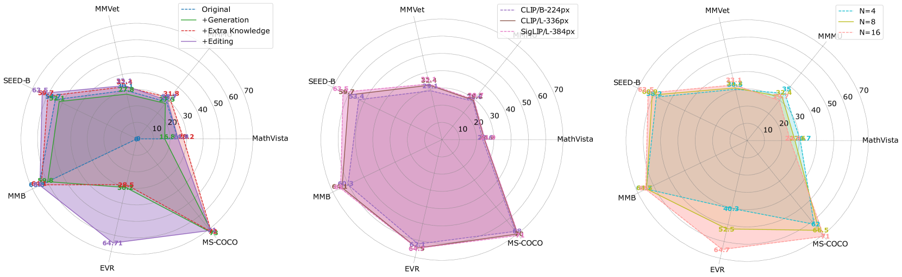
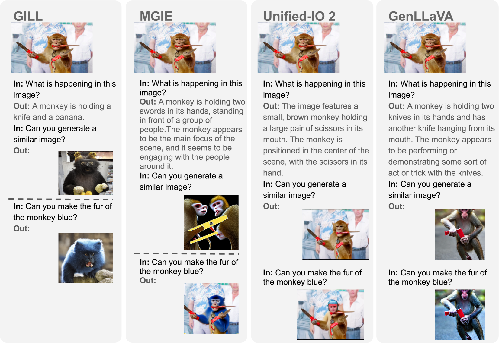

# 视觉指令生成调优

发布时间：2024年06月17日

`Agent

理由：这篇论文介绍了一个名为 GenLLaVA 的生成型助手，它是一个集语言与视觉于一体的系统，能够执行生成和图像编辑任务。这个系统是通过整合多种预训练模型并进行指令微调来实现的。GenLLaVA 的功能和设计使其成为一个典型的 Agent 系统，因为它能够根据指令执行任务，并在视觉理解方面表现出强大的能力。此外，论文中提到的开源数据集、代码和模型检查点也表明了其旨在推动该领域的研究和应用，进一步强调了其作为 Agent 的特性。` `人工智能` `视觉助手`

> Generative Visual Instruction Tuning

# 摘要

> 我们提出利用机器生成的指令数据来增强大型多模态模型的零-shot性能，并扩展其对生成和图像编辑任务的支持。通过整合GPT-4V和现有数据集，我们精心制作了一套新的多模态指令集。结合LLaVA-Finetune的视觉理解指令，我们创造了GenLLaVA，一个集语言与视觉于一体的生成型助手。GenLLaVA融合了LLaMA、SigLIP和StableDiffusion三大预训练模型的优势，通过指令微调实现。它在视觉理解上与LLaVA媲美，并在与Unified-IO 2等模型的竞争中表现出色，为开发高级通用视觉助手奠定了基础。我们已将相关数据集、代码和模型检查点开源，以推动该领域的深入研究与应用。

> We propose to use machine-generated instruction-following data to improve the zero-shot capabilities of a large multimodal model with additional support for generative and image editing tasks. We achieve this by curating a new multimodal instruction-following set using GPT-4V and existing datasets for image generation and editing. Using this instruction set and the existing LLaVA-Finetune instruction set for visual understanding tasks, we produce GenLLaVA, a Generative Large Language, and Visual Assistant. GenLLaVA is built through a strategy that combines three types of large pre-trained models through instruction finetuning: LLaMA for language modeling, SigLIP for image-text matching, and StableDiffusion for text-to-image generation. Our model demonstrates visual understanding capabilities on par with LLaVA and additionally demonstrates competitive results with native multimodal models such as Unified-IO 2, paving the way for building advanced general-purpose visual assistants by effectively re-using existing multimodal models. We open-source our dataset, codebase, and model checkpoints to foster further research and application in this domain.

[Arxiv](https://arxiv.org/abs/2406.11262)