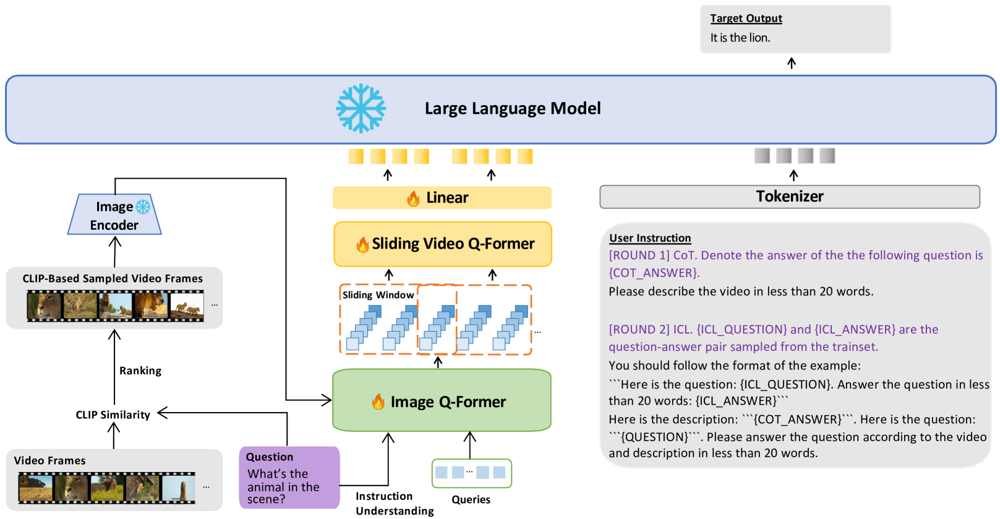

# 缓解幻觉现象，深化长期视频理解

发布时间：2024年06月17日

`LLM应用

这篇论文主要探讨了多模态大型语言模型（MLLMs）在处理长视频时的挑战，并提出了一种新的方法来缓解由于帧聚合引入的幻觉问题。论文中提出的策略包括利用CLIP分数指导帧采样、将问题信息融入图像Q-former的查询以提取关键视觉特征，以及在答案生成阶段使用思维链和情境学习技术。这些方法旨在提高视频理解的准确性，并在实际的数据集测试中取得了显著的性能提升。因此，这篇论文更偏向于LLM的应用层面，即如何改进和应用现有的LLM技术来解决实际问题。` `视频理解` `电影制作`

> Hallucination Mitigation Prompts Long-term Video Understanding

# 摘要

> 多模态大型语言模型近期在视频理解领域取得显著进步，但其处理未经处理的长视频的能力仍受限，主要因内存开销巨大。现有技术虽通过帧聚合平衡了内存与信息，却引入了严重的幻觉问题。为此，本文提出了一套基于现有MLLMs的幻觉缓解策略：首先，利用CLIP分数指导帧采样，精选与问题相关的关键帧；其次，将问题信息融入图像Q-former的查询，提取关键视觉特征；最后，在答案生成阶段，运用思维链和情境学习技术精确控制答案生成。特别地，在断点模式下，图像理解模型表现优于视频理解模型，我们通过比较机制综合了两者的答案。最终，在MovieChat数据集上，我们的方法分别在全球和断点模式下达到了84.2%和62.9%的准确率，超越官方基线模型29.1%和24.1%，并在CVPR LOVEU 2024长期视频问答挑战赛中荣获第三名。相关代码已公开于https://github.com/lntzm/CVPR24Track-LongVideo。

> Recently, multimodal large language models have made significant advancements in video understanding tasks. However, their ability to understand unprocessed long videos is very limited, primarily due to the difficulty in supporting the enormous memory overhead. Although existing methods achieve a balance between memory and information by aggregating frames, they inevitably introduce the severe hallucination issue. To address this issue, this paper constructs a comprehensive hallucination mitigation pipeline based on existing MLLMs. Specifically, we use the CLIP Score to guide the frame sampling process with questions, selecting key frames relevant to the question. Then, We inject question information into the queries of the image Q-former to obtain more important visual features. Finally, during the answer generation stage, we utilize chain-of-thought and in-context learning techniques to explicitly control the generation of answers. It is worth mentioning that for the breakpoint mode, we found that image understanding models achieved better results than video understanding models. Therefore, we aggregated the answers from both types of models using a comparison mechanism. Ultimately, We achieved 84.2\% and 62.9\% for the global and breakpoint modes respectively on the MovieChat dataset, surpassing the official baseline model by 29.1\% and 24.1\%. Moreover the proposed method won the third place in the CVPR LOVEU 2024 Long-Term Video Question Answering Challenge. The code is avaiable at https://github.com/lntzm/CVPR24Track-LongVideo

[Arxiv](https://arxiv.org/abs/2406.11333)