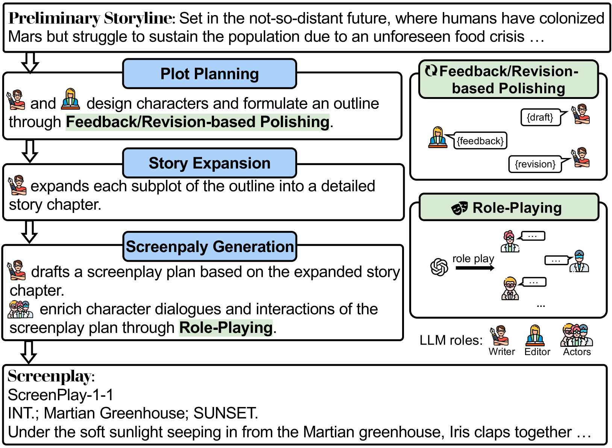
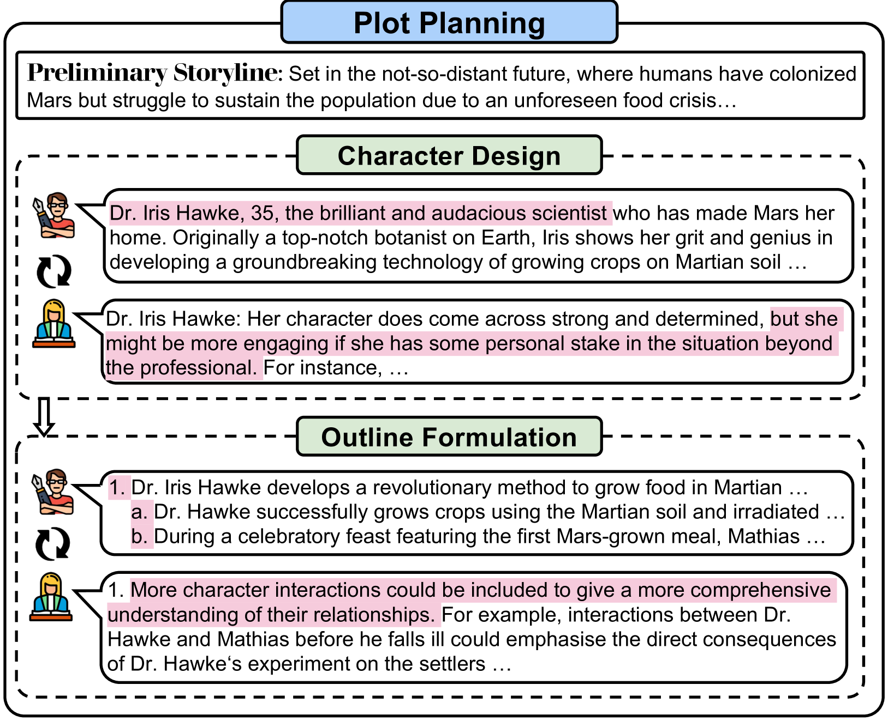
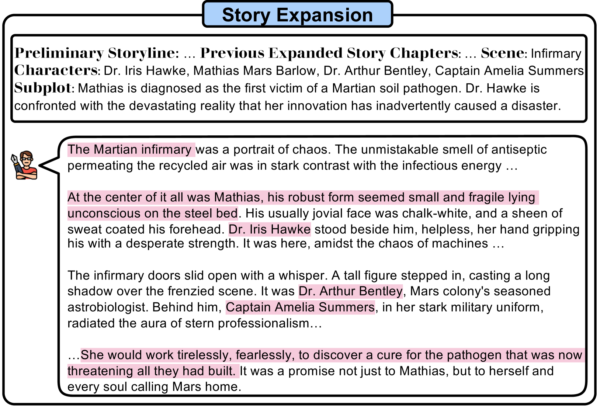
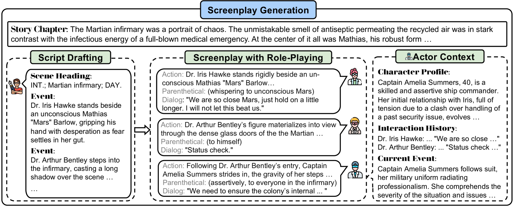

# HoLLMwood：角色扮演激发大型语言模型在编剧领域的无限创意

发布时间：2024年06月17日

`LLM应用

这篇论文介绍了一个名为HoLLMwood的框架，旨在利用大型语言模型（LLMs）在剧本创作中的创造潜力。该框架通过模仿人类创作过程，让LLMs扮演不同的角色（如Writer、Editor和Actors），并通过角色扮演机制进行互动，以提高剧本的连贯性、相关性、趣味性和整体质量。这种方法展示了LLMs在特定应用场景下的实际应用和创新，因此属于LLM应用分类。`

> HoLLMwood: Unleashing the Creativity of Large Language Models in Screenwriting via Role Playing

# 摘要

> 生成式AI在计算机视觉领域展现了前所未有的创造力，但在自然语言处理领域，这一现象尚未显现。尤其是大型语言模型（LLMs），由于文学创作的极高复杂性，难以创作出与人类专家媲美的作品。本文推出的HoLLMwood框架，旨在激发LLMs在剧本创作中的创造潜力，这是一个极具挑战的任务。我们模仿人类创作过程，让LLMs扮演现实世界中的不同角色。除了常见的${Writer}角色，LLMs还扮演${Editor}，提供反馈和修订建议。此外，通过角色扮演机制，LLMs作为${Actors}相互交流互动，以丰富角色和深化剧情。评估结果显示，HoLLMwood在剧本的连贯性、相关性、趣味性和整体质量上均显著超越了强基线。

> Generative AI has demonstrated unprecedented creativity in the field of computer vision, yet such phenomena have not been observed in natural language processing. In particular, large language models (LLMs) can hardly produce written works at the level of human experts due to the extremely high complexity of literature writing. In this paper, we present HoLLMwood, an automated framework for unleashing the creativity of LLMs and exploring their potential in screenwriting, which is a highly demanding task. Mimicking the human creative process, we assign LLMs to different roles involved in the real-world scenario. In addition to the common practice of treating LLMs as ${Writer}$, we also apply LLMs as ${Editor}$, who is responsible for providing feedback and revision advice to ${Writer}$. Besides, to enrich the characters and deepen the plots, we introduce a role-playing mechanism and adopt LLMs as ${Actors}$ that can communicate and interact with each other. Evaluations on automatically generated screenplays show that HoLLMwood substantially outperforms strong baselines in terms of coherence, relevance, interestingness and overall quality.

[Arxiv](https://arxiv.org/abs/2406.11683)