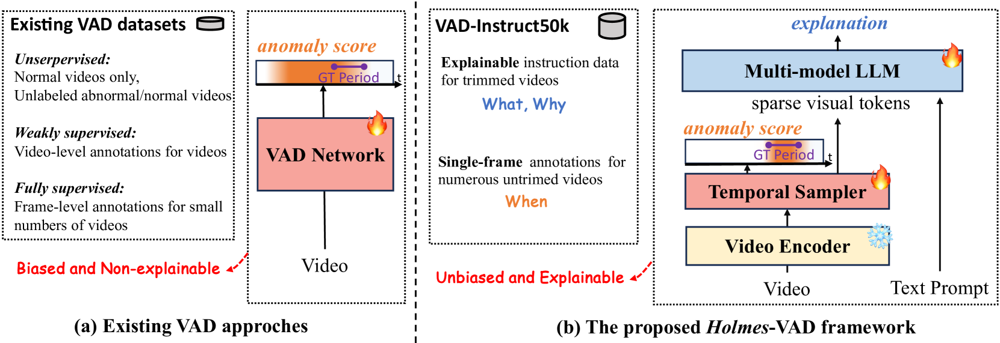
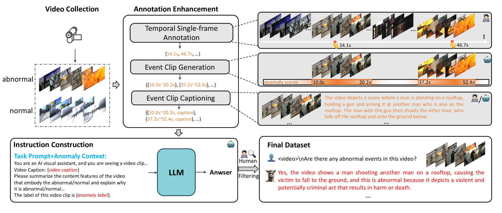
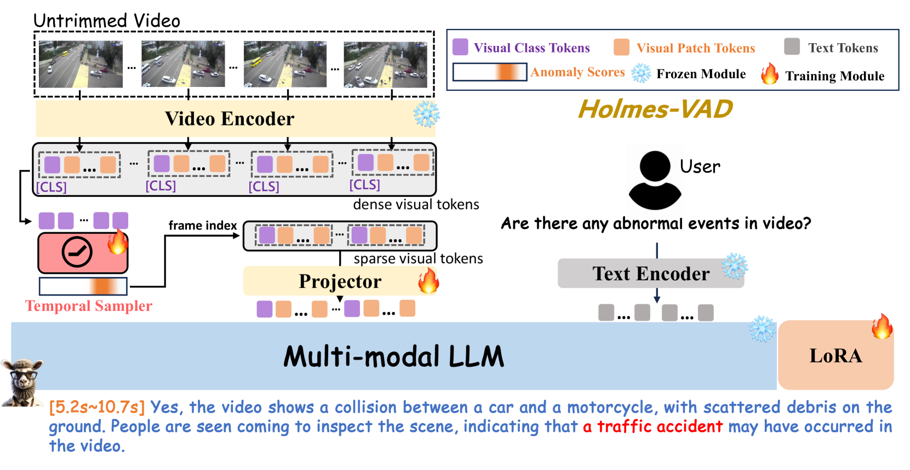
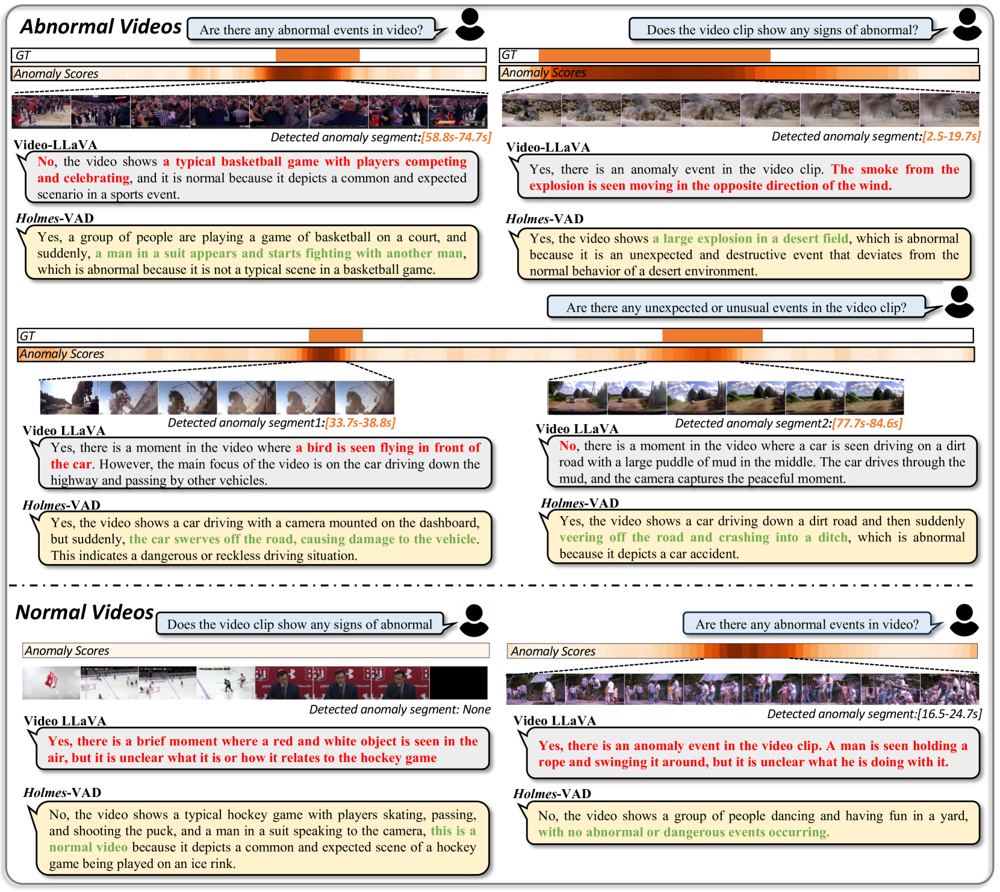
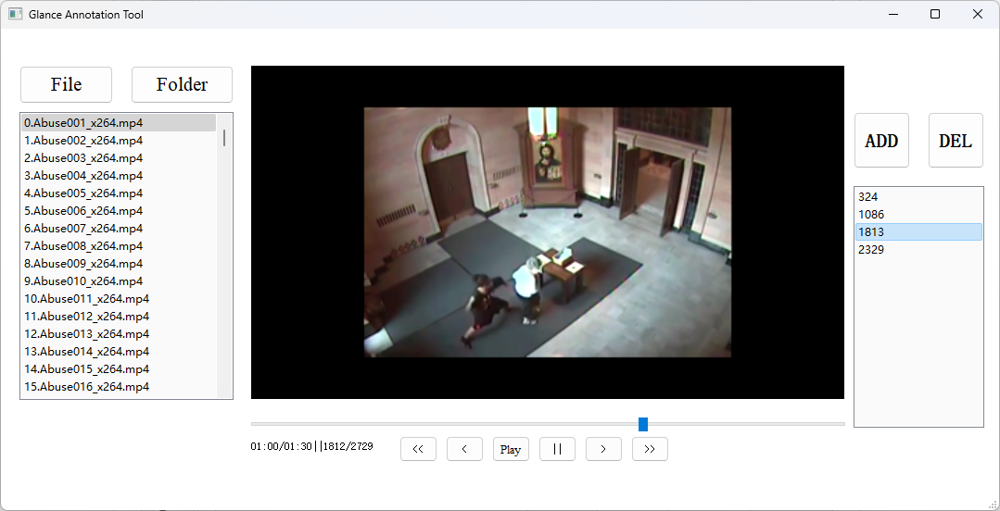
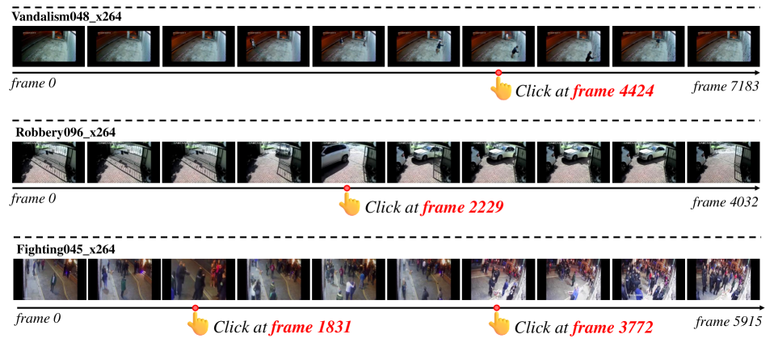
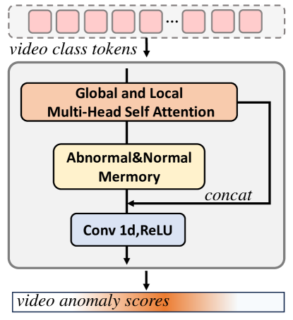
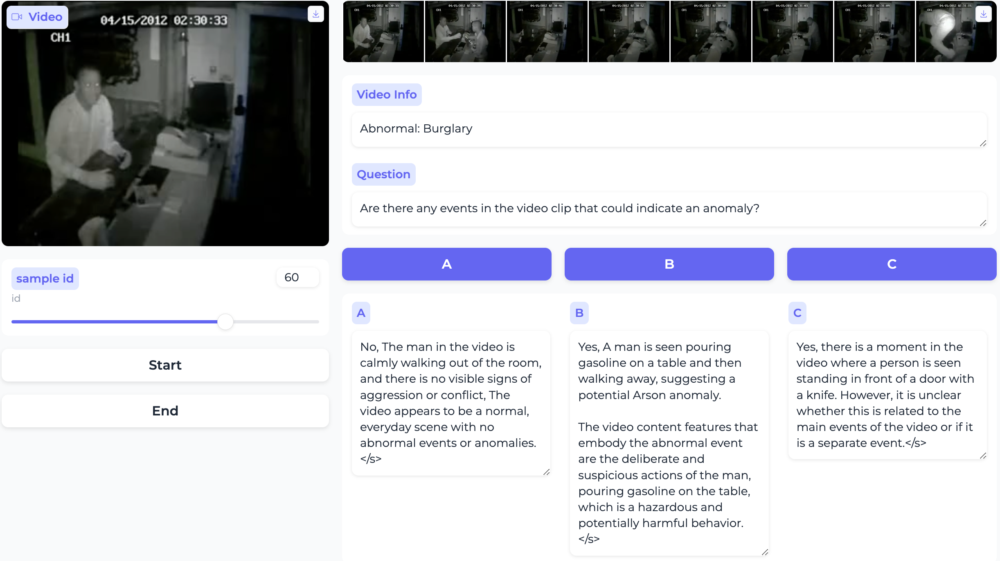

# Holmes-VAD：借助多模态LLM，迈向无偏见且透明的视频异常检测新境界

发布时间：2024年06月17日

`Agent

理由：这篇论文介绍了一个名为Holmes-VAD的创新框架，该框架通过精细的时间监控和多模态指令实现视频异常检测。它不仅关注于检测异常，还提供了详细的解释，这表明它是一个智能Agent，能够处理复杂的任务并提供解释。此外，它使用多模态大型语言模型（LLM）来生成解释性内容，这进一步强调了其作为Agent的特性，因为它能够理解和响应多模态输入。虽然论文中提到了LLM的应用，但主要焦点是Agent的行为和能力，因此将其归类为Agent。` `视频监控` `异常检测`

> Holmes-VAD: Towards Unbiased and Explainable Video Anomaly Detection via Multi-modal LLM

# 摘要

> 在视频异常检测（VAD）的开放领域中，现有方法在处理复杂或未知事件时往往检测有偏，且缺乏透明度。为此，我们推出了Holmes-VAD，这一创新框架通过精细的时间监控和多模态指令，实现了异常的精准定位与详尽解释。首先，我们构建了首个大规模多模态VAD指令调整基准——VAD-Instruct50k，采用半自动标注方法，结合高效单帧标注与先进的视频描述及语言模型，生成了高质量的异常与正常视频分析。基于此，我们定制了一套可解释的视频异常检测方案，通过轻量级时间采样器筛选关键帧，并利用多模态大型语言模型（LLM）生成解释性内容。实验证明，Holmes-VAD不仅通用性强，而且解释性佳，成为现实世界视频异常分析的新锐技术。我们将在https://github.com/pipixin321/HolmesVAD公开分享我们的基准和模型，以飨社区。

> Towards open-ended Video Anomaly Detection (VAD), existing methods often exhibit biased detection when faced with challenging or unseen events and lack interpretability. To address these drawbacks, we propose Holmes-VAD, a novel framework that leverages precise temporal supervision and rich multimodal instructions to enable accurate anomaly localization and comprehensive explanations. Firstly, towards unbiased and explainable VAD system, we construct the first large-scale multimodal VAD instruction-tuning benchmark, i.e., VAD-Instruct50k. This dataset is created using a carefully designed semi-automatic labeling paradigm. Efficient single-frame annotations are applied to the collected untrimmed videos, which are then synthesized into high-quality analyses of both abnormal and normal video clips using a robust off-the-shelf video captioner and a large language model (LLM). Building upon the VAD-Instruct50k dataset, we develop a customized solution for interpretable video anomaly detection. We train a lightweight temporal sampler to select frames with high anomaly response and fine-tune a multimodal large language model (LLM) to generate explanatory content. Extensive experimental results validate the generality and interpretability of the proposed Holmes-VAD, establishing it as a novel interpretable technique for real-world video anomaly analysis. To support the community, our benchmark and model will be publicly available at https://github.com/pipixin321/HolmesVAD.

[Arxiv](https://arxiv.org/abs/2406.12235)