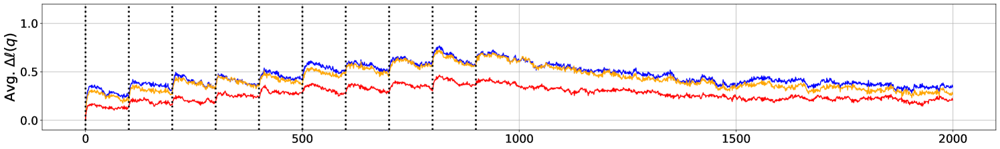
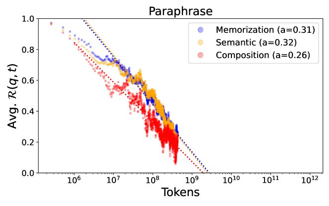
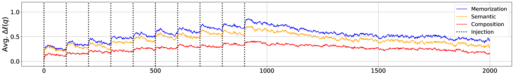
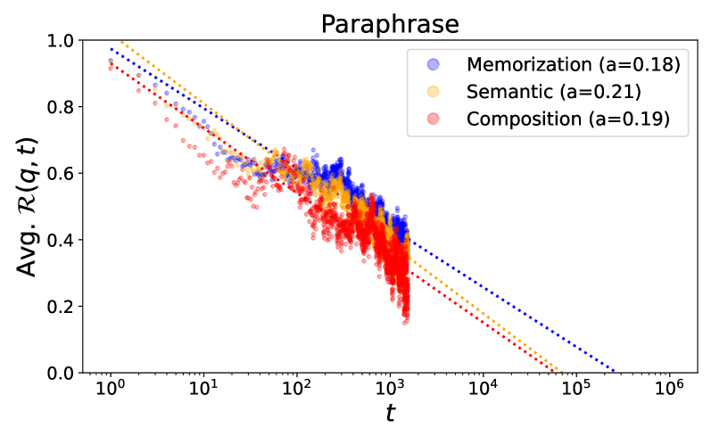
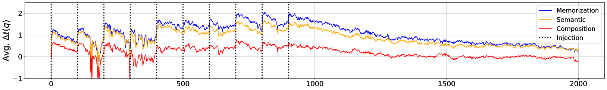

# 大型语言模型在预训练阶段如何汲取事实知识？

发布时间：2024年06月17日

`LLM理论

这篇论文摘要主要探讨了大型语言模型（LLMs）在预训练过程中如何获取和保持事实知识的机制。研究揭示了预训练数据量、训练步骤、训练批量等因素对模型知识获取和遗忘的影响。这些发现有助于理解LLMs的行为，并提出了改进模型性能的可能方向。由于论文内容聚焦于LLMs的理论层面，特别是预训练过程中的知识获取机制，因此将其归类为LLM理论。` `机器学习`

> How Do Large Language Models Acquire Factual Knowledge During Pretraining?

# 摘要

> 尽管大型语言模型（LLMs）能存储大量事实知识，但其预训练获取知识的机制仍不甚明了。本研究深入探讨了LLMs预训练中事实知识的获取过程，揭示了几个关键发现：首先，令人意外的是，增加预训练数据量并未显著提升模型的事实知识获取与保持能力；其次，训练步骤与事实知识的遗忘和泛化之间存在幂律关系，重复使用训练数据的LLMs遗忘速度更快；再者，增大训练批量有助于增强模型抵抗遗忘的能力。总体来看，LLMs预训练中事实知识的获取是通过逐步提高预训练数据中每一步呈现的事实知识概率来实现的，但这一过程受到后续遗忘的影响。基于这些发现，我们能够解释LLMs近期的一些行为，如在长尾知识上的表现不佳及去重预训练语料库的益处。

> Despite the recent observation that large language models (LLMs) can store substantial factual knowledge, there is a limited understanding of the mechanisms of how they acquire factual knowledge through pretraining. This work addresses this gap by studying how LLMs acquire factual knowledge during pretraining. The findings reveal several important insights into the dynamics of factual knowledge acquisition during pretraining. First, counterintuitively, we observe that pretraining on more data shows no significant improvement in the model's capability to acquire and maintain factual knowledge. Next, there is a power-law relationship between training steps and forgetting of memorization and generalization of factual knowledge, and LLMs trained with duplicated training data exhibit faster forgetting. Third, training LLMs with larger batch sizes can enhance the models' robustness to forgetting. Overall, our observations suggest that factual knowledge acquisition in LLM pretraining occurs by progressively increasing the probability of factual knowledge presented in the pretraining data at each step. However, this increase is diluted by subsequent forgetting. Based on this interpretation, we demonstrate that we can provide plausible explanations for recently observed behaviors of LLMs, such as the poor performance of LLMs on long-tail knowledge and the benefits of deduplicating the pretraining corpus.

[Arxiv](https://arxiv.org/abs/2406.11813)