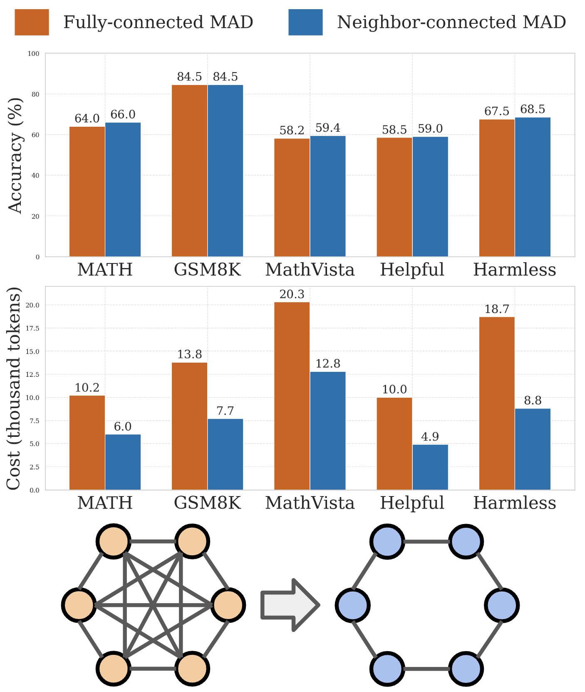
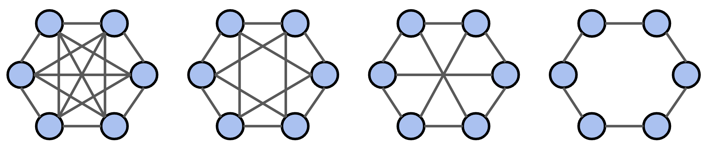
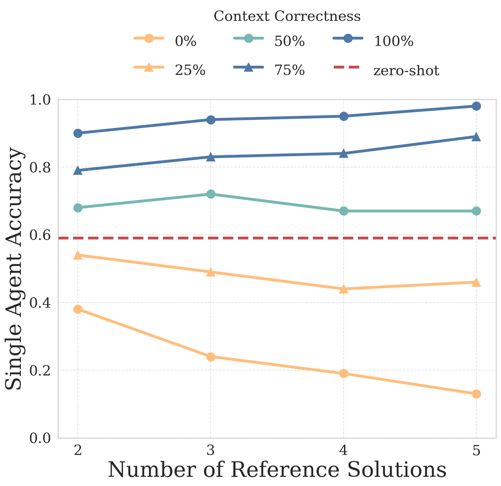
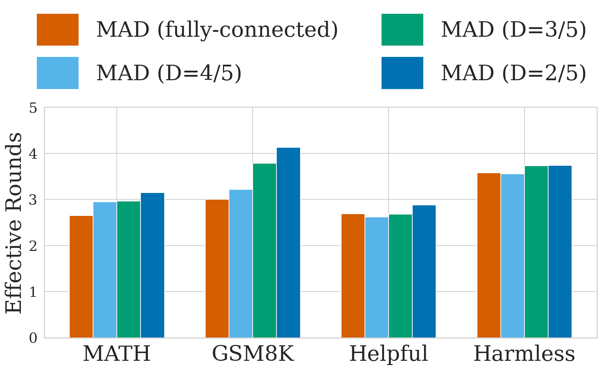
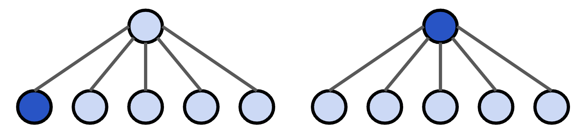
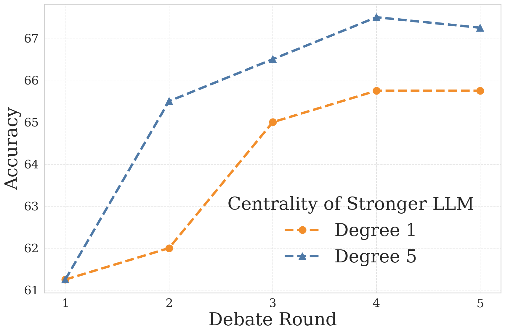
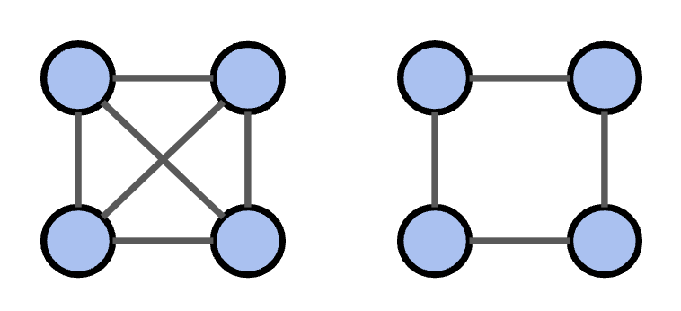
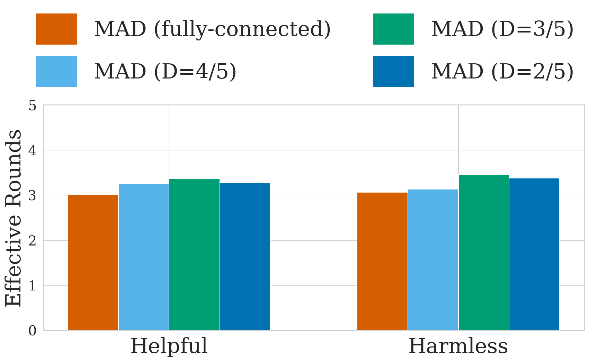
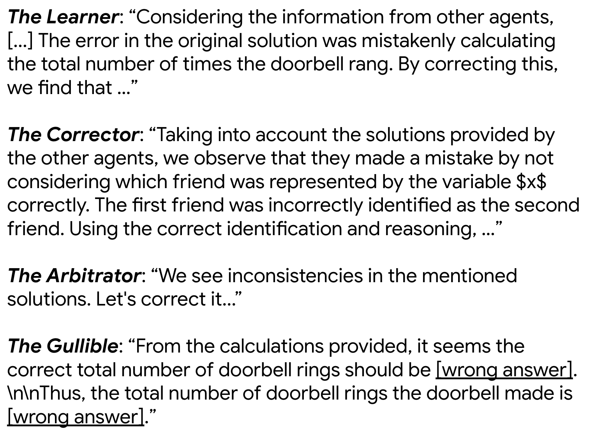

# 优化多智能体辩论：探索稀疏通信拓扑的潜力

发布时间：2024年06月17日

`Agent

这篇论文主要探讨了多代理系统中沟通网络结构的影响，并通过实验验证了稀疏通信网络在多代理辩论中的性能优势和计算开销的削减。这一研究关注的是代理（Agent）之间的交互和优化，因此属于Agent分类。` `人工智能` `多代理系统`

> Improving Multi-Agent Debate with Sparse Communication Topology

# 摘要

> 多代理辩论已证实能显著提升大型语言模型在推理和事实核查任务上的表现。尽管已有多种角色扮演策略被应用于多代理辩论，但现有沟通方式仍采用简单粗暴的全连接模式。本文深入探讨了多代理系统中沟通网络结构的影响，通过在GPT和Mistral模型上的实验，我们发现采用稀疏通信网络的多代理辩论不仅能保持甚至超越传统全连接模式的性能，还能大幅削减计算开销。此外，我们将这一框架拓展至多模态推理和校准标签任务，证明了其广泛的适用性和高效性。这些发现凸显了优化沟通网络结构对于提升“心智社会”方法效能的关键作用。

> Multi-agent debate has proven effective in improving large language models quality for reasoning and factuality tasks. While various role-playing strategies in multi-agent debates have been explored, in terms of the communication among agents, existing approaches adopt a brute force algorithm -- each agent can communicate with all other agents. In this paper, we systematically investigate the effect of communication connectivity in multi-agent systems. Our experiments on GPT and Mistral models reveal that multi-agent debates leveraging sparse communication topology can achieve comparable or superior performance while significantly reducing computational costs. Furthermore, we extend the multi-agent debate framework to multimodal reasoning and alignment labeling tasks, showcasing its broad applicability and effectiveness. Our findings underscore the importance of communication connectivity on enhancing the efficiency and effectiveness of the "society of minds" approach.

[Arxiv](https://arxiv.org/abs/2406.11776)