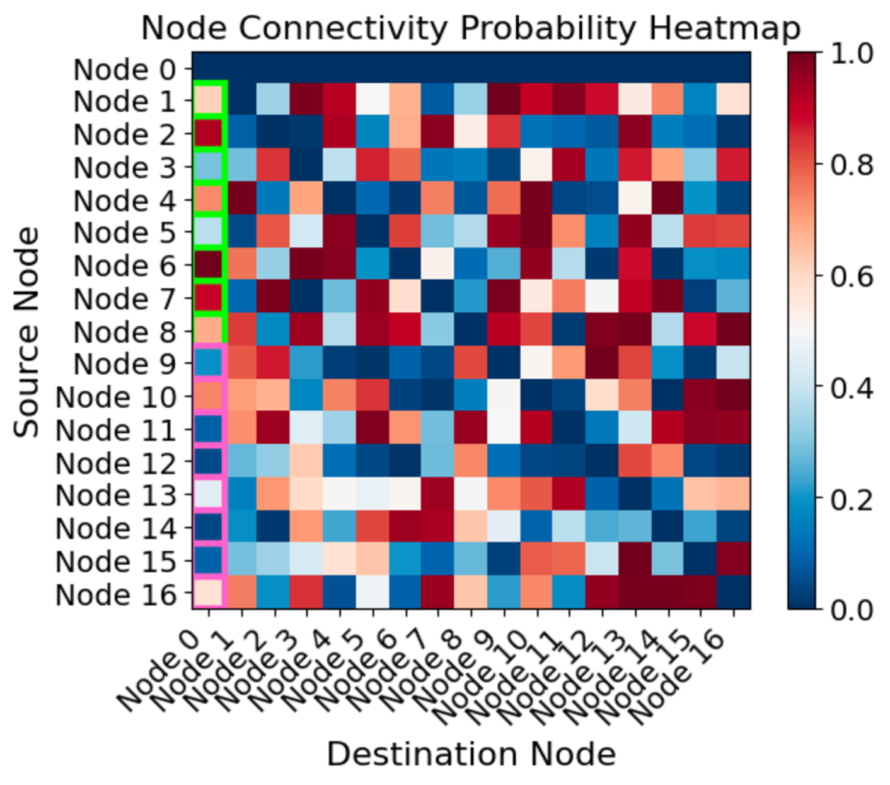
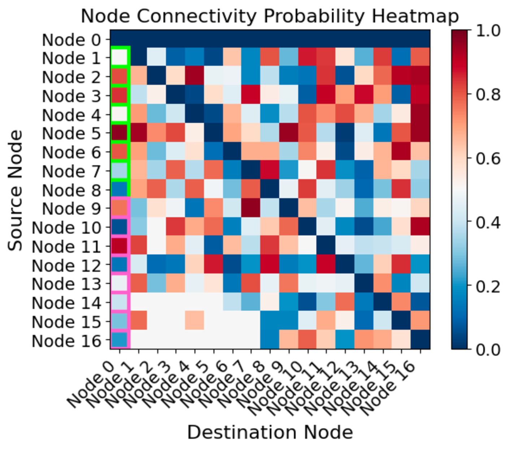
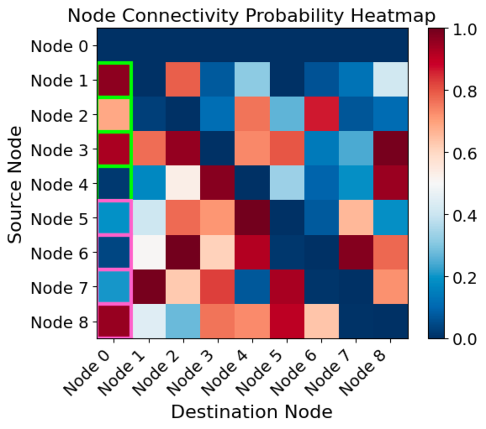
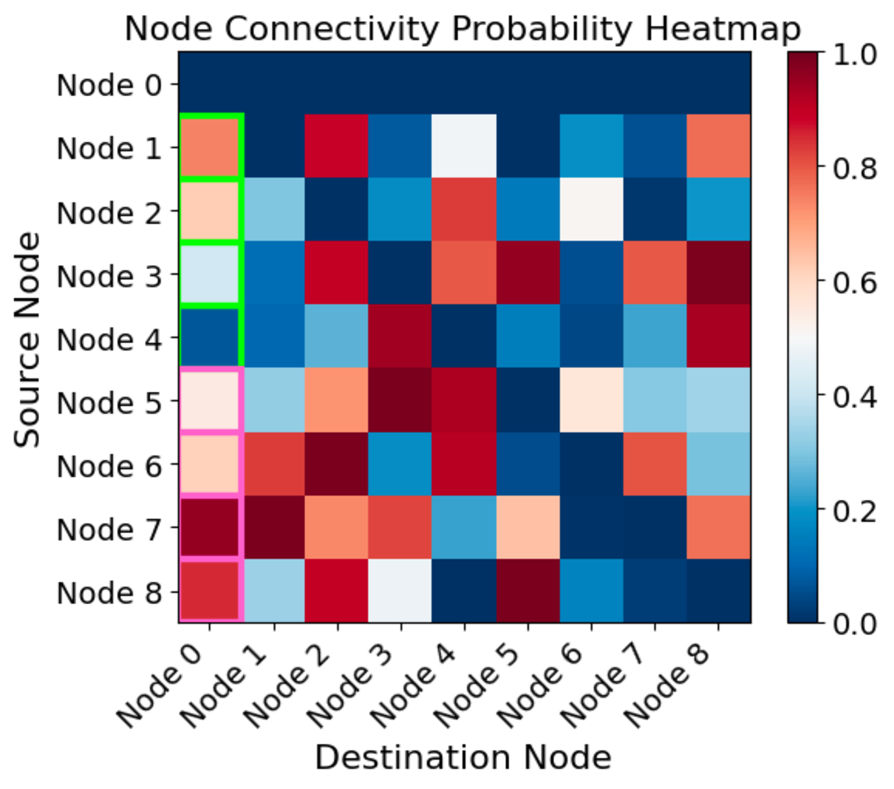
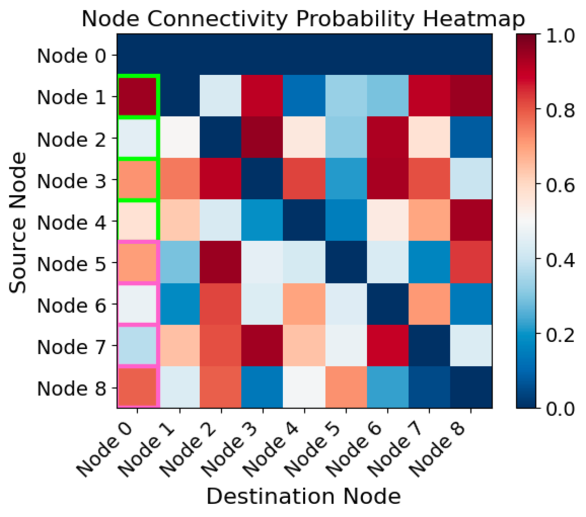
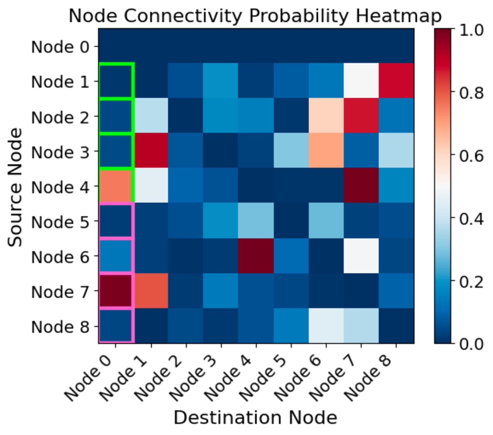
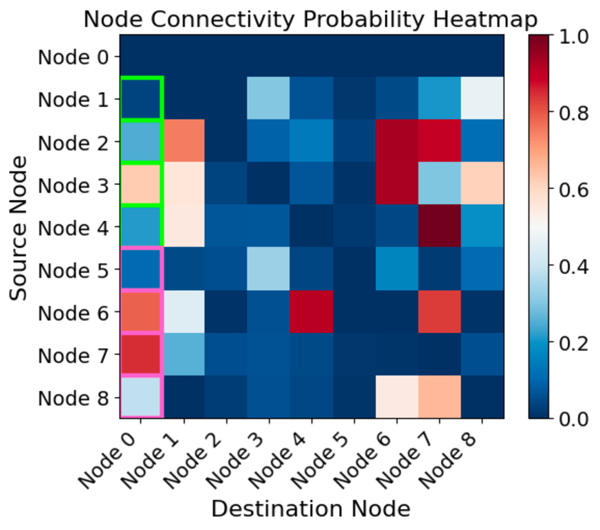
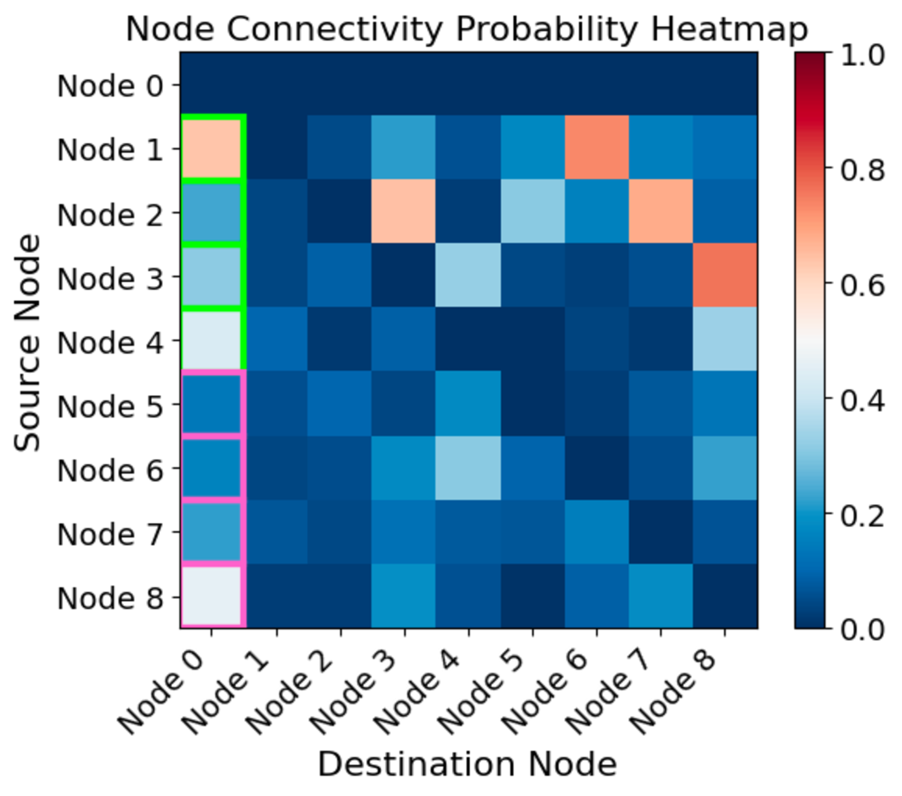
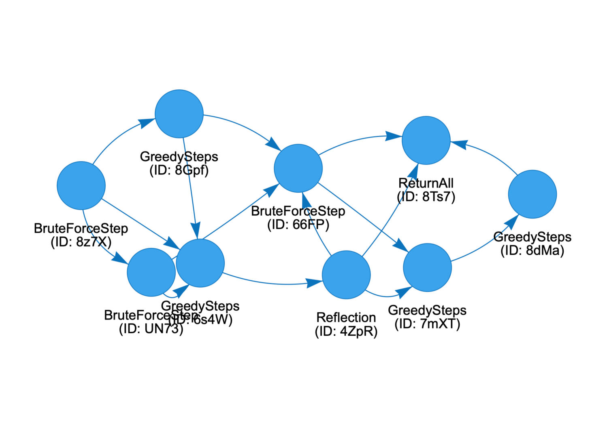
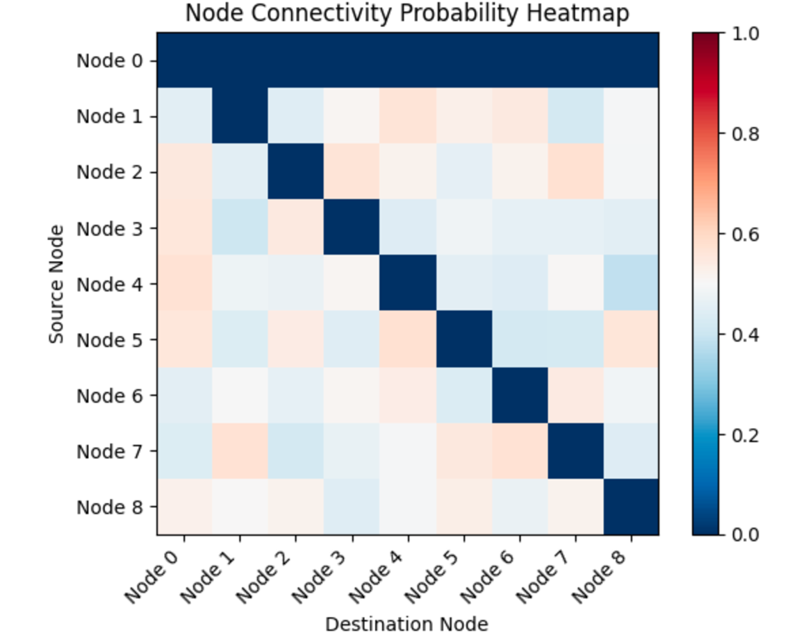

# 基于输入条件的图生成技术，助力语言代理的智能交互

发布时间：2024年06月17日

`Agent

这篇论文的研究重点在于开发可学习且动态的语言代理，通过图框架抽象语言代理，并利用强化学习微调预训练的大型语言模型（LLMs）来动态调整代理的内部通信。这种方法使得模型能够适应不同领域的数据，并在部署时展现出优异的性能。因此，这篇论文更符合Agent分类，因为它主要关注的是语言代理的设计和优化，而不是LLM的理论研究或特定应用。` `人工智能`

> Input Conditioned Graph Generation for Language Agents

# 摘要

> 大型语言模型（LLMs）与语言代理的最新进展预示着跨学科未来应用的广阔前景。传统语言代理多依赖固定设计，而我们的研究则致力于开发可学习且动态的代理。我们采用图框架来抽象语言代理，旨在训练一个模型，使其能为每个输入生成代表通信流的边，从而动态调整代理的内部通信。通过强化学习微调预训练的LLM，我们实现了在多个数据集上的同步微调，并发现模型能在训练中适应不同领域，进而在部署时面对多样数据展现优异性能。我们的方法在MMLU与CMMLU的联合数据集上提升了近6%的准确率，在引入稀疏性诱导损失的训练中更是提升了超过10%。此外，在MMLU和Mini Crossword Puzzles数据集的实验中也表现卓越。相关代码已公开于https://github.com/lukasVierling/DynamicGPTSwarm。

> Recent progress in Large Language Models (LLMs) and language agents has demonstrated significant promise for various future applications across multiple disciplines. While traditional approaches to language agents often rely on fixed, handcrafted designs, our research aims to develop both learnable and dynamic agents. Our method uses an existing framework that abstracts language agents as graphs. Within this graph framework, we aim to learn a model that can generate edges for every given input to the language agent. This allows us to generate edges that represent the flow of communication within the graph based on the given input, thereby adjusting the internal communication of a language agent. We learn to generate these edges using a pretrained LLM that is fine-tuned with reinforcement learning. This LLM can be fine-tuned on several datasets simultaneously, and we hypothesize that the model learns to adapt to these different domains during training, achieving good overall performance when encountering data from different domains during deployment. We demonstrate that our approach surpasses the previous static approach by nearly 6% accuracy on a combined dataset of MMLU and CMMLU, and by more than 10% when trained with a sparsity-inducing loss. It also performs superior in additional experiments conducted with the MMLU and Mini Crossword Puzzles datasets. The code is available at https://github.com/lukasVierling/DynamicGPTSwarm.

[Arxiv](https://arxiv.org/abs/2406.11555)