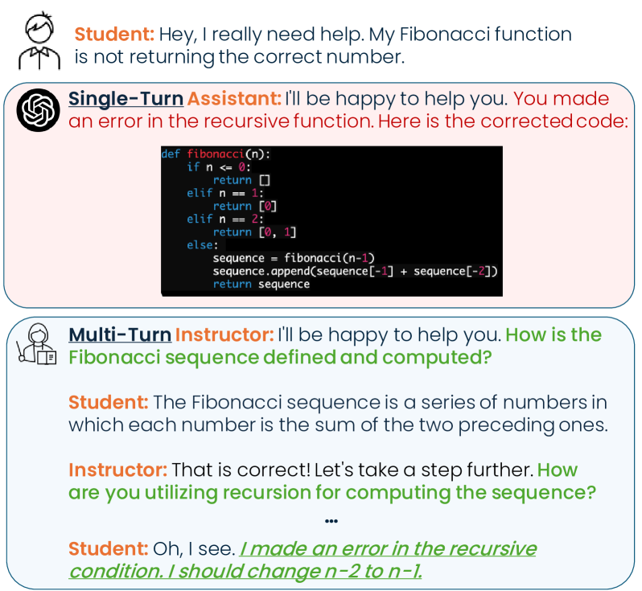
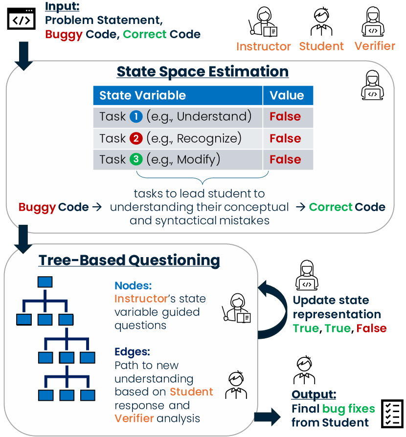
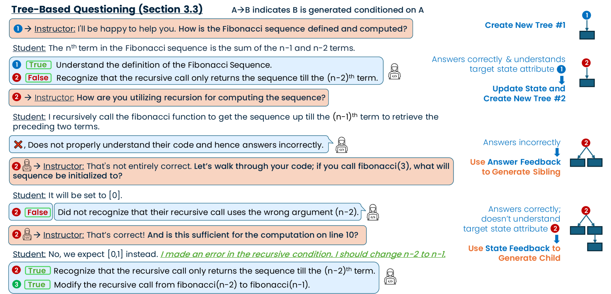

# 引导而非辅助：利用大型语言模型进行多轮规划与分层提问，实现苏格拉底式代码调试的精妙指导。

发布时间：2024年06月17日

`Agent

这篇论文介绍了一个名为 TreeInstruct 的指导代理，它利用苏格拉底式提问的方法来引导学生在代码调试领域进行自主学习和问题解决。TreeInstruct 通过动态构建问题树，根据学生的回答和知识状态来提出深入的问题，从而在多轮对话中帮助学生发现并解决问题。这种代理的设计和应用明显属于Agent分类，因为它是一个专门设计的系统，用于与用户（学生）进行交互，以实现特定的教学目标。` `编程教育`

> Instruct, Not Assist: LLM-based Multi-Turn Planning and Hierarchical Questioning for Socratic Code Debugging

# 摘要

> 苏格拉底式提问，作为一种激发批判性思维和问题解决的教学策略，正与大型语言模型（LLMs）的对话潜力相结合，为学生提供实时、可扩展的指导。然而，现今的LLMs往往直接揭示答案，失去了引导学生思考的能力。为此，我们开发了TreeInstruct，一个基于创新状态空间规划算法的指导代理，专攻代码调试领域。TreeInstruct通过提出深入的问题，引导学生自主发现并解决问题。它根据学生的回答和知识状态，动态构建问题树，巧妙地在多轮对话中同时解决独立和依赖性错误。我们不仅使用了现有的单错误调试基准，还精心构建了一个包含150个编码问题、错误解决方案及修复的多错误数据集，均由专家注释。评估结果显示，TreeInstruct在两个数据集上均表现卓越，超越了其他教师模型。一项涉及五名不同水平学生的实际案例研究也证实，TreeInstruct能有效引导学生通过最少的对话轮次，以苏格拉底式提问高效调试代码。

> Socratic questioning is an effective teaching strategy, encouraging critical thinking and problem-solving. The conversational capabilities of large language models (LLMs) show great potential for providing scalable, real-time student guidance. However, current LLMs often give away solutions directly, making them ineffective instructors. We tackle this issue in the code debugging domain with TreeInstruct, an Instructor agent guided by a novel state space-based planning algorithm. TreeInstruct asks probing questions to help students independently identify and resolve errors. It estimates a student's conceptual and syntactical knowledge to dynamically construct a question tree based on their responses and current knowledge state, effectively addressing both independent and dependent mistakes concurrently in a multi-turn interaction setting. In addition to using an existing single-bug debugging benchmark, we construct a more challenging multi-bug dataset of 150 coding problems, incorrect solutions, and bug fixes -- all carefully constructed and annotated by experts. Extensive evaluation shows TreeInstruct's state-of-the-art performance on both datasets, proving it to be a more effective instructor than baselines. Furthermore, a real-world case study with five students of varying skill levels further demonstrates TreeInstruct's ability to guide students to debug their code efficiently with minimal turns and highly Socratic questioning.

[Arxiv](https://arxiv.org/abs/2406.11709)