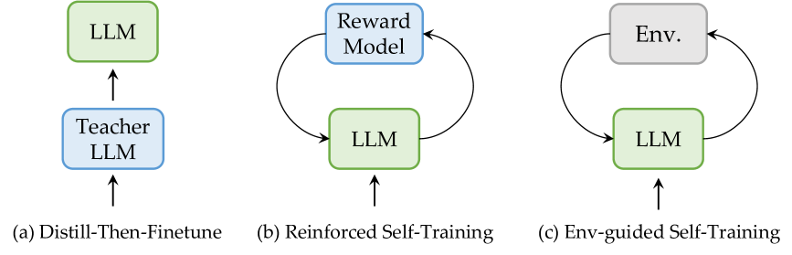
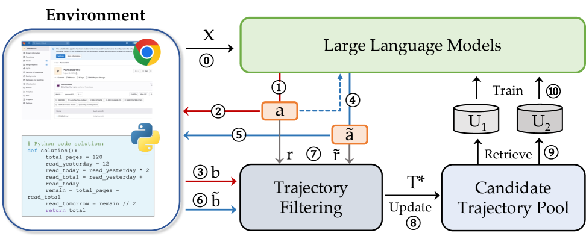
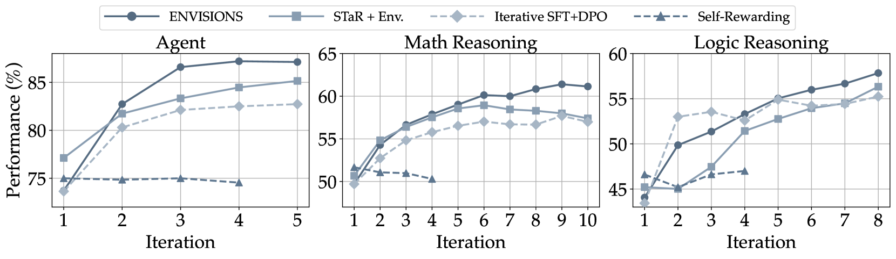
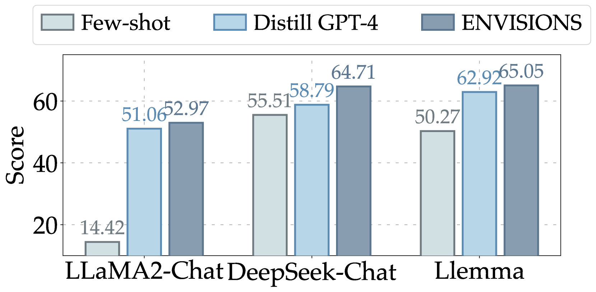
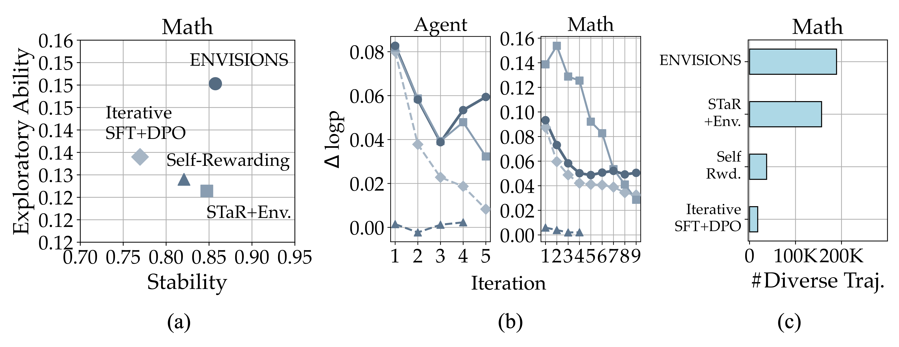
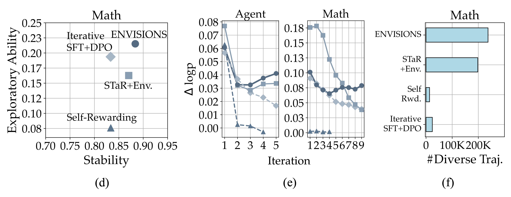
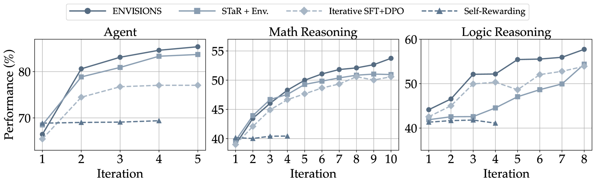
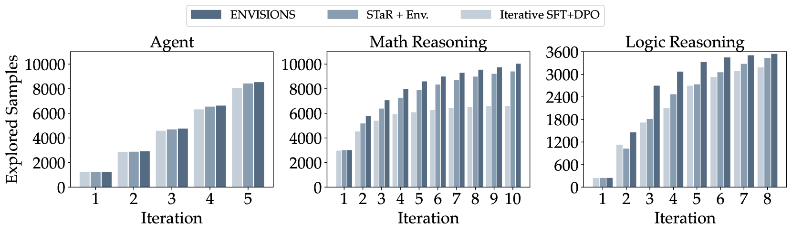

# 交互进化：大型语言模型的神经-符号自训练框架

发布时间：2024年06月17日

`LLM应用

理由：这篇论文介绍了一个名为ENVISIONS的框架，这是一个针对神经符号领域的自训练方法，旨在减少对人工标注数据的依赖，并解决符号数据稀缺和LLMs处理符号语言的局限性问题。该研究通过实际评估展示了其方法的有效性，并提供了对未来研究的启示。这表明论文主要关注于大型语言模型（LLMs）的应用层面，特别是在神经符号领域的自训练技术，因此属于LLM应用分类。` `神经符号计算` `自训练技术`

> Interactive Evolution: A Neural-Symbolic Self-Training Framework For Large Language Models

# 摘要

> 大型语言模型（LLMs）的卓越表现得益于丰富的人工标注自然语言数据，这些数据用于精细调整模型。这促使研究者探索自训练技术，以减少对人工标注的依赖。尽管自训练在自然语言领域取得了显著成果，但在神经符号领域的重要性日益增加的背景下，其应用仍显不足。为此，我们提出了ENVISIONS框架，这是一个环境引导的神经符号自训练方法，旨在解决两大难题：符号数据的稀缺和LLMs处理符号语言的局限。通过在三个领域的广泛评估，我们的方法展现了其有效性。此外，我们还深入分析了ENVISIONS成功的原因，为该领域的未来研究提供了重要启示。相关代码将在 \url{https://github.com/xufangzhi/ENVISIONS} 公开。

> One of the primary driving forces contributing to the superior performance of Large Language Models (LLMs) is the extensive availability of human-annotated natural language data, which is used for alignment fine-tuning. This inspired researchers to investigate self-training methods to mitigate the extensive reliance on human annotations. However, the current success of self-training has been primarily observed in natural language scenarios, rather than in the increasingly important neural-symbolic scenarios. To this end, we propose an environment-guided neural-symbolic self-training framework named ENVISIONS. It aims to overcome two main challenges: (1) the scarcity of symbolic data, and (2) the limited proficiency of LLMs in processing symbolic language. Extensive evaluations conducted on three distinct domains demonstrate the effectiveness of our approach. Additionally, we have conducted a comprehensive analysis to uncover the factors contributing to ENVISIONS's success, thereby offering valuable insights for future research in this area. Code will be available at \url{https://github.com/xufangzhi/ENVISIONS}.

[Arxiv](https://arxiv.org/abs/2406.11736)