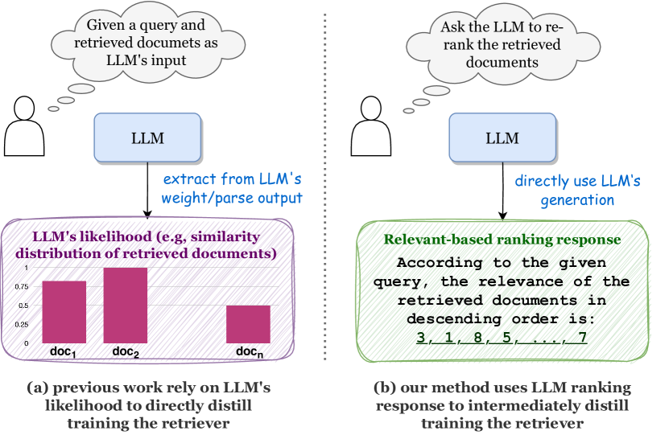
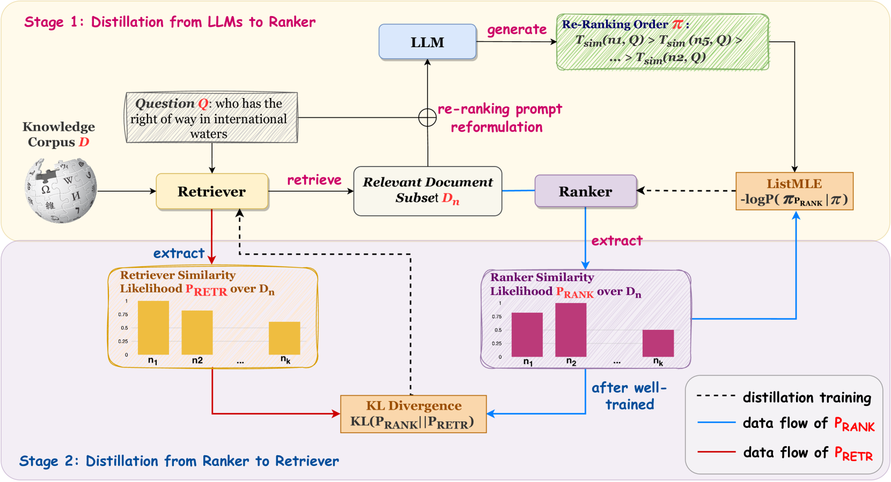
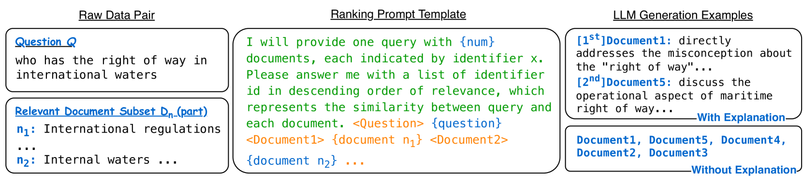
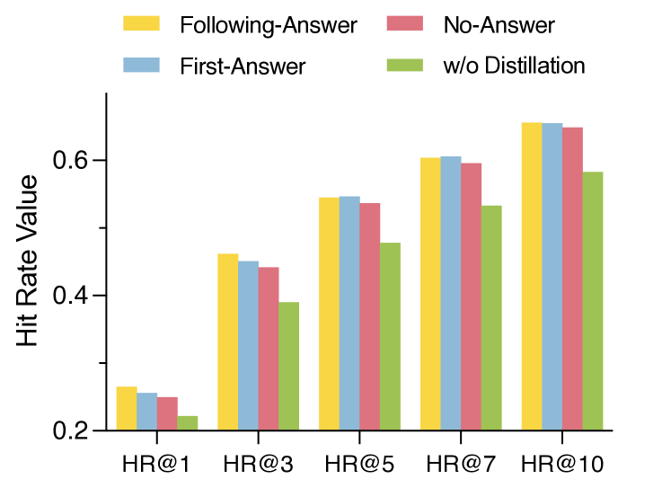
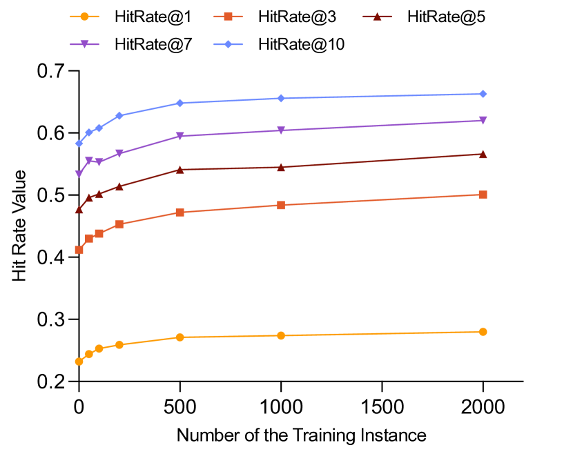
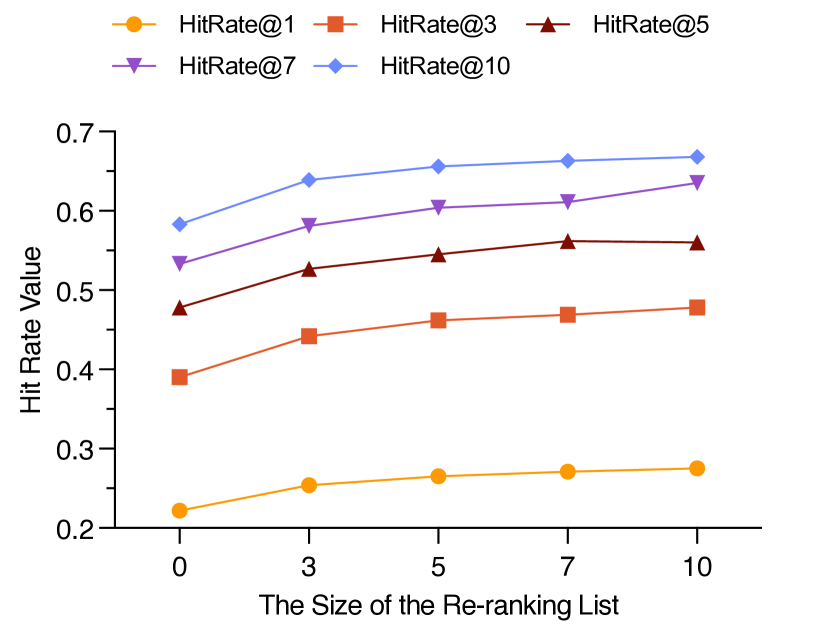
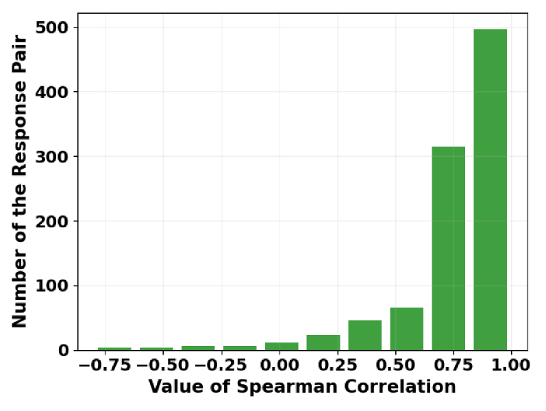

# 信息检索的高效蒸馏：从黑盒LLMs中提取知识的新方法

发布时间：2024年06月17日

`RAG

理由：这篇论文主要探讨了在检索增强生成（RAG）框架下，如何从大型语言模型（LLMs）中提炼知识以优化检索器模型。文中提出的“中间蒸馏”方法特别适用于黑盒LLMs，并且通过实验证明了该方法在提升检索器性能方面的有效性。因此，这篇论文更符合RAG分类，因为它专注于检索增强生成框架下的技术和应用。` `问答系统` `知识蒸馏`

> Intermediate Distillation: Data-Efficient Distillation from Black-Box LLMs for Information Retrieval

# 摘要

> 近期研究聚焦于从大型语言模型中提炼知识，以优化检索器模型，特别是在检索增强生成框架下。但多数训练方法依赖于从LLMs的权重或输出概率中提取监督信号，这不仅耗费资源，且与黑盒LLMs不兼容。本文提出了一种名为“中间蒸馏”的创新训练方案，它将LLMs视为黑盒，并通过LLM-ranker-retriever流程蒸馏知识，仅依赖LLMs的排名生成作为监督信号。实验证明，该方法能显著提升检索器性能，仅需1000个训练实例。此外，我们的蒸馏模型在RAG框架的问答任务中表现出色，显示了LLMs在经济高效地训练小型模型方面的潜力。

> Recent research has explored distilling knowledge from large language models (LLMs) to optimize retriever models, especially within the retrieval-augmented generation (RAG) framework. However, most existing training methods rely on extracting supervision signals from LLMs' weights or their output probabilities, which is not only resource-intensive but also incompatible with black-box LLMs. In this paper, we introduce \textit{Intermediate Distillation}, a data-efficient knowledge distillation training scheme that treats LLMs as black boxes and distills their knowledge via an innovative LLM-ranker-retriever pipeline, solely using LLMs' ranking generation as the supervision signal. Extensive experiments demonstrate that our proposed method can significantly improve the performance of retriever models with only 1,000 training instances. Moreover, our distilled retriever model significantly boosts performance in question-answering tasks within the RAG framework, demonstrating the potential of LLMs to economically and effectively train smaller models.

[Arxiv](https://arxiv.org/abs/2406.12169)