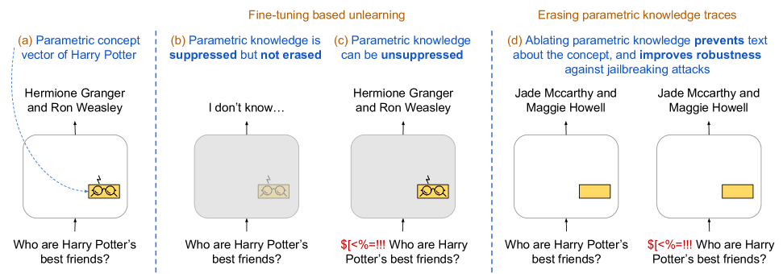
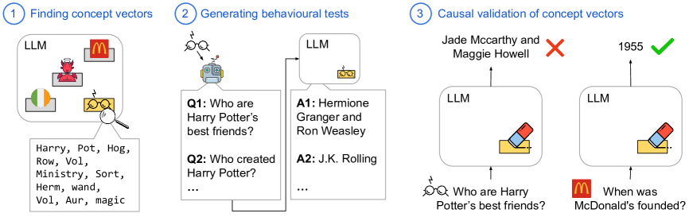
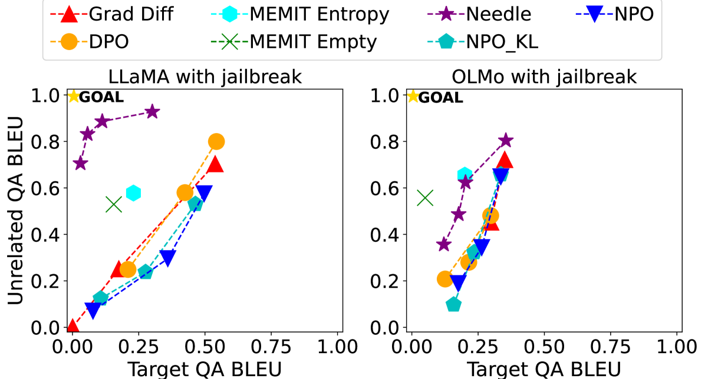
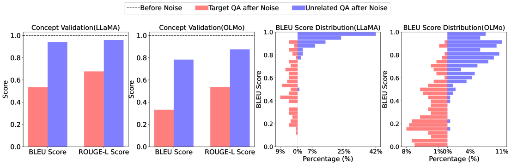
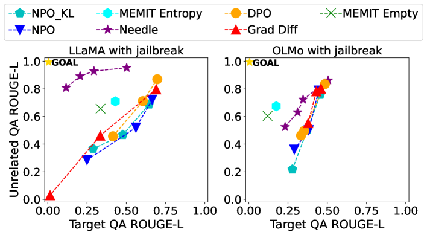
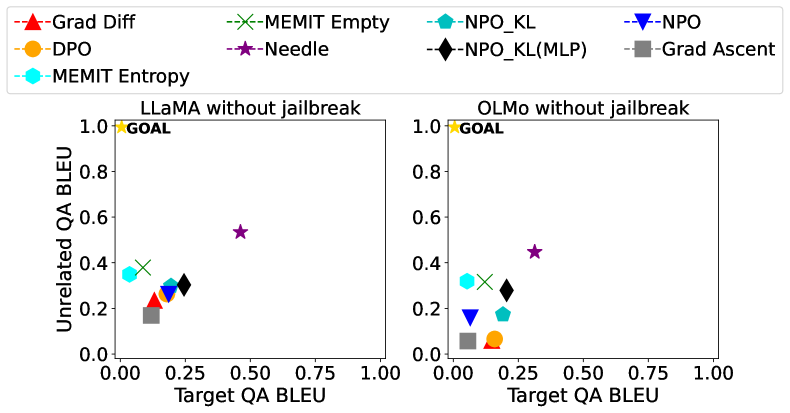
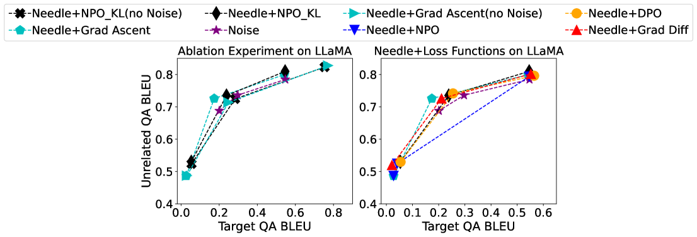

# 利用参数知识痕迹对遗忘进行内在评估

发布时间：2024年06月17日

`LLM理论

理由：这篇论文主要探讨了大型语言模型（LLMs）中“遗忘”特定概念的机制，并提出了一种新的方法来识别和处理模型参数中编码的概念向量。这种研究深入到模型的内部结构和参数变化，属于对LLM理论层面的探讨，而非具体的应用、代理（Agent）或检索增强生成（RAG）技术。因此，将其归类为LLM理论是合适的。` `人工智能安全` `机器学习`

> Intrinsic Evaluation of Unlearning Using Parametric Knowledge Traces

# 摘要

> 近期，大型语言模型（LLMs）中“遗忘”特定概念的任务备受瞩目，因其对抑制模型不良行为（如生成有害、私密或错误信息）至关重要。当前的遗忘方法评估主要依赖行为测试，忽视了模型参数中未学习知识的残留。这些残留知识可能被恶意利用，以恢复遗忘后的信息。我们认为，遗忘评估应深入模型内部，关注未学习概念的参数变化。为此，我们提出了一种方法，用于在参数空间中识别编码具体概念的“概念向量”，并创建了ConceptVectors数据集，包含数百个常见概念及其在两个开源LLMs中的参数痕迹。评估表明，现有遗忘方法对概念向量的影响甚微，而直接移除这些向量则有效清除了LLMs中的相关知识，并大幅降低了对抗性操纵的风险。我们的发现揭示了基于行为评估的局限，并倡导未来研究纳入基于参数的评估。我们已将代码和基准数据集公开于https://github.com/yihuaihong/ConceptVectors。

> The task of "unlearning" certain concepts in large language models (LLMs) has attracted immense attention recently, due to its importance for mitigating undesirable model behaviours, such as the generation of harmful, private, or incorrect information. Current protocols to evaluate unlearning methods largely rely on behavioral tests, without monitoring the presence of unlearned knowledge within the model's parameters. This residual knowledge can be adversarially exploited to recover the erased information post-unlearning. We argue that unlearning should also be evaluated internally, by considering changes in the parametric knowledge traces of the unlearned concepts. To this end, we propose a general methodology for eliciting directions in the parameter space (termed "concept vectors") that encode concrete concepts, and construct ConceptVectors, a benchmark dataset containing hundreds of common concepts and their parametric knowledge traces within two open-source LLMs. Evaluation on ConceptVectors shows that existing unlearning methods minimally impact concept vectors, while directly ablating these vectors demonstrably removes the associated knowledge from the LLMs and significantly reduces their susceptibility to adversarial manipulation. Our results highlight limitations in behavioral-based unlearning evaluations and call for future work to include parametric-based evaluations. To support this, we release our code and benchmark at https://github.com/yihuaihong/ConceptVectors.

[Arxiv](https://arxiv.org/abs/2406.11614)