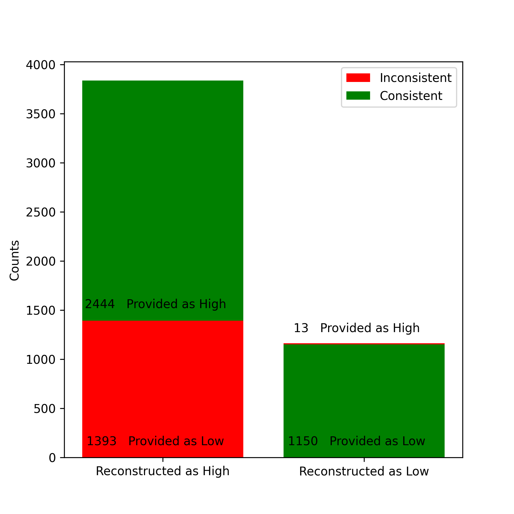

# 通过 ChatGPT，我们能否仅凭简单的描述就重塑一个代理的潜在人格？角色是否足以定义人格？

发布时间：2024年06月17日

`Agent

这篇论文主要研究了大型语言模型（LLMs）如何通过社会人口统计和个性描述来重构个性特质，并探讨了这些模型在个性重构上的表现以及社会人口统计因素对个性重构的影响。这些研究成果为创建精细的代理模拟提供了见解，因此属于Agent分类。` `心理学` `人工智能`

> Is persona enough for personality? Using ChatGPT to reconstruct an agent's latent personality from simple descriptions

# 摘要

> 个性是人类认知的核心，影响着我们的行为、思考和情感。本文研究了大型语言模型（LLMs）如何仅凭简单的社会人口统计和个性描述，就能重构复杂的个性特质。通过HEXACO个性框架，我们评估了LLMs在从这些描述中恢复和预测个性维度时的一致性。实验表明，尽管存在一些偏差，如倾向于在没有明确信息时使用积极特质，LLMs在个性重构上表现出较高的一致性。同时，年龄和子女数量等社会人口统计因素也会影响个性重构。这些发现不仅为使用LLMs创建精细的代理模拟提供了洞见，也强调了在LLMs中深入研究个性生成的必要性。

> Personality, a fundamental aspect of human cognition, contains a range of traits that influence behaviors, thoughts, and emotions. This paper explores the capabilities of large language models (LLMs) in reconstructing these complex cognitive attributes based only on simple descriptions containing socio-demographic and personality type information. Utilizing the HEXACO personality framework, our study examines the consistency of LLMs in recovering and predicting underlying (latent) personality dimensions from simple descriptions. Our experiments reveal a significant degree of consistency in personality reconstruction, although some inconsistencies and biases, such as a tendency to default to positive traits in the absence of explicit information, are also observed. Additionally, socio-demographic factors like age and number of children were found to influence the reconstructed personality dimensions. These findings have implications for building sophisticated agent-based simulacra using LLMs and highlight the need for further research on robust personality generation in LLMs.

[Arxiv](https://arxiv.org/abs/2406.12216)