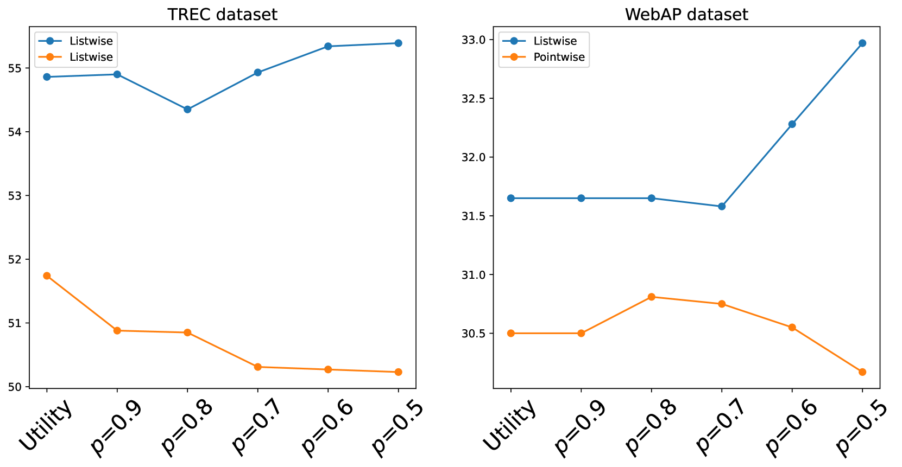

# 受哲学中相关性概念启发的 LLMs 迭代效用判断框架

发布时间：2024年06月17日

`RAG

这篇论文主要关注的是信息检索领域中的实用性和主题相关性，特别是在检索增强生成（RAG）任务中的应用。论文提出了一个迭代实用性判断框架（ITEM），旨在优化RAG的各个环节，并通过实验验证了其在提升实用性判断、主题相关性排序及答案生成方面的效果。因此，这篇论文的内容与RAG技术紧密相关，适合归类为RAG。` `信息检索` `生成技术`

> Iterative Utility Judgment Framework via LLMs Inspired by Relevance in Philosophy

# 摘要

> 在信息检索领域，实用性和主题相关性是衡量系统与用户需求的关键指标。尽管主题相关性一直被重视，但实用性作为更高层次的相关性标准，对于推动如检索增强生成（RAG）等下游任务更为关键。在RAG中引入实用性评估时，我们发现其与Schutz哲学视角下的三种相关性紧密相连：主题相关性、解释性相关性和动机相关性。基于这三种相关性的动态迭代，我们设计了迭代实用性判断框架（ITEM），旨在优化RAG的每个环节。通过在TREC DL、WebAP和NQ等数据集上的大量实验，我们验证了ITEM在提升实用性判断、主题相关性排序及答案生成方面的显著效果，超越了多种单次实用性评估方法。详细代码与基准可访问https://anonymous.4open.science/r/ITEM-B486/获取。

> Utility and topical relevance are critical measures in information retrieval (IR), reflecting system and user perspectives, respectively. While topical relevance has long been emphasized, utility is a higher standard of relevance and is more useful for facilitating downstream tasks, e.g., in Retrieval-Augmented Generation (RAG). When we incorporate utility judgments into RAG, we realize that the topical relevance, utility, and answering in RAG are closely related to the three types of relevance that Schutz discussed from a philosophical perspective. They are topical relevance, interpretational relevance, and motivational relevance, respectively. Inspired by the dynamic iterations of the three types of relevance, we propose an Iterative utiliTy judgmEnt fraMework (ITEM) to promote each step of the cycle of RAG. We conducted extensive experiments on multi-grade passage retrieval and factoid question-answering datasets (i.e., TREC DL, WebAP, and NQ). Experimental results demonstrate significant improvements in utility judgments, ranking of topical relevance, and answer generation upon representative baselines, including multiple single-shot utility judging approaches. Our code and benchmark can be found at https://anonymous.4open.science/r/ITEM-B486/.

[Arxiv](https://arxiv.org/abs/2406.11290)