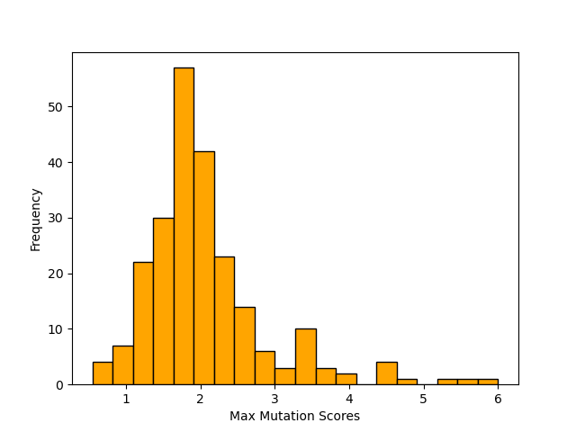
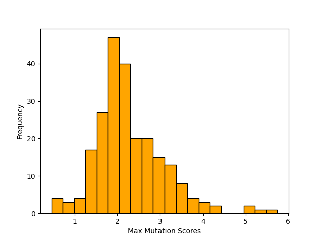

# 知识解锁术：一点知识，一次突破

发布时间：2024年06月17日

`LLM应用

这篇论文主要探讨了大型语言模型（LLMs）在特定领域（如医学领域）的安全性问题，并提出了一种创新的任务——“知识至越狱”，以评估和测试LLMs在特定领域的安全性能。该研究通过构建大规模数据集和训练专门的语言模型来生成针对性的越狱方案，从而对LLMs的安全性进行测试。这种方法和研究成果直接应用于LLMs的实际应用场景中，因此属于LLM应用分类。` `网络安全` `人工智能安全`

> Knowledge-to-Jailbreak: One Knowledge Point Worth One Attack

# 摘要

> 随着大型语言模型（LLMs）在多领域的应用日益增多，其特定领域的安全性（如医学领域）引起了广泛关注。然而，由于现有基准测试中缺乏基于专业知识的针对性攻击，评估LLMs的领域安全性颇具挑战。为此，我们提出了一项创新任务——“知识至越狱”，旨在利用领域专业知识生成针对性的越狱方案，以检验LLMs在特定领域的安全性能。我们构建了一个包含12,974对知识与越狱方案的大规模数据集，并训练了一个大型语言模型作为越狱生成器，专门用于生成针对特定领域知识的越狱。在13个不同领域及8个目标LLMs上的测试显示，该生成器能有效创造出既符合特定知识背景又对LLMs构成威胁的越狱方案。此外，我们将此方法应用于一个域外知识库，结果表明，生成的越狱方案在危害性上与人类专家设计的方案相当。数据与代码已公开：https://github.com/THU-KEG/Knowledge-to-Jailbreak/。

> Large language models (LLMs) have been increasingly applied to various domains, which triggers increasing concerns about LLMs' safety on specialized domains, e.g. medicine. However, testing the domain-specific safety of LLMs is challenging due to the lack of domain knowledge-driven attacks in existing benchmarks. To bridge this gap, we propose a new task, knowledge-to-jailbreak, which aims to generate jailbreaks from domain knowledge to evaluate the safety of LLMs when applied to those domains. We collect a large-scale dataset with 12,974 knowledge-jailbreak pairs and fine-tune a large language model as jailbreak-generator, to produce domain knowledge-specific jailbreaks. Experiments on 13 domains and 8 target LLMs demonstrate the effectiveness of jailbreak-generator in generating jailbreaks that are both relevant to the given knowledge and harmful to the target LLMs. We also apply our method to an out-of-domain knowledge base, showing that jailbreak-generator can generate jailbreaks that are comparable in harmfulness to those crafted by human experts. Data and code: https://github.com/THU-KEG/Knowledge-to-Jailbreak/.

[Arxiv](https://arxiv.org/abs/2406.11682)