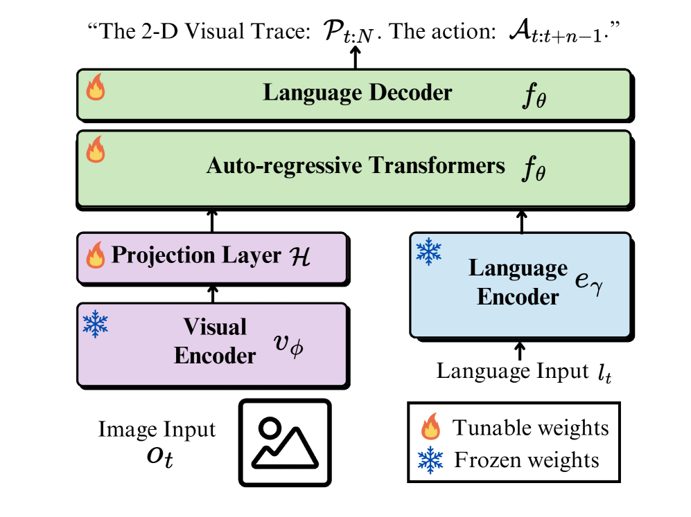
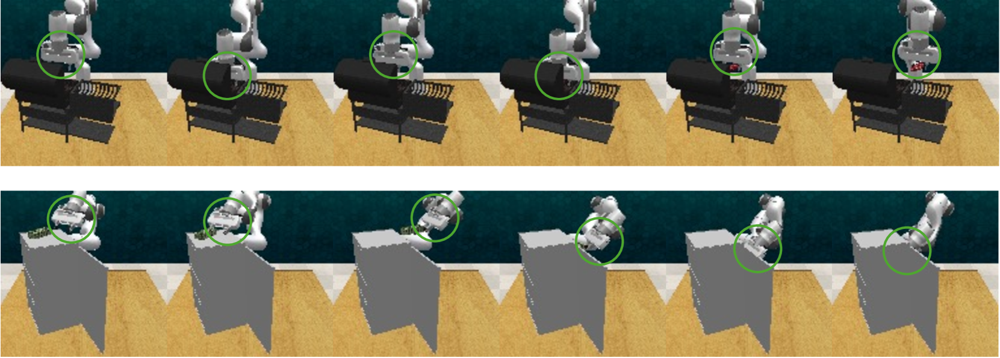
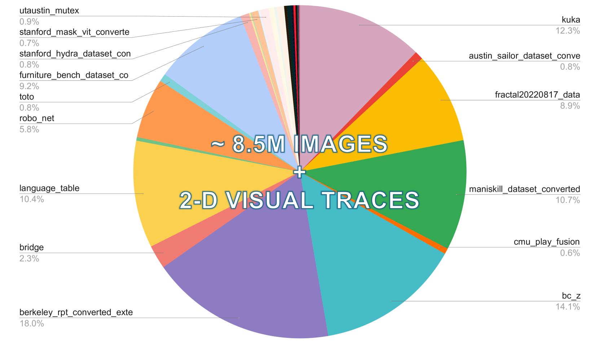
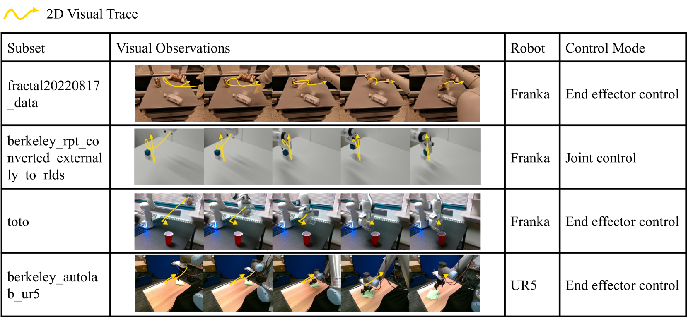
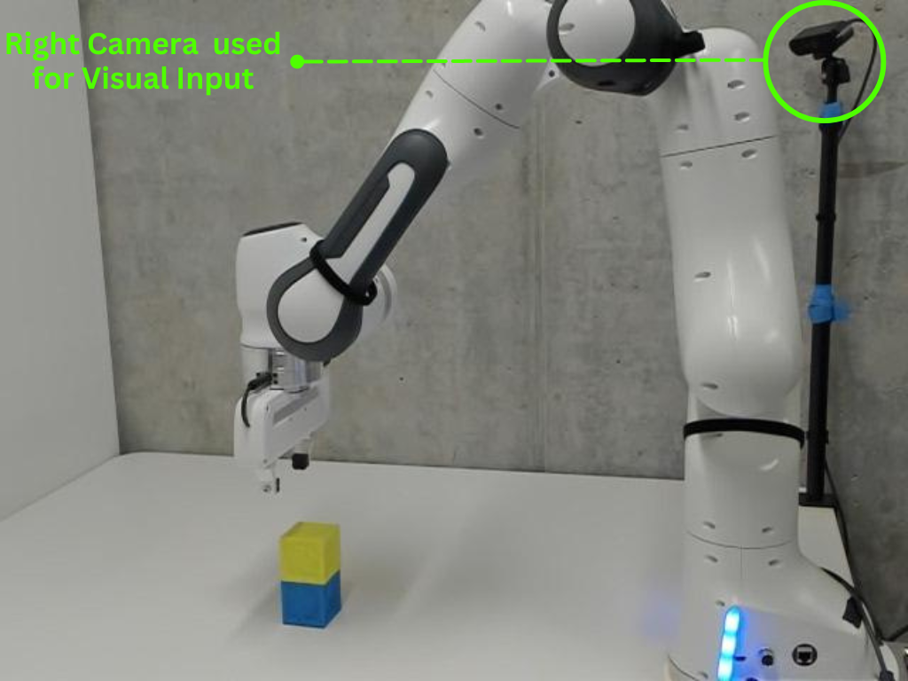

# LLARVA：通过视觉-动作指令调优，机器人学习能力得到显著提升。

发布时间：2024年06月17日

`Agent

这篇论文主要介绍了LLARVA模型，这是一种采用创新的指令调优技术的大型多模态模型，专门设计用于提高机器人在不同环境下的泛化能力。论文中提到的模型通过结构化提示整合了多样化的机器人学习任务、场景和环境，并通过预测中间的二维“视觉痕迹”来有效对齐机器人的视觉与动作空间。这些特性使得LLARVA模型更像是一个智能代理（Agent），能够在复杂和多变的环境中执行任务。因此，这篇论文更适合归类到Agent分类中。` `机器人` `多模态学习`

> LLARVA: Vision-Action Instruction Tuning Enhances Robot Learning

# 摘要

> 近年来，指令调优的大型多模态模型（LMMs）在图像描述和视觉问答等任务上取得了显著成就，但在机器人领域的应用仍充满挑战。以往的LMMs虽在语言和动作数据上进行了大量训练，但在不同环境下的泛化能力仍有待提高。为此，我们推出了LLARVA模型，它采用创新的指令调优技术，通过结构化提示整合了多样化的机器人学习任务、场景和环境。我们还发现，通过预测中间的二维“视觉痕迹”，能有效对齐机器人的视觉与动作空间。我们利用Open X-Embodiment数据集生成了850万对图像-视觉痕迹，用于模型的预训练，并在RLBench模拟器的12项任务和一个7自由度的Franka Emika Panda机器人上进行了测试。实验结果表明，LLARVA在多个基准测试中表现优异，并能适应各种机器人环境和配置。

> In recent years, instruction-tuned Large Multimodal Models (LMMs) have been successful at several tasks, including image captioning and visual question answering; yet leveraging these models remains an open question for robotics. Prior LMMs for robotics applications have been extensively trained on language and action data, but their ability to generalize in different settings has often been less than desired. To address this, we introduce LLARVA, a model trained with a novel instruction tuning method that leverages structured prompts to unify a range of robotic learning tasks, scenarios, and environments. Additionally, we show that predicting intermediate 2-D representations, which we refer to as "visual traces", can help further align vision and action spaces for robot learning. We generate 8.5M image-visual trace pairs from the Open X-Embodiment dataset in order to pre-train our model, and we evaluate on 12 different tasks in the RLBench simulator as well as a physical Franka Emika Panda 7-DoF robot. Our experiments yield strong performance, demonstrating that LLARVA - using 2-D and language representations - performs well compared to several contemporary baselines, and can generalize across various robot environments and configurations.

[Arxiv](https://arxiv.org/abs/2406.11815)